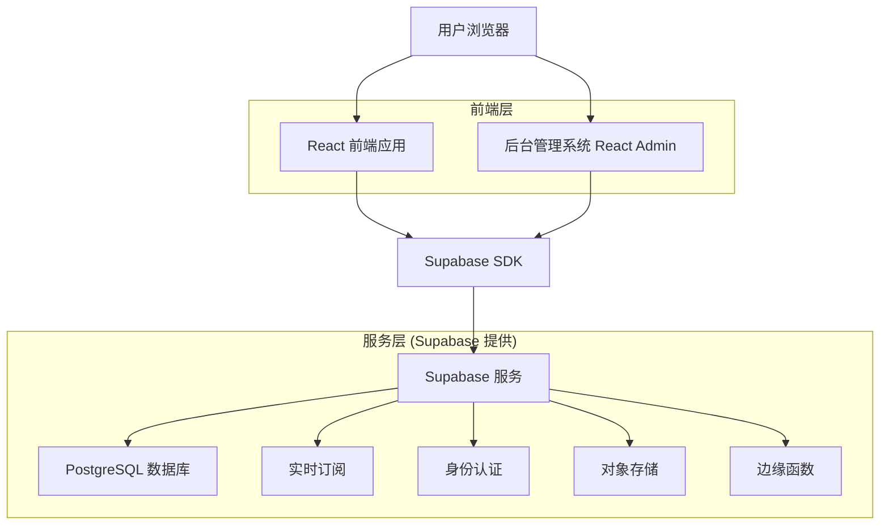
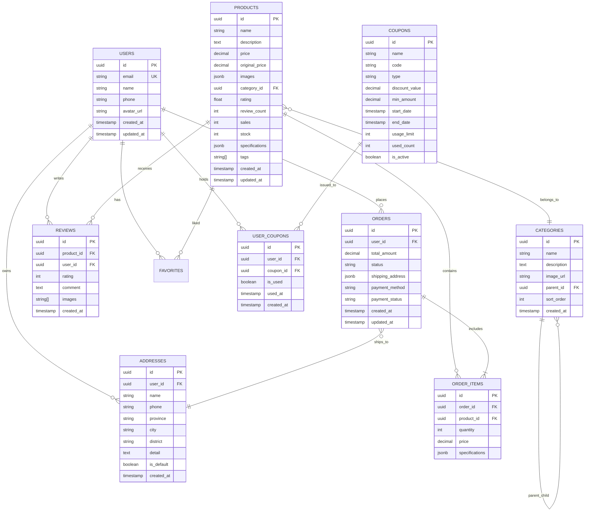

# JADESHOPPING 技术架构设计文档

## 1. 架构设计



## 2. 技术描述

- **前端**：React@18 + TypeScript + Tailwind CSS + Vite
- **后台管理**：React@18 + React Admin + TypeScript + Tailwind CSS
- **数据库**：Supabase (PostgreSQL)
- **身份认证**：Supabase Auth
- **实时同步**：Supabase Realtime
- **文件存储**：Supabase Storage
- **API层**：Supabase Edge Functions (可选)

## 3. 路由定义

### 3.1 前端用户路由

| 路由 | 用途 |
|------|------|
| / | 首页，展示轮播图、商品推荐、分类导航 |
| /products | 商品列表页，支持筛选、排序、分页 |
| /product/:id | 商品详情页，展示商品信息、评价、推荐 |
| /cart | 购物车页面，商品管理、结算功能 |
| /checkout | 结算页面，订单确认、支付处理 |
| /login | 登录页面，用户身份认证 |
| /orders | 我的订单，订单状态跟踪 |
| /favorites | 我的收藏，收藏商品管理 |
| /profile | 个人资料，用户信息管理 |
| /address | 地址管理，收货地址CRUD |
| /points | 积分中心，积分查询兑换 |
| /wallet | 我的钱包，余额充值提现 |
| /coupons | 优惠券中心，优惠券管理使用 |
| /about | 公司简介，企业信息展示 |
| /culture | 企业文化，品牌价值观 |
| /history | 发展历程，公司发展史 |
| /contact | 联系我们，联系方式客服 |
| /help | 帮助中心，常见问题解答 |
| /service | 售后服务，服务政策说明 |
| /shipping | 配送说明，物流政策 |
| /returns | 退换货政策，退货流程 |
| /policy/coupons | 优惠券政策，使用规则 |
| /policy/points | 积分政策，积分规则 |
| /policy/wallet | 钱包政策，钱包使用说明 |
| /policy/payments | 支付方式，支付政策 |
| /join | 加盟合作，合作申请 |
| /supplier | 供应商入驻，供应商申请 |
| /wholesale | 批发业务，批发政策 |
| /media | 媒体报道，品牌资讯 |

### 3.2 后台管理路由

| 路由 | 用途 |
|------|------|
| /admin | 管理后台首页，数据概览仪表板 |
| /admin/login | 管理员登录页面 |
| /admin/users | 用户管理，用户信息CRUD |
| /admin/products | 商品管理，商品信息CRUD |
| /admin/categories | 分类管理，商品分类管理 |
| /admin/orders | 订单管理，订单处理跟踪 |
| /admin/inventory | 库存管理，库存监控预警 |
| /admin/members | 会员管理，会员等级积分 |
| /admin/coupons | 优惠券管理，优惠券发放 |
| /admin/content | 内容管理，网站内容编辑 |
| /admin/banners | 轮播图管理，首页轮播配置 |
| /admin/announcements | 公告管理，置顶公告发布 |
| /admin/feedback | 反馈管理，用户反馈处理 |
| /admin/analytics | 数据分析，销售统计报表 |
| /admin/settings | 系统设置，参数配置 |
| /admin/roles | 角色管理，权限分配 |
| /admin/logs | 日志管理，操作日志查看 |
| /admin/migration | 数据迁移，迁移工具控制台 |
| /admin/buyback | 回购管理，回购申请处理 |
| /admin/buyback/applications | 回购申请列表，申请审核 |
| /admin/buyback/appraisals | 回购评估管理，鉴定任务 |
| /admin/buyback/pricing | 回购定价规则，价格配置 |
| /admin/buyback/transactions | 回购交易管理，付款处理 |
| /admin/buyback/disputes | 回购争议处理，第三方鉴定 |
| /buyback | 前端回购中心，用户申请入口 |
| /buyback/apply | 回购申请页面，资料上传 |
| /buyback/status/:id | 回购状态查询，进度跟踪 |

## 4. API 定义

### 4.1 Supabase 表结构 API

由于使用 Supabase，API 通过 Supabase SDK 自动生成，支持 RESTful 和 GraphQL 接口。

#### 用户认证相关
```typescript
// 用户注册
supabase.auth.signUp({
  email: string,
  password: string,
  options?: {
    data: {
      name: string,
      phone?: string
    }
  }
})

// 用户登录
supabase.auth.signInWithPassword({
  email: string,
  password: string
})

// 获取当前用户
supabase.auth.getUser()
```

#### 商品数据相关
```typescript
// 获取商品列表
supabase
  .from('products')
  .select('*')
  .range(offset, limit)
  .order('created_at', { ascending: false })

// 获取商品详情
supabase
  .from('products')
  .select('*, categories(*), reviews(*)')
  .eq('id', productId)
  .single()

// 创建商品
supabase
  .from('products')
  .insert({
    name: string,
    description: string,
    price: number,
    category_id: string,
    images: string[],
    stock: number
  })
```

#### 订单数据相关
```typescript
// 创建订单
supabase
  .from('orders')
  .insert({
    user_id: string,
    items: OrderItem[],
    total_amount: number,
    shipping_address: Address,
    payment_method: string
  })

// 获取用户订单
supabase
  .from('orders')
  .select('*, order_items(*, products(*))')
  .eq('user_id', userId)
  .order('created_at', { ascending: false })
```

### 4.2 实时数据同步

```typescript
// 订阅商品变更
supabase
  .channel('products')
  .on('postgres_changes', 
    { event: '*', schema: 'public', table: 'products' },
    (payload) => {
      // 处理商品数据变更
    }
  )
  .subscribe()

// 订阅订单状态变更
supabase
  .channel('orders')
  .on('postgres_changes',
    { event: 'UPDATE', schema: 'public', table: 'orders' },
    (payload) => {
      // 处理订单状态更新
    }
  )
  .subscribe()
```

## 5. 数据模型

### 5.1 数据模型定义



### 5.2 数据定义语言

#### 用户表 (users)
```sql
-- 创建用户表
CREATE TABLE users (
  id UUID PRIMARY KEY DEFAULT gen_random_uuid(),
  email VARCHAR(255) UNIQUE NOT NULL,
  name VARCHAR(100) NOT NULL,
  phone VARCHAR(20),
  avatar_url TEXT,
  birthday DATE,
  gender VARCHAR(10),
  points INTEGER DEFAULT 0,
  member_level VARCHAR(20) DEFAULT 'bronze',
  created_at TIMESTAMP WITH TIME ZONE DEFAULT NOW(),
  updated_at TIMESTAMP WITH TIME ZONE DEFAULT NOW()
);

-- 创建索引
CREATE INDEX idx_users_email ON users(email);
CREATE INDEX idx_users_member_level ON users(member_level);

-- 设置 RLS 策略
ALTER TABLE users ENABLE ROW LEVEL SECURITY;
GRANT SELECT ON users TO anon;
GRANT ALL PRIVILEGES ON users TO authenticated;

-- 用户只能访问自己的数据
CREATE POLICY "Users can view own profile" ON users
  FOR SELECT USING (auth.uid() = id);
CREATE POLICY "Users can update own profile" ON users
  FOR UPDATE USING (auth.uid() = id);
```

#### 商品表 (products)
```sql
-- 创建商品表
CREATE TABLE products (
  id UUID PRIMARY KEY DEFAULT gen_random_uuid(),
  name VARCHAR(255) NOT NULL,
  description TEXT,
  price DECIMAL(10,2) NOT NULL,
  original_price DECIMAL(10,2),
  images JSONB DEFAULT '[]',
  category_id UUID REFERENCES categories(id),
  rating FLOAT DEFAULT 0,
  review_count INTEGER DEFAULT 0,
  sales INTEGER DEFAULT 0,
  stock INTEGER DEFAULT 0,
  specifications JSONB DEFAULT '{}',
  tags TEXT[] DEFAULT '{}',
  is_active BOOLEAN DEFAULT true,
  created_at TIMESTAMP WITH TIME ZONE DEFAULT NOW(),
  updated_at TIMESTAMP WITH TIME ZONE DEFAULT NOW()
);

-- 创建索引
CREATE INDEX idx_products_category_id ON products(category_id);
CREATE INDEX idx_products_rating ON products(rating DESC);
CREATE INDEX idx_products_sales ON products(sales DESC);
CREATE INDEX idx_products_price ON products(price);
CREATE INDEX idx_products_created_at ON products(created_at DESC);

-- 设置 RLS 策略
ALTER TABLE products ENABLE ROW LEVEL SECURITY;
GRANT SELECT ON products TO anon;
GRANT ALL PRIVILEGES ON products TO authenticated;

-- 所有用户可以查看激活的商品
CREATE POLICY "Anyone can view active products" ON products
  FOR SELECT USING (is_active = true);
```

#### 分类表 (categories)
```sql
-- 创建分类表
CREATE TABLE categories (
  id UUID PRIMARY KEY DEFAULT gen_random_uuid(),
  name VARCHAR(100) NOT NULL,
  description TEXT,
  image_url TEXT,
  parent_id UUID REFERENCES categories(id),
  sort_order INTEGER DEFAULT 0,
  is_active BOOLEAN DEFAULT true,
  created_at TIMESTAMP WITH TIME ZONE DEFAULT NOW()
);

-- 创建索引
CREATE INDEX idx_categories_parent_id ON categories(parent_id);
CREATE INDEX idx_categories_sort_order ON categories(sort_order);

-- 设置 RLS 策略
ALTER TABLE categories ENABLE ROW LEVEL SECURITY;
GRANT SELECT ON categories TO anon;
GRANT ALL PRIVILEGES ON categories TO authenticated;

-- 所有用户可以查看激活的分类
CREATE POLICY "Anyone can view active categories" ON categories
  FOR SELECT USING (is_active = true);
```

#### 订单表 (orders)
```sql
-- 创建订单表
CREATE TABLE orders (
  id UUID PRIMARY KEY DEFAULT gen_random_uuid(),
  user_id UUID REFERENCES users(id) NOT NULL,
  total_amount DECIMAL(10,2) NOT NULL,
  status VARCHAR(20) DEFAULT 'pending',
  shipping_address JSONB NOT NULL,
  payment_method VARCHAR(50),
  payment_status VARCHAR(20) DEFAULT 'pending',
  tracking_number VARCHAR(100),
  notes TEXT,
  created_at TIMESTAMP WITH TIME ZONE DEFAULT NOW(),
  updated_at TIMESTAMP WITH TIME ZONE DEFAULT NOW()
);

-- 创建订单项表
CREATE TABLE order_items (
  id UUID PRIMARY KEY DEFAULT gen_random_uuid(),
  order_id UUID REFERENCES orders(id) ON DELETE CASCADE,
  product_id UUID REFERENCES products(id),
  quantity INTEGER NOT NULL,
  price DECIMAL(10,2) NOT NULL,
  specifications JSONB DEFAULT '{}'
);

-- 创建索引
CREATE INDEX idx_orders_user_id ON orders(user_id);
CREATE INDEX idx_orders_status ON orders(status);
CREATE INDEX idx_orders_created_at ON orders(created_at DESC);
CREATE INDEX idx_order_items_order_id ON order_items(order_id);

-- 设置 RLS 策略
ALTER TABLE orders ENABLE ROW LEVEL SECURITY;
ALTER TABLE order_items ENABLE ROW LEVEL SECURITY;
GRANT SELECT ON orders TO anon;
GRANT ALL PRIVILEGES ON orders TO authenticated;
GRANT SELECT ON order_items TO anon;
GRANT ALL PRIVILEGES ON order_items TO authenticated;

-- 用户只能访问自己的订单
CREATE POLICY "Users can view own orders" ON orders
  FOR SELECT USING (auth.uid() = user_id);
CREATE POLICY "Users can create own orders" ON orders
  FOR INSERT WITH CHECK (auth.uid() = user_id);
```

#### 回购管理表
```sql
-- 创建回购申请表
CREATE TABLE buyback_applications (
  id UUID PRIMARY KEY DEFAULT gen_random_uuid(),
  user_id UUID REFERENCES users(id) NOT NULL,
  product_id UUID REFERENCES products(id) NOT NULL,
  original_order_id UUID REFERENCES orders(id),
  application_status VARCHAR(20) DEFAULT 'pending', -- pending, approved, rejected, completed, cancelled
  purchase_date DATE NOT NULL,
  purchase_price DECIMAL(10,2) NOT NULL,
  purchase_proof_urls TEXT[], -- 购买凭证图片
  certificate_urls TEXT[], -- 鉴定证书图片
  product_photos TEXT[], -- 商品照片
  product_videos TEXT[], -- 商品视频
  condition_description TEXT, -- 商品状态描述
  delivery_method VARCHAR(20) DEFAULT 'mail', -- mail, store
  tracking_number VARCHAR(100), -- 邮寄单号
  notes TEXT,
  created_at TIMESTAMP WITH TIME ZONE DEFAULT NOW(),
  updated_at TIMESTAMP WITH TIME ZONE DEFAULT NOW()
);

-- 创建回购评估表
CREATE TABLE buyback_appraisals (
  id UUID PRIMARY KEY DEFAULT gen_random_uuid(),
  application_id UUID REFERENCES buyback_applications(id) NOT NULL,
  appraiser_id UUID REFERENCES users(id) NOT NULL, -- 鉴定师ID
  appraisal_status VARCHAR(20) DEFAULT 'pending', -- pending, in_progress, completed
  material_quality JSONB, -- 材质品质评估 {种水, 颜色, 纯度}
  craftsmanship_score INTEGER, -- 工艺水准评分 1-10
  wear_condition VARCHAR(20), -- excellent, good, fair, poor
  authenticity_verified BOOLEAN DEFAULT false,
  market_price DECIMAL(10,2), -- 市场参考价
  final_quote DECIMAL(10,2), -- 最终报价
  quote_reasoning TEXT, -- 定价依据说明
  appraisal_report_url TEXT, -- 评估报告文件
  video_record_url TEXT, -- 鉴定过程视频
  created_at TIMESTAMP WITH TIME ZONE DEFAULT NOW(),
  completed_at TIMESTAMP WITH TIME ZONE
);

-- 创建回购定价规则表
CREATE TABLE buyback_pricing_rules (
  id UUID PRIMARY KEY DEFAULT gen_random_uuid(),
  category_id UUID REFERENCES categories(id),
  min_purchase_price DECIMAL(10,2), -- 最低购买价格
  max_purchase_price DECIMAL(10,2), -- 最高购买价格
  base_percentage DECIMAL(5,2) DEFAULT 90.00, -- 基础回购比例 90%
  quality_adjustments JSONB, -- 品质调整系数
  wear_adjustments JSONB, -- 磨损调整系数
  time_depreciation JSONB, -- 时间折旧系数
  is_active BOOLEAN DEFAULT true,
  created_at TIMESTAMP WITH TIME ZONE DEFAULT NOW(),
  updated_at TIMESTAMP WITH TIME ZONE DEFAULT NOW()
);

-- 创建回购交易表
CREATE TABLE buyback_transactions (
  id UUID PRIMARY KEY DEFAULT gen_random_uuid(),
  application_id UUID REFERENCES buyback_applications(id) NOT NULL,
  appraisal_id UUID REFERENCES buyback_appraisals(id) NOT NULL,
  transaction_status VARCHAR(20) DEFAULT 'pending', -- pending, confirmed, paid, rejected, returned
  final_amount DECIMAL(10,2) NOT NULL,
  payment_method VARCHAR(50), -- bank_transfer, alipay, wechat
  payment_account TEXT, -- 收款账户信息
  contract_url TEXT, -- 电子协议文件
  payment_proof_url TEXT, -- 付款凭证
  user_confirmed_at TIMESTAMP WITH TIME ZONE,
  paid_at TIMESTAMP WITH TIME ZONE,
  created_at TIMESTAMP WITH TIME ZONE DEFAULT NOW()
);

-- 创建回购争议表
CREATE TABLE buyback_disputes (
  id UUID PRIMARY KEY DEFAULT gen_random_uuid(),
  application_id UUID REFERENCES buyback_applications(id) NOT NULL,
  dispute_type VARCHAR(20) DEFAULT 'price', -- price, quality, authenticity
  user_reason TEXT NOT NULL,
  third_party_institution VARCHAR(255), -- 第三方鉴定机构
  third_party_cost DECIMAL(10,2), -- 第三方鉴定费用
  third_party_result JSONB, -- 第三方鉴定结果
  resolution_status VARCHAR(20) DEFAULT 'pending', -- pending, resolved, escalated
  resolution_notes TEXT,
  created_at TIMESTAMP WITH TIME ZONE DEFAULT NOW(),
  resolved_at TIMESTAMP WITH TIME ZONE
);

-- 创建索引
CREATE INDEX idx_buyback_applications_user_id ON buyback_applications(user_id);
CREATE INDEX idx_buyback_applications_status ON buyback_applications(application_status);
CREATE INDEX idx_buyback_applications_created_at ON buyback_applications(created_at DESC);
CREATE INDEX idx_buyback_appraisals_application_id ON buyback_appraisals(application_id);
CREATE INDEX idx_buyback_appraisals_appraiser_id ON buyback_appraisals(appraiser_id);
CREATE INDEX idx_buyback_transactions_application_id ON buyback_transactions(application_id);
CREATE INDEX idx_buyback_disputes_application_id ON buyback_disputes(application_id);

-- 设置 RLS 策略
ALTER TABLE buyback_applications ENABLE ROW LEVEL SECURITY;
ALTER TABLE buyback_appraisals ENABLE ROW LEVEL SECURITY;
ALTER TABLE buyback_pricing_rules ENABLE ROW LEVEL SECURITY;
ALTER TABLE buyback_transactions ENABLE ROW LEVEL SECURITY;
ALTER TABLE buyback_disputes ENABLE ROW LEVEL SECURITY;

-- 用户只能访问自己的回购申请
CREATE POLICY "Users can view own buyback applications" ON buyback_applications
  FOR SELECT USING (auth.uid() = user_id);
CREATE POLICY "Users can create own buyback applications" ON buyback_applications
  FOR INSERT WITH CHECK (auth.uid() = user_id);

-- 鉴定师可以查看分配给自己的评估任务
CREATE POLICY "Appraisers can view assigned appraisals" ON buyback_appraisals
  FOR SELECT USING (auth.uid() = appraiser_id);
```

#### 内容管理表
```sql
-- 创建轮播图表
CREATE TABLE carousel_items (
  id UUID PRIMARY KEY DEFAULT gen_random_uuid(),
  title VARCHAR(255),
  image_url TEXT NOT NULL,
  link_url TEXT,
  sort_order INTEGER DEFAULT 0,
  is_active BOOLEAN DEFAULT true,
  start_date TIMESTAMP WITH TIME ZONE,
  end_date TIMESTAMP WITH TIME ZONE,
  created_at TIMESTAMP WITH TIME ZONE DEFAULT NOW()
);

-- 创建公告表
CREATE TABLE announcements (
  id UUID PRIMARY KEY DEFAULT gen_random_uuid(),
  title VARCHAR(255) NOT NULL,
  content TEXT NOT NULL,
  type VARCHAR(20) DEFAULT 'info',
  is_pinned BOOLEAN DEFAULT false,
  is_active BOOLEAN DEFAULT true,
  start_date TIMESTAMP WITH TIME ZONE,
  end_date TIMESTAMP WITH TIME ZONE,
  created_at TIMESTAMP WITH TIME ZONE DEFAULT NOW()
);

-- 创建网站内容表
CREATE TABLE site_contents (
  id UUID PRIMARY KEY DEFAULT gen_random_uuid(),
  slug VARCHAR(100) UNIQUE NOT NULL,
  title VARCHAR(255) NOT NULL,
  content TEXT NOT NULL,
  meta_description TEXT,
  is_published BOOLEAN DEFAULT true,
  created_at TIMESTAMP WITH TIME ZONE DEFAULT NOW(),
  updated_at TIMESTAMP WITH TIME ZONE DEFAULT NOW()
);

-- 设置 RLS 策略
ALTER TABLE carousel_items ENABLE ROW LEVEL SECURITY;
ALTER TABLE announcements ENABLE ROW LEVEL SECURITY;
ALTER TABLE site_contents ENABLE ROW LEVEL SECURITY;

GRANT SELECT ON carousel_items TO anon;
GRANT SELECT ON announcements TO anon;
GRANT SELECT ON site_contents TO anon;
GRANT ALL PRIVILEGES ON carousel_items TO authenticated;
GRANT ALL PRIVILEGES ON announcements TO authenticated;
GRANT ALL PRIVILEGES ON site_contents TO authenticated;

-- 初始化网站内容数据
INSERT INTO site_contents (slug, title, content) VALUES
('about', '公司简介', '翡翠雅韵致力于为客户提供最优质的翡翠产品...'),
('culture', '企业文化', '我们秉承"诚信为本，品质至上"的经营理念...'),
('history', '发展历程', '翡翠雅韵成立于2010年，经过十多年的发展...'),
('shipping', '配送说明', '我们提供全国范围内的配送服务...'),
('returns', '退换货政策', '为保障您的权益，我们提供7天无理由退换货服务...');
```

## 6. 权限控制系统

### 6.1 RBAC 权限模型

```sql
-- 创建角色表
CREATE TABLE roles (
  id UUID PRIMARY KEY DEFAULT gen_random_uuid(),
  name VARCHAR(50) UNIQUE NOT NULL,
  description TEXT,
  is_active BOOLEAN DEFAULT true,
  created_at TIMESTAMP WITH TIME ZONE DEFAULT NOW()
);

-- 创建权限表
CREATE TABLE permissions (
  id UUID PRIMARY KEY DEFAULT gen_random_uuid(),
  name VARCHAR(50) UNIQUE NOT NULL,
  resource VARCHAR(50) NOT NULL,
  action VARCHAR(20) NOT NULL,
  description TEXT
);

-- 创建角色权限关联表
CREATE TABLE role_permissions (
  role_id UUID REFERENCES roles(id) ON DELETE CASCADE,
  permission_id UUID REFERENCES permissions(id) ON DELETE CASCADE,
  PRIMARY KEY (role_id, permission_id)
);

-- 创建用户角色关联表
CREATE TABLE user_roles (
  user_id UUID REFERENCES users(id) ON DELETE CASCADE,
  role_id UUID REFERENCES roles(id) ON DELETE CASCADE,
  assigned_at TIMESTAMP WITH TIME ZONE DEFAULT NOW(),
  assigned_by UUID REFERENCES users(id),
  PRIMARY KEY (user_id, role_id)
);

-- 初始化角色数据
INSERT INTO roles (name, description) VALUES
('super_admin', '超级管理员'),
('admin', '系统管理员'),
('product_manager', '商品管理员'),
('order_manager', '订单管理员'),
('buyback_reviewer', '回购审核员'),
('buyback_appraiser', '回购鉴定师'),
('customer_service', '客服人员'),
('marketing_manager', '营销人员');

-- 初始化权限数据
INSERT INTO permissions (name, resource, action, description) VALUES
('users.read', 'users', 'read', '查看用户'),
('users.write', 'users', 'write', '编辑用户'),
('products.read', 'products', 'read', '查看商品'),
('products.write', 'products', 'write', '编辑商品'),
('products.buyback_zone', 'products', 'buyback_zone', '管理保值专区'),
('orders.read', 'orders', 'read', '查看订单'),
('orders.write', 'orders', 'write', '处理订单'),
('buyback.review', 'buyback', 'review', '回购申请审核'),
('buyback.appraise', 'buyback', 'appraise', '回购实物鉴定'),
('buyback.pricing', 'buyback', 'pricing', '回购定价管理'),
('buyback.transaction', 'buyback', 'transaction', '回购交易处理'),
('buyback.dispute', 'buyback', 'dispute', '回购争议处理'),
('system.admin', 'system', 'admin', '系统管理');

-- 初始化角色权限关联
INSERT INTO role_permissions (role_id, permission_id) 
SELECT r.id, p.id FROM roles r, permissions p 
WHERE r.name = 'super_admin'; -- 超级管理员拥有所有权限

INSERT INTO role_permissions (role_id, permission_id)
SELECT r.id, p.id FROM roles r, permissions p 
WHERE r.name = 'product_manager' AND p.name IN ('products.read', 'products.write', 'products.buyback_zone');

INSERT INTO role_permissions (role_id, permission_id)
SELECT r.id, p.id FROM roles r, permissions p 
WHERE r.name = 'buyback_reviewer' AND p.name IN ('buyback.review', 'products.read');

INSERT INTO role_permissions (role_id, permission_id)
SELECT r.id, p.id FROM roles r, permissions p 
WHERE r.name = 'buyback_appraiser' AND p.name IN ('buyback.appraise', 'buyback.pricing', 'buyback.transaction');
```

### 6.2 数据迁移策略

```sql
-- 创建数据迁移日志表
CREATE TABLE migration_logs (
  id UUID PRIMARY KEY DEFAULT gen_random_uuid(),
  migration_name VARCHAR(255) NOT NULL,
  status VARCHAR(20) DEFAULT 'pending',
  started_at TIMESTAMP WITH TIME ZONE DEFAULT NOW(),
  completed_at TIMESTAMP WITH TIME ZONE,
  error_message TEXT,
  records_processed INTEGER DEFAULT 0,
  records_failed INTEGER DEFAULT 0
);

-- 创建数据同步配置表
CREATE TABLE sync_configs (
  id UUID PRIMARY KEY DEFAULT gen_random_uuid(),
  table_name VARCHAR(100) NOT NULL,
  sync_enabled BOOLEAN DEFAULT true,
  last_sync_at TIMESTAMP WITH TIME ZONE,
  sync_interval INTEGER DEFAULT 300, -- 秒
  created_at TIMESTAMP WITH TIME ZONE DEFAULT NOW()
);
```