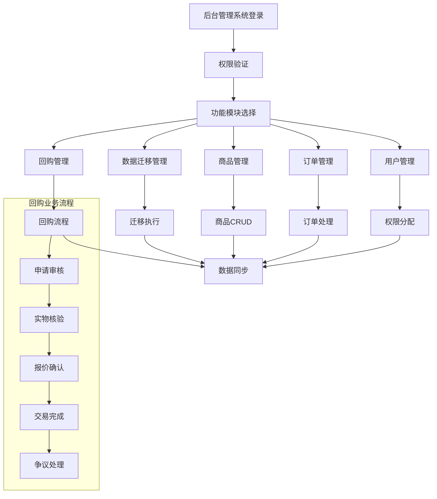

# JADESHOPPING 数据迁移与后台管理系统产品需求文档

## 1. 产品概述

本项目旨在将 JADESHOPPING 前端网站的所有数据全面迁移至 Supabase 数据库，并构建完整的后台管理系统。
该系统将实现前后端数据实时同步，建立规范化的数据库架构，提供全面的后台管理功能，确保数据完整性和系统安全性。
项目目标是建立一个现代化、可扩展的电商数据管理平台，支持 GDPR 合规和 RBAC 权限控制。

## 2. 核心功能

### 2.1 用户角色

| 角色 | 注册方式 | 核心权限 |
|------|----------|----------|
| 超级管理员 | 系统预设账号 admin/123456 | 系统全部功能访问权限，用户权限管理 |
| 系统管理员 | 超级管理员创建 | 系统配置、用户管理、数据管理 |
| 商品管理员 | 系统管理员分配 | 商品CRUD、分类管理、库存管理、保值专区管理 |
| 订单管理员 | 系统管理员分配 | 订单处理、状态跟踪、退款处理 |
| 回购审核员 | 系统管理员分配 | 回购申请审核、初步评估、流程管理 |
| 回购鉴定师 | 系统管理员分配 | 实物鉴定、专业评估、报价制定、鉴定报告生成 |
| 客服人员 | 系统管理员分配 | 客户服务、意见反馈处理、在线客服、回购咨询 |
| 营销人员 | 系统管理员分配 | 积分管理、优惠券管理、会员管理 |

### 2.2 功能模块

本系统包含以下核心页面和功能模块：

1. **数据迁移管理页面**：数据迁移状态监控、迁移校验工具、数据同步管理
2. **用户管理页面**：注册用户审核、权限分配、用户信息管理
3. **商品管理页面**：商品CRUD操作、分类管理、库存管理、SKU管理、保值专区管理
4. **订单管理页面**：订单处理、状态跟踪、支付信息管理、物流信息管理
5. **回购管理页面**：回购申请处理、实物核验、报价管理、交易完成、争议处理
6. **会员管理页面**：会员信息管理、VIP等级设置、积分规则配置
7. **营销管理页面**：积分发放兑换、消费券管理、促销活动管理
8. **内容管理页面**：网站内容管理、轮播图管理、公告管理
9. **系统管理页面**：操作员权限管理、系统参数设置、日志管理
10. **客服管理页面**：在线客服、调查问卷、意见反馈处理、回购咨询
11. **数据分析页面**：销售统计、用户行为分析、系统性能监控、回购数据分析

### 2.3 页面详情

| 页面名称 | 模块名称 | 功能描述 |
|----------|----------|----------|
| 数据迁移管理 | 迁移状态监控 | 显示迁移进度、错误日志、数据校验结果 |
| 数据迁移管理 | 迁移工具 | 执行数据迁移、回滚操作、数据备份恢复 |
| 用户管理 | 用户列表 | 查看、编辑、删除用户信息，批量操作 |
| 用户管理 | 权限分配 | 分配用户角色、设置访问权限、权限继承 |
| 商品管理 | 商品列表 | 商品CRUD操作、批量编辑、状态管理 |
| 商品管理 | 分类管理 | 多级分类创建、编辑、排序、关联管理 |
| 商品管理 | 库存管理 | 库存监控、预警设置、补货提醒 |
| 商品管理 | 保值专区 | 保值商品标识、回购资格设置、回购期限管理 |
| 回购管理 | 申请审核 | 回购申请列表、初步审核、资料验证、审核通过/拒绝 |
| 回购管理 | 实物核验 | 鉴定师分配、实物检测记录、评估报告生成、视频记录管理 |
| 回购管理 | 报价管理 | 定价规则配置、报价生成、报价确认、价格争议处理 |
| 回购管理 | 交易完成 | 电子协议签署、付款处理、交易记录、退货处理 |
| 回购管理 | 争议处理 | 第三方鉴定申请、复检结果处理、争议解决记录 |
| 订单管理 | 订单列表 | 订单查询、状态更新、批量处理 |
| 订单管理 | 支付管理 | 支付状态跟踪、退款处理、对账管理 |
| 订单管理 | 物流管理 | 发货处理、物流跟踪、配送状态更新 |
| 会员管理 | 会员信息 | 会员档案管理、等级升降、积分查询 |
| 会员管理 | 等级设置 | VIP等级配置、权益设置、升级规则 |
| 营销管理 | 积分系统 | 积分发放、兑换规则、积分统计 |
| 营销管理 | 优惠券管理 | 优惠券创建、发放、使用统计 |
| 内容管理 | 网站内容 | 企业信息、政策条款、帮助文档管理 |
| 内容管理 | 轮播图管理 | 首页轮播图上传、排序、定时发布 |
| 内容管理 | 公告管理 | 置顶公告发布、分类管理、定时推送 |
| 系统管理 | 权限控制 | RBAC权限配置、角色管理、资源授权 |
| 系统管理 | 系统配置 | 系统参数设置、接口配置、缓存管理 |
| 客服管理 | 在线客服 | 客服对话管理、工单系统、响应时间统计 |
| 客服管理 | 反馈处理 | 用户反馈收集、处理跟踪、满意度调查 |

## 3. 核心流程

### 数据迁移流程
1. 系统管理员登录后台管理系统
2. 进入数据迁移管理页面，选择迁移范围和类型
3. 执行数据校验，确认数据完整性
4. 启动数据迁移，实时监控迁移进度
5. 迁移完成后进行数据验证和测试
6. 建立前后端数据同步机制

### 用户管理流程
1. 超级管理员创建系统管理员账号
2. 系统管理员根据职能分配不同角色权限
3. 各角色用户在权限范围内执行相应操作
4. 系统记录所有操作日志，支持审计追踪

### 商品管理流程
1. 商品管理员创建商品分类体系
2. 录入商品基本信息、SKU、库存等数据
3. 设置商品价格、促销信息、上架状态
4. 配置保值专区商品，设置回购资格和期限
5. 系统自动同步到前端展示页面

### 玉石回购业务流程
1. **申请提交**：用户在前端"回购中心"上传商品照片/视频、购买凭证及鉴定证书，填写基本信息提交申请
2. **初步审核**：回购审核员在1个工作日内完成资料审核，验证商品是否符合回购条件
3. **实物核验**：审核通过后，用户选择邮寄或到店交付，鉴定师进行专业检测并生成评估报告
4. **报价确认**：系统根据评估报告自动生成回购报价，用户在3个工作日内确认是否接受
5. **交易完成**：用户确认报价后签署电子协议，平台24小时内完成付款或商品退回
6. **争议处理**：如有价格争议，可申请第三方权威机构复检，系统跟踪处理结果

## 4. 用户界面设计

### 4.1 设计风格

- **主色调**：深蓝色 (#1e40af) 和浅蓝色 (#3b82f6)，体现专业性和可信度
- **辅助色**：灰色系 (#f3f4f6, #6b7280) 用于背景和文字
- **按钮样式**：圆角矩形，悬停效果，支持禁用状态
- **字体**：系统默认字体，标题 16-20px，正文 14px，说明文字 12px
- **布局风格**：左侧导航 + 主内容区域，卡片式设计，表格和表单结合
- **图标风格**：线性图标，统一风格，支持状态变化

### 4.2 页面设计概览

| 页面名称 | 模块名称 | UI元素 |
|----------|----------|--------|
| 登录页面 | 登录表单 | 居中卡片布局，用户名密码输入框，记住密码选项，登录按钮 |
| 仪表板 | 数据概览 | 统计卡片，图表展示，快捷操作按钮，最近活动列表 |
| 数据迁移 | 迁移控制台 | 进度条，状态指示器，日志输出区域，操作按钮组 |
| 用户管理 | 用户列表 | 搜索筛选栏，数据表格，分页组件，批量操作工具栏 |
| 商品管理 | 商品编辑 | 多标签页表单，图片上传组件，富文本编辑器，保存发布按钮 |
| 订单管理 | 订单详情 | 订单信息卡片，状态时间线，操作历史，打印导出功能 |
| 系统设置 | 配置面板 | 分组配置项，开关组件，输入验证，保存重置按钮 |

### 4.3 响应式设计

系统采用桌面优先设计，支持平板和移动设备访问。左侧导航在小屏幕下收缩为汉堡菜单，表格支持横向滚动，表单采用垂直布局适配移动端。

## 5. 数据迁移范围

### 5.1 核心业务数据
- **商品数据**：产品信息、SKU、库存、价格、描述、图片、规格参数
- **订单数据**：订单详情、支付信息、物流信息、订单状态、退换货记录
- **用户数据**：注册信息、登录凭证、个人资料、地址信息、偏好设置
- **商品分类**：多级分类体系、分类关联关系、分类属性配置

### 5.2 网站内容数据
- **企业相关**：公司简介(/about)、企业文化(/culture)、发展历程(/history)
- **客户服务**：联系我们(/contact)、帮助中心(/help)、售后服务(/service)
- **交易政策**：配送说明(/shipping)、退换货政策(/returns)、优惠券政策(/policy/coupons)、积分政策(/policy/points)、钱包说明(/policy/wallet)、支付方式(/policy/payments)
- **商业合作**：加盟合作(/join)、供应商入驻(/supplier)、批发业务(/wholesale)
- **媒体内容**：媒体报道(/media)、品牌资讯

### 5.3 运营数据
- **首页元素**：轮播图配置、置顶公告、推荐商品
- **营销数据**：积分记录、优惠券使用、会员等级、促销活动
- **客服数据**：在线客服记录、意见反馈、调查问卷结果
- **系统数据**：操作日志、访问统计、性能监控数据