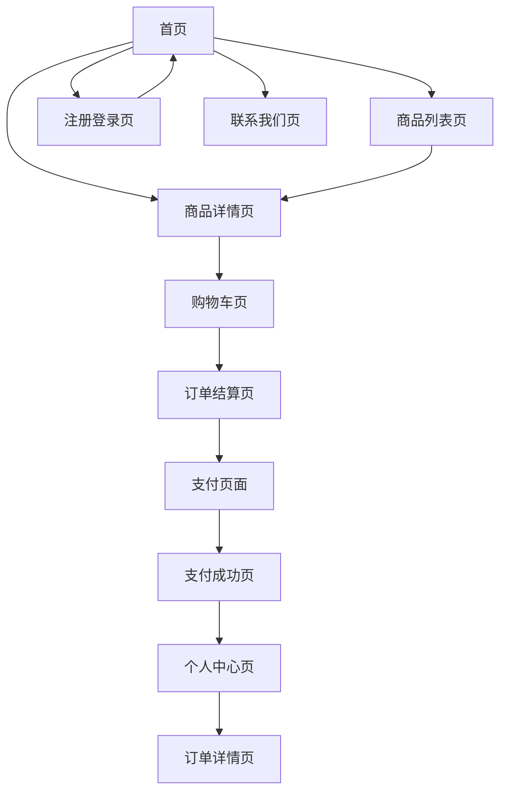

# 玉石雅韵电商平台产品需求文档

## 1. 产品概述

玉石雅韵是一个面向消费者的专业玉石交易电商平台，致力于传承千年玉石文化，为用户提供优质的玉石商品和专业的购物体验。平台以"温润如玉，雅致生活"为理念，打造集商品展示、在线交易、文化传播于一体的综合性玉石电商服务。

## 2. 核心功能

### 2.1 用户角色

| 角色 | 注册方式 | 核心权限 |
|------|----------|----------|
| 普通用户 | 邮箱、微信、支付宝注册 | 浏览商品、购买商品、查看订单、评价商品 |
| VIP用户 | 消费达到一定金额自动升级 | 享受专属折扣、优先客服、专属活动 |

### 2.2 功能模块

我们的玉石电商平台包含以下核心页面：

1. **首页**：品牌展示区、轮播图、商品分类导航、新品推荐、热销商品、新用户弹窗
2. **注册登录页**：多种登录方式、用户协议、找回密码
3. **商品列表页**：商品筛选、分类浏览、搜索功能、排序选项
4. **商品详情页**：商品图片展示、详细信息、规格选择、用户评价、相关推荐
5. **购物车页**：商品管理、数量调整、优惠券使用、结算功能
6. **订单结算页**：收货地址管理、配送方式选择、支付方式选择
7. **支付页面**：多种支付方式、安全支付保障
8. **个人中心页**：订单管理、地址管理、个人信息、收藏夹
9. **联系我们页**：客服联系、邮件咨询、常见问题

### 2.3 页面详情

| 页面名称 | 模块名称 | 功能描述 |
|----------|----------|----------|
| 首页 | 品牌展示区 | 展示"传承千年玉石文化"主题横幅，突出品牌文化价值 |
| 首页 | 轮播图 | 自动轮播展示精选商品和活动信息，支持手动切换 |
| 首页 | 商品分类 | 按玉石类型分类展示（白玉、青玉、黄玉、碧玉、墨玉等） |
| 首页 | 新品推荐 | 展示最新上架的精品玉石，包含商品图片、名称、价格 |
| 首页 | 热销商品 | 展示销量排行榜前列商品，显示销量数据和用户评分 |
| 首页 | 新用户弹窗 | 首次访问用户显示欢迎信息和注册优惠 |
| 注册登录页 | 多方式登录 | 支持邮箱、微信、支付宝三种登录注册方式 |
| 注册登录页 | 密码管理 | 提供找回密码、重置密码功能 |
| 商品列表页 | 筛选功能 | 按价格区间、玉石类型、产地、工艺等条件筛选 |
| 商品列表页 | 排序功能 | 支持按价格、销量、评分、上架时间排序 |
| 商品详情页 | 图片展示 | 高清大图展示，支持放大查看细节，多角度展示 |
| 商品详情页 | 商品信息 | 详细展示玉石材质、尺寸、重量、产地、工艺等信息 |
| 商品详情页 | 用户评价 | 显示用户评分、评价内容、晒图，支持评价筛选 |
| 购物车页 | 商品管理 | 添加、删除、修改商品数量，批量操作 |
| 购物车页 | 优惠计算 | 自动计算优惠券折扣、会员折扣等 |
| 订单结算页 | 地址管理 | 选择收货地址，新增、编辑、删除地址 |
| 订单结算页 | 配送选择 | 选择配送方式和时间，显示配送费用 |
| 支付页面 | 支付方式 | 支持贝宝、苹果支付、支付宝、微信支付、银行卡支付 |
| 支付页面 | 安全保障 | 显示支付安全认证，订单加密处理 |
| 个人中心页 | 订单管理 | 查看历史订单、订单状态跟踪、申请售后 |
| 个人中心页 | 个人信息 | 修改个人资料、头像上传、密码修改 |
| 联系我们页 | 客服系统 | 在线客服聊天、邮件联系表单 |
| 联系我们页 | 帮助中心 | 常见问题解答、购买指南、售后政策 |

## 3. 核心流程

**用户购物流程：**
用户首先访问首页浏览商品推荐，通过分类导航或搜索找到心仪商品，进入商品详情页查看详细信息和用户评价，确认购买后添加到购物车。在购物车中确认商品信息后进入结算页面，填写或选择收货地址，选择配送方式和支付方式，完成支付后生成订单。用户可在个人中心查看订单状态和物流信息。

**用户注册登录流程：**
新用户可选择邮箱、微信或支付宝方式注册账号，填写基本信息后完成注册。已注册用户可通过相应方式快速登录，支持记住登录状态和自动登录功能。

## 4. 用户界面设计

### 4.1 设计风格

- **主色调**：浅蓝色(#E8F4F8)、浅绿色(#E8F5E8)为主，白色(#FFFFFF)为背景色
- **辅助色**：深蓝色(#2E8B8B)用于按钮和链接，灰色(#666666)用于辅助文字
- **按钮样式**：圆角矩形按钮，渐变色彩，悬停效果自然过渡
- **字体**：主标题使用18-24px，正文使用14-16px，采用系统默认字体
- **布局风格**：卡片式布局，顶部导航栏固定，内容区域居中对齐
- **图标风格**：使用线性图标，风格统一简洁，不使用emoji表情

### 4.2 页面设计概览

| 页面名称 | 模块名称 | UI元素 |
|----------|----------|---------|
| 首页 | 品牌展示区 | 浅绿色渐变背景，大标题白色字体，居中布局，下方圆角按钮 |
| 首页 | 轮播图 | 全宽度图片展示，底部圆点指示器，左右切换箭头 |
| 首页 | 商品分类 | 横向滚动卡片布局，每个分类圆角图标配文字标签 |
| 首页 | 商品推荐 | 网格布局商品卡片，包含商品图片、名称、价格、评分 |
| 商品详情页 | 图片展示 | 大图主展示区，下方缩略图列表，支持点击切换 |
| 商品详情页 | 商品信息 | 标题、价格突出显示，详细参数表格化展示 |
| 购物车页 | 商品列表 | 列表式布局，左侧商品图片，右侧信息和操作按钮 |
| 支付页面 | 支付方式 | 图标+文字的选择列表，选中状态高亮显示 |

### 4.3 响应式设计

网站采用移动端优先的响应式设计，在手机端(320px-768px)采用单列布局，平板端(768px-1024px)采用双列布局，桌面端(1024px+)采用多列网格布局。所有交互元素针对触屏操作进行优化，按钮尺寸不小于44px，确保良好的触控体验。