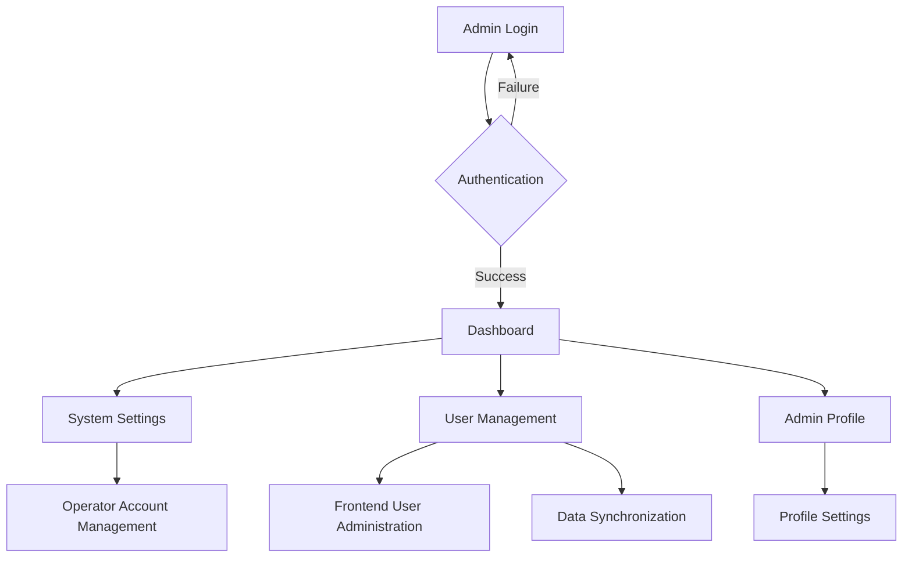

# Backend Management System - Product Requirements Document

## 1. Product Overview

A comprehensive backend management system for the jade shopping e-commerce platform, providing secure administrative control over system operations, user management, and operator account administration. The system enables administrators to manage frontend users, configure system settings, and maintain operational security through role-based access control.

The system addresses the need for centralized administration of the e-commerce platform, ensuring data consistency between frontend and backend operations while maintaining secure authentication protocols for administrative access.

## 2. Core Features

### 2.1 User Roles

| Role | Registration Method | Core Permissions |
|------|---------------------|------------------|
| Super Admin | System initialization with default credentials | Full system access, operator management, system configuration |
| System Admin | Created by Super Admin | User management, content management, order processing |
| Operator | Created by Admin users | Limited access to assigned modules |

### 2.2 Feature Module

Our backend management system consists of the following main pages:

1. **Admin Login Page**: Secure authentication portal with credential validation
2. **Dashboard Page**: System overview, statistics, and quick access navigation
3. **System Settings Page**: Operator account management, system configuration
4. **User Management Page**: Frontend user administration, data synchronization
5. **Admin Profile Page**: Administrator account settings and preferences

### 2.3 Page Details

| Page Name | Module Name | Feature description |
|-----------|-------------|---------------------|
| Admin Login Page | Authentication System | Secure login with username/password validation, session management, remember me functionality |
| Dashboard Page | System Overview | Display system statistics, recent activities, quick navigation to key modules |
| System Settings Page | Operator Account Management | Create, edit, delete operator accounts; manage permissions and roles; default admin account setup |
| User Management Page | Frontend User Administration | View, edit, delete frontend users; remove mock data; ensure data consistency with frontend |
| User Management Page | Data Synchronization | Real-time sync between frontend user data and backend management system |
| Admin Profile Page | Account Management | Update admin profile, change password, manage personal settings |

## 3. Core Process

### Admin Authentication Flow
1. Admin accesses `/admin` route
2. System redirects to `/admin/login` if not authenticated
3. Admin enters credentials (default: admin/123456)
4. System validates credentials and creates secure session
5. Admin is redirected to dashboard upon successful authentication

### User Management Flow
1. Admin navigates to User Management section
2. System displays all frontend users (no mock data)
3. Admin can view, edit, or delete user accounts
4. Changes are synchronized with frontend user data in real-time
5. System maintains data consistency across all platforms

### Operator Account Management Flow
1. Super Admin accesses System Settings
2. Admin creates new operator accounts with specific roles
3. System assigns appropriate permissions based on role
4. New operators can login with assigned credentials
5. Admin can modify or deactivate operator accounts as needed

## 4. User Interface Design

### 4.1 Design Style

- **Primary Colors**: Emerald (#059669), Teal (#0d9488)
- **Secondary Colors**: Gray (#6b7280), White (#ffffff)
- **Button Style**: Rounded corners with subtle shadows, hover effects
- **Font**: System fonts with 14px base size, bold headings
- **Layout Style**: Clean sidebar navigation, card-based content areas
- **Icons**: Lucide React icons for consistency and clarity

### 4.2 Page Design Overview

| Page Name | Module Name | UI Elements |
|-----------|-------------|-------------|
| Admin Login Page | Authentication Form | Centered login card, emerald gradient background, logo display, input fields with icons, loading states |
| Dashboard Page | Statistics Cards | Grid layout with metric cards, chart visualizations, quick action buttons, notification badges |
| System Settings Page | Operator Management | Data table with search/filter, modal forms for account creation, role selection dropdowns, status indicators |
| User Management Page | User Administration | Comprehensive data table, advanced filtering, bulk actions, real-time status updates, sync indicators |
| Admin Profile Page | Profile Settings | Form-based layout, avatar upload, password change section, preference toggles |

### 4.3 Responsiveness

The system is desktop-first with mobile-adaptive design. Touch interaction optimization is considered for tablet usage, with responsive breakpoints at 768px and 1024px for optimal viewing across devices.

## 5. Security Requirements

### 5.1 Authentication Security
- Secure session management with JWT tokens
- Password hashing using bcrypt
- Session timeout and automatic logout
- Failed login attempt monitoring

### 5.2 Data Protection
- Role-based access control (RBAC)
- Input validation and sanitization
- SQL injection prevention
- XSS protection measures

### 5.3 System Security
- HTTPS enforcement
- CORS configuration
- Rate limiting for API endpoints
- Audit logging for administrative actions

## 6. Data Consistency Requirements

### 6.1 User Data Synchronization
- Real-time sync between frontend and backend user data
- Elimination of all mock user data
- Consistent user state across all system components
- Data validation and integrity checks

### 6.2 System Integration
- Seamless integration with existing e-commerce platform
- Consistent data models across frontend and backend
- Transaction-based data operations
- Rollback capabilities for failed operations