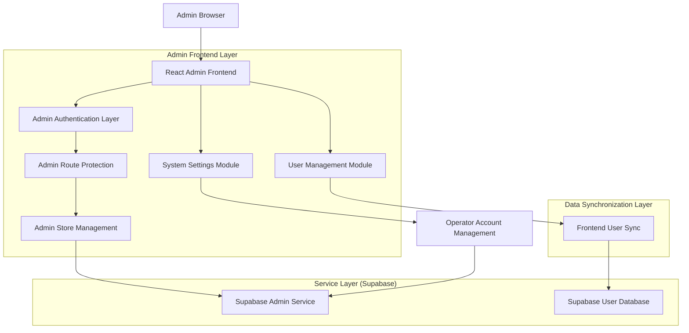
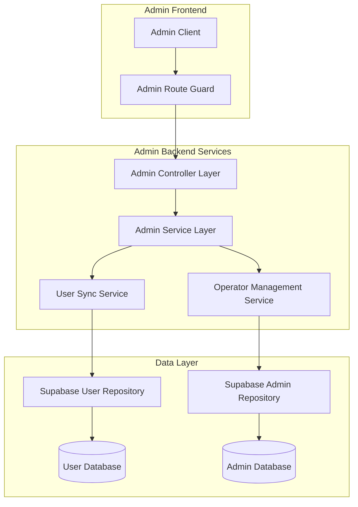
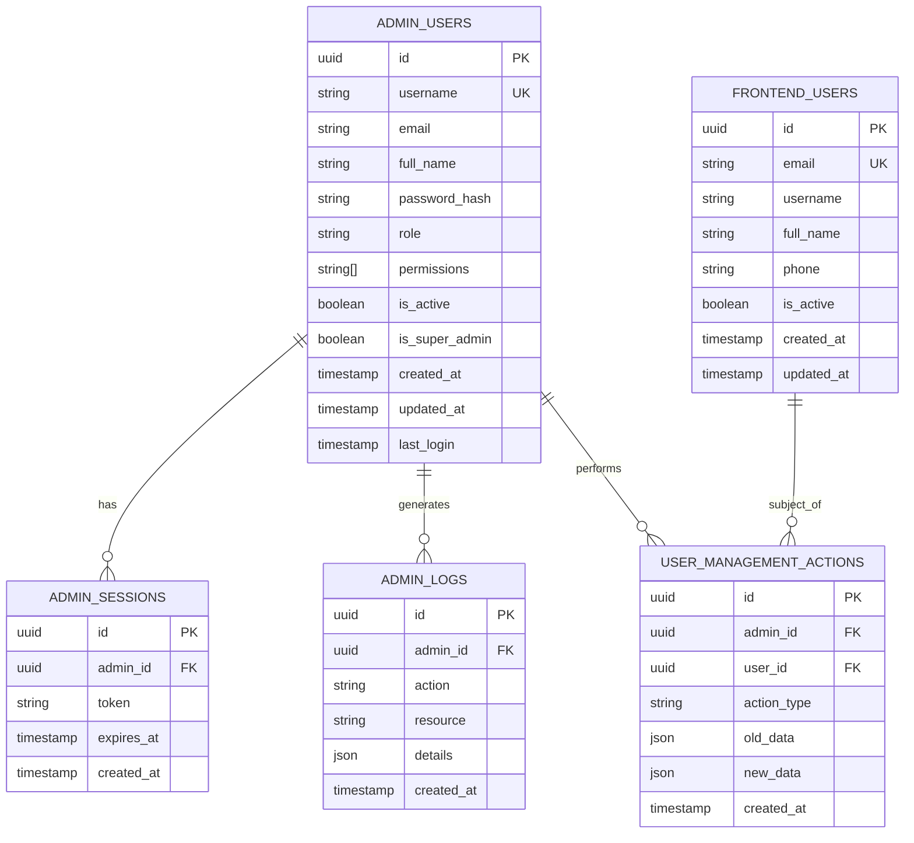

# Backend Management System - Technical Architecture Document

## 1. Architecture Design



## 2. Technology Description

- Frontend: React@18 + TypeScript + Tailwind CSS + Vite
- Backend: Supabase (Authentication, Database, Real-time subscriptions)
- State Management: Zustand
- Routing: React Router v6
- UI Components: Lucide React Icons + Custom Components
- Authentication: Supabase Auth with custom admin roles

## 3. Route Definitions

| Route | Purpose |
|-------|---------|
| /admin/login | Admin authentication page |
| /admin | Admin dashboard with system overview |
| /admin/settings | System settings and operator account management |
| /admin/settings/admins | Operator account list and management |
| /admin/users | Frontend user management and administration |
| /admin/profile | Admin profile settings and preferences |

## 4. API Definitions

### 4.1 Admin Authentication API

**Admin Login**
```
POST /api/admin/auth/login
```

Request:
| Param Name | Param Type | isRequired | Description |
|------------|------------|------------|-------------|
| username | string | true | Admin username |
| password | string | true | Admin password |

Response:
| Param Name | Param Type | Description |
|------------|------------|-------------|
| success | boolean | Authentication status |
| admin | AdminUser | Admin user details |
| token | string | JWT authentication token |

Example:
```json
{
  "username": "admin",
  "password": "123456"
}
```

**Admin Logout**
```
POST /api/admin/auth/logout
```

### 4.2 Operator Management API

**Create Operator Account**
```
POST /api/admin/operators
```

Request:
| Param Name | Param Type | isRequired | Description |
|------------|------------|------------|-------------|
| username | string | true | Operator username |
| email | string | true | Operator email |
| full_name | string | true | Operator full name |
| role | AdminRole | true | Operator role |
| permissions | string[] | true | Assigned permissions |

**Get Operators List**
```
GET /api/admin/operators
```

**Update Operator**
```
PUT /api/admin/operators/:id
```

**Delete Operator**
```
DELETE /api/admin/operators/:id
```

### 4.3 User Management API

**Get Frontend Users**
```
GET /api/admin/users
```

**Update User Status**
```
PUT /api/admin/users/:id/status
```

**Delete User**
```
DELETE /api/admin/users/:id
```

**Sync User Data**
```
POST /api/admin/users/sync
```

## 5. Server Architecture Diagram



## 6. Data Model

### 6.1 Data Model Definition



### 6.2 Data Definition Language

**Admin Users Table**
```sql
-- Create admin users table
CREATE TABLE admin_users (
    id UUID PRIMARY KEY DEFAULT gen_random_uuid(),
    username VARCHAR(50) UNIQUE NOT NULL,
    email VARCHAR(255) UNIQUE,
    full_name VARCHAR(100) NOT NULL,
    password_hash VARCHAR(255) NOT NULL,
    role VARCHAR(20) DEFAULT 'admin' CHECK (role IN ('super_admin', 'admin', 'operator')),
    permissions TEXT[] DEFAULT '{}',
    is_active BOOLEAN DEFAULT true,
    is_super_admin BOOLEAN DEFAULT false,
    created_at TIMESTAMP WITH TIME ZONE DEFAULT NOW(),
    updated_at TIMESTAMP WITH TIME ZONE DEFAULT NOW(),
    last_login TIMESTAMP WITH TIME ZONE
);

-- Create indexes
CREATE INDEX idx_admin_users_username ON admin_users(username);
CREATE INDEX idx_admin_users_email ON admin_users(email);
CREATE INDEX idx_admin_users_role ON admin_users(role);
CREATE INDEX idx_admin_users_is_active ON admin_users(is_active);

-- Insert default admin account
INSERT INTO admin_users (username, email, full_name, password_hash, role, is_super_admin, permissions)
VALUES (
    'admin',
    'admin@jadeshopping.com',
    'System Administrator',
    '$2b$10$rQZ8kHWKtGKVQZ8kHWKtGOyQZ8kHWKtGKVQZ8kHWKtGKVQZ8kHWKtG', -- hashed '123456'
    'super_admin',
    true,
    ARRAY['all']
);
```

**Admin Sessions Table**
```sql
-- Create admin sessions table
CREATE TABLE admin_sessions (
    id UUID PRIMARY KEY DEFAULT gen_random_uuid(),
    admin_id UUID REFERENCES admin_users(id) ON DELETE CASCADE,
    token VARCHAR(500) NOT NULL,
    expires_at TIMESTAMP WITH TIME ZONE NOT NULL,
    created_at TIMESTAMP WITH TIME ZONE DEFAULT NOW()
);

-- Create indexes
CREATE INDEX idx_admin_sessions_admin_id ON admin_sessions(admin_id);
CREATE INDEX idx_admin_sessions_token ON admin_sessions(token);
CREATE INDEX idx_admin_sessions_expires_at ON admin_sessions(expires_at);
```

**Admin Activity Logs Table**
```sql
-- Create admin logs table
CREATE TABLE admin_logs (
    id UUID PRIMARY KEY DEFAULT gen_random_uuid(),
    admin_id UUID REFERENCES admin_users(id) ON DELETE SET NULL,
    action VARCHAR(100) NOT NULL,
    resource VARCHAR(100) NOT NULL,
    details JSONB DEFAULT '{}',
    ip_address INET,
    user_agent TEXT,
    created_at TIMESTAMP WITH TIME ZONE DEFAULT NOW()
);

-- Create indexes
CREATE INDEX idx_admin_logs_admin_id ON admin_logs(admin_id);
CREATE INDEX idx_admin_logs_action ON admin_logs(action);
CREATE INDEX idx_admin_logs_created_at ON admin_logs(created_at DESC);
```

**User Management Actions Table**
```sql
-- Create user management actions table
CREATE TABLE user_management_actions (
    id UUID PRIMARY KEY DEFAULT gen_random_uuid(),
    admin_id UUID REFERENCES admin_users(id) ON DELETE SET NULL,
    user_id UUID REFERENCES users(id) ON DELETE CASCADE,
    action_type VARCHAR(50) NOT NULL,
    old_data JSONB,
    new_data JSONB,
    created_at TIMESTAMP WITH TIME ZONE DEFAULT NOW()
);

-- Create indexes
CREATE INDEX idx_user_mgmt_actions_admin_id ON user_management_actions(admin_id);
CREATE INDEX idx_user_mgmt_actions_user_id ON user_management_actions(user_id);
CREATE INDEX idx_user_mgmt_actions_created_at ON user_management_actions(created_at DESC);
```

**Row Level Security Policies**
```sql
-- Enable RLS on admin tables
ALTER TABLE admin_users ENABLE ROW LEVEL SECURITY;
ALTER TABLE admin_sessions ENABLE ROW LEVEL SECURITY;
ALTER TABLE admin_logs ENABLE ROW LEVEL SECURITY;

-- Admin users can only see themselves unless they're super admin
CREATE POLICY "Admin users can view own profile" ON admin_users
    FOR SELECT USING (auth.uid()::text = id::text OR 
                     EXISTS(SELECT 1 FROM admin_users WHERE id::text = auth.uid()::text AND is_super_admin = true));

-- Only super admins can modify admin users
CREATE POLICY "Super admins can manage admin users" ON admin_users
    FOR ALL USING (EXISTS(SELECT 1 FROM admin_users WHERE id::text = auth.uid()::text AND is_super_admin = true));

-- Admins can view their own sessions
CREATE POLICY "Admins can view own sessions" ON admin_sessions
    FOR SELECT USING (admin_id::text = auth.uid()::text);

-- Grant permissions
GRANT SELECT ON admin_users TO authenticated;
GRANT ALL ON admin_sessions TO authenticated;
GRANT ALL ON admin_logs TO authenticated;
GRANT ALL ON user_management_actions TO authenticated;
```

## 7. Security Implementation

### 7.1 Authentication Security
- JWT tokens with 24-hour expiration
- Secure password hashing using bcrypt (cost factor 12)
- Session management with automatic cleanup
- Multi-factor authentication support (future enhancement)

### 7.2 Authorization Security
- Role-based access control (RBAC)
- Permission-based route protection
- API endpoint authorization middleware
- Resource-level access control

### 7.3 Data Security
- Row Level Security (RLS) policies in Supabase
- Input validation and sanitization
- SQL injection prevention
- XSS protection with Content Security Policy

### 7.4 Audit and Monitoring
- Comprehensive admin action logging
- Failed login attempt monitoring
- Real-time security event alerts
- Regular security audit reports