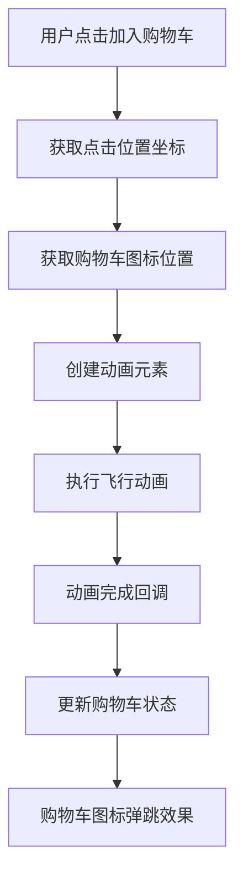
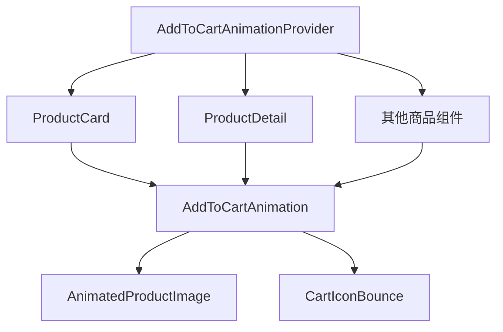

# 加入购物车动画效果技术架构文档

## 1. 项目概述

本文档详细描述了为Jade购物网站所有页面的"加入购物车"功能添加点击动画效果的技术实现方案。动画效果将提供商品飞入购物车的视觉轨迹，增强用户体验和操作反馈。

## 2. 动画需求分析

### 2.1 功能需求
- **动画流畅性**: 使用60fps的流畅动画，确保视觉体验自然
- **持续时间**: 300-500毫秒的动画时长，平衡视觉效果和用户等待时间
- **视觉轨迹**: 商品图片从点击位置飞向购物车图标的抛物线轨迹
- **状态反馈**: 动画结束后立即更新购物车数量显示
- **性能要求**: 不影响页面性能，兼容主流浏览器

### 2.2 视觉效果要求
- 商品图片缩放效果（从原始大小缩小到购物车图标大小）
- 透明度渐变（从100%到0%）
- 抛物线运动轨迹
- 购物车图标的弹跳反馈效果

## 3. 技术实现方案

### 3.1 技术栈选择
- **动画库**: Framer Motion - 提供强大的动画能力和React集成
- **状态管理**: 现有的Zustand store
- **样式方案**: Tailwind CSS + 自定义CSS动画
- **性能优化**: CSS Transform硬件加速

### 3.2 核心组件设计

#### AddToCartAnimation 组件
```typescript
interface AddToCartAnimationProps {
  isAnimating: boolean;
  productImage: string;
  startPosition: { x: number; y: number };
  endPosition: { x: number; y: number };
  onAnimationComplete: () => void;
}
```

#### 动画触发器 Hook
```typescript
interface UseAddToCartAnimationReturn {
  triggerAnimation: (product: Product, clickEvent: React.MouseEvent) => void;
  isAnimating: boolean;
  animationData: AnimationData | null;
}
```

### 3.3 动画实现流程



## 4. 组件架构设计

### 4.1 动画组件层次结构



### 4.2 状态管理

#### 动画状态接口
```typescript
interface AnimationState {
  isAnimating: boolean;
  animationQueue: AnimationData[];
  currentAnimation: AnimationData | null;
}

interface AnimationData {
  id: string;
  product: Product;
  startPosition: Position;
  endPosition: Position;
  timestamp: number;
}
```

## 5. 核心实现代码

### 5.1 AddToCartAnimation 组件

```typescript
import React from 'react';
import { motion, AnimatePresence } from 'framer-motion';

const AddToCartAnimation: React.FC<AddToCartAnimationProps> = ({
  isAnimating,
  productImage,
  startPosition,
  endPosition,
  onAnimationComplete
}) => {
  const animationVariants = {
    initial: {
      x: startPosition.x,
      y: startPosition.y,
      scale: 1,
      opacity: 1,
    },
    animate: {
      x: endPosition.x,
      y: endPosition.y,
      scale: 0.3,
      opacity: 0,
      transition: {
        duration: 0.4,
        ease: [0.25, 0.46, 0.45, 0.94], // 自定义贝塞尔曲线
      }
    }
  };

  return (
    <AnimatePresence>
      {isAnimating && (
        <motion.div
          className="fixed z-50 pointer-events-none"
          variants={animationVariants}
          initial="initial"
          animate="animate"
          onAnimationComplete={onAnimationComplete}
        >
          
        </motion.div>
      )}
    </AnimatePresence>
  );
};
```

### 5.2 动画触发 Hook

```typescript
import { useState, useCallback } from 'react';
import { useStore } from '@/store/useStore';

export const useAddToCartAnimation = () => {
  const [animationState, setAnimationState] = useState<AnimationState>({
    isAnimating: false,
    animationQueue: [],
    currentAnimation: null,
  });

  const { addToCart } = useStore();

  const getCartIconPosition = useCallback(() => {
    const cartIcon = document.querySelector('[data-cart-icon]');
    if (cartIcon) {
      const rect = cartIcon.getBoundingClientRect();
      return {
        x: rect.left + rect.width / 2,
        y: rect.top + rect.height / 2,
      };
    }
    return { x: window.innerWidth - 50, y: 50 }; // 默认位置
  }, []);

  const triggerAnimation = useCallback((
    product: Product, 
    clickEvent: React.MouseEvent
  ) => {
    const startPosition = {
      x: clickEvent.clientX,
      y: clickEvent.clientY,
    };
    
    const endPosition = getCartIconPosition();
    
    const animationData: AnimationData = {
      id: `${product.id}-${Date.now()}`,
      product,
      startPosition,
      endPosition,
      timestamp: Date.now(),
    };

    setAnimationState(prev => ({
      ...prev,
      isAnimating: true,
      currentAnimation: animationData,
    }));
  }, [getCartIconPosition]);

  const onAnimationComplete = useCallback(() => {
    if (animationState.currentAnimation) {
      // 添加到购物车
      addToCart(animationState.currentAnimation.product);
      
      // 触发购物车图标弹跳效果
      const cartIcon = document.querySelector('[data-cart-icon]');
      if (cartIcon) {
        cartIcon.classList.add('animate-bounce');
        setTimeout(() => {
          cartIcon.classList.remove('animate-bounce');
        }, 600);
      }
    }

    setAnimationState(prev => ({
      ...prev,
      isAnimating: false,
      currentAnimation: null,
    }));
  }, [animationState.currentAnimation, addToCart]);

  return {
    triggerAnimation,
    isAnimating: animationState.isAnimating,
    animationData: animationState.currentAnimation,
    onAnimationComplete,
  };
};
```

### 5.3 ProductCard 组件集成

```typescript
// 在 ProductCard 组件中的修改
const ProductCard: React.FC<ProductCardProps> = ({ product, onAddToCart, ...props }) => {
  const { triggerAnimation, isAnimating, animationData, onAnimationComplete } = useAddToCartAnimation();

  const handleAddToCart = (e: React.MouseEvent) => {
    e.preventDefault();
    e.stopPropagation();
    
    // 触发动画而不是直接添加到购物车
    triggerAnimation(product, e);
  };

  return (
    <>
      {/* 原有的 ProductCard JSX */}
      <Card className="group relative overflow-hidden hover:shadow-lg transition-shadow duration-300">
        {/* ... 其他内容 ... */}
        <Button
          variant="primary"
          size="sm"
          onClick={handleAddToCart}
          disabled={product.stock_quantity === 0 || isAnimating}
        >
          <ShoppingCart className="h-4 w-4 mr-1" />
          {isAnimating ? '添加中...' : '加入购物车'}
        </Button>
      </Card>

      {/* 动画组件 */}
      {animationData && (
        <AddToCartAnimation
          isAnimating={isAnimating}
          productImage={product.image_url}
          startPosition={animationData.startPosition}
          endPosition={animationData.endPosition}
          onAnimationComplete={onAnimationComplete}
        />
      )}
    </>
  );
};
```

### 5.4 Header 组件购物车图标修改

```typescript
// 在 Header 组件中添加 data-cart-icon 属性
<div className="relative" data-cart-icon>
  <ShoppingCart className="w-6 h-6" />
  {cartItemCount > 0 && (
    <span className="absolute -top-2 -right-2 bg-jade-500 text-red-500 text-sm font-bold rounded-full h-5 w-5 flex items-center justify-center">
      {cartItemCount}
    </span>
  )}
</div>
```

## 6. 性能优化策略

### 6.1 硬件加速
- 使用 CSS `transform` 和 `opacity` 属性进行动画
- 避免修改 `width`、`height`、`top`、`left` 等会触发重排的属性
- 启用 GPU 加速：`will-change: transform`

### 6.2 动画队列管理
```typescript
// 防止动画堆积的队列管理
const MAX_CONCURRENT_ANIMATIONS = 3;
const ANIMATION_COOLDOWN = 100; // 毫秒

const manageAnimationQueue = () => {
  // 限制同时进行的动画数量
  // 实现动画冷却时间
  // 优化内存使用
};
```

### 6.3 浏览器兼容性
- 使用 Framer Motion 的自动降级功能
- 为不支持的浏览器提供简单的状态更新
- 检测 `prefers-reduced-motion` 用户偏好

## 7. 测试策略

### 7.1 功能测试
- 验证动画在所有页面正常触发
- 测试购物车状态正确更新
- 验证动画完成后的回调执行

### 7.2 性能测试
- 监控动画期间的 FPS
- 测试内存使用情况
- 验证在低端设备上的表现

### 7.3 用户体验测试
- 测试动画的视觉流畅性
- 验证用户操作反馈的及时性
- 测试无障碍访问支持

## 8. 部署和维护

### 8.1 渐进式部署
1. 首先在 ProductCard 组件中实现
2. 扩展到 ProductDetail 页面
3. 添加到其他相关组件

### 8.2 监控和分析
- 添加动画性能监控
- 收集用户交互数据
- 监控错误和异常情况

### 8.3 配置选项
```typescript
interface AnimationConfig {
  duration: number;
  easing: string;
  enabled: boolean;
  respectReducedMotion: boolean;
}
```

## 9. 总结

本技术架构文档提供了完整的"加入购物车"动画效果实现方案，包括：

- 基于 Framer Motion 的流畅动画实现
- 可复用的组件设计模式
- 完善的性能优化策略
- 全面的测试和部署计划

通过这个实现方案，用户将获得更加直观和愉悦的购物体验，同时保证了系统的性能和稳定性。