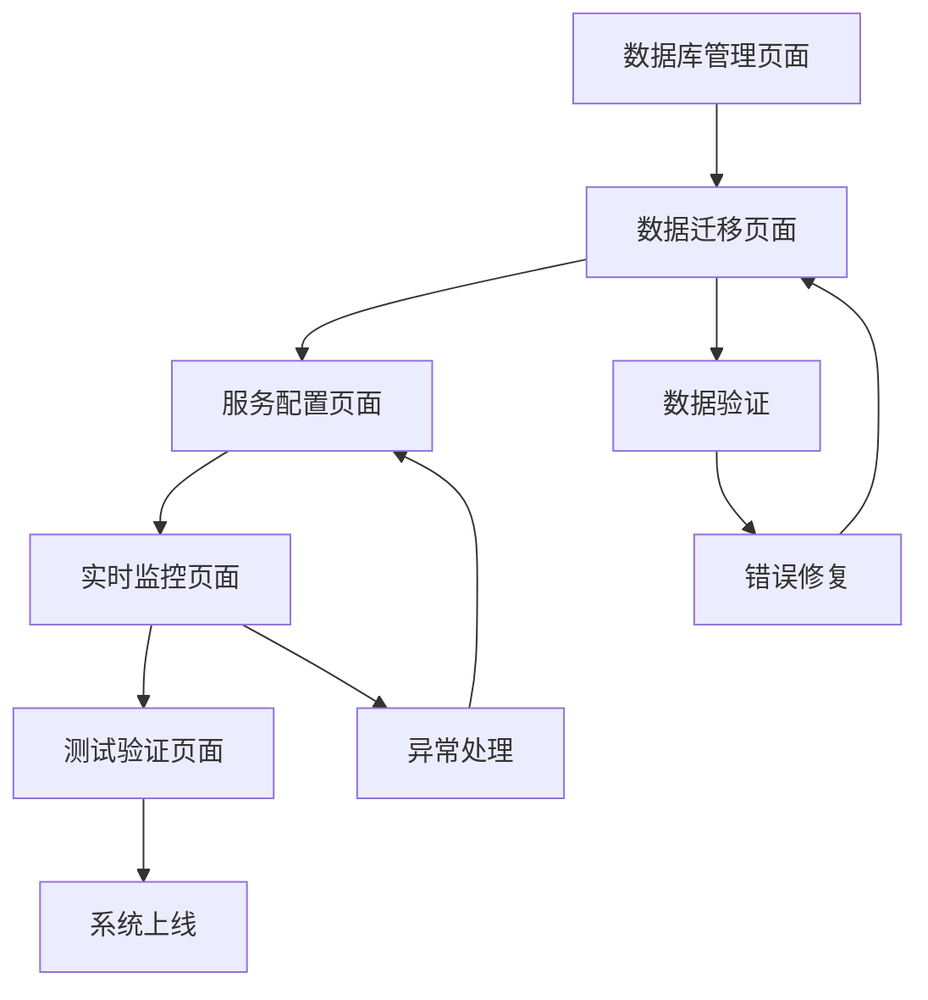

# 前端网站数据迁移产品需求文档

## 1. 产品概述

本项目旨在将玉石轩电商网站的所有前端模拟数据完全迁移到Supabase数据库系统，实现从静态数据到动态数据库驱动的全面升级。通过建立完整的数据库架构、实现实时数据同步，为网站提供可扩展、高性能的数据管理能力。

- 解决问题：替换当前使用的mockData.ts静态数据，建立真实的数据库驱动系统
- 目标用户：网站管理员、开发团队、最终用户
- 产品价值：提升数据管理效率，支持业务扩展，实现数据实时同步和持久化存储

## 2. 核心功能

### 2.1 用户角色

| 角色 | 注册方式 | 核心权限 |
|------|----------|----------|
| 系统管理员 | 内部分配 | 完整数据库管理权限，数据迁移执行权限 |
| 前端用户 | 邮箱注册 | 浏览商品、下单、查看个人信息 |
| 开发人员 | 技术团队 | 数据服务层开发，API集成权限 |

### 2.2 功能模块

数据迁移系统包含以下核心模块：

1. **数据库设计模块**：表结构设计、关系建立、索引优化
2. **数据迁移模块**：模拟数据转换、批量导入、数据验证
3. **服务层重构模块**：API服务创建、数据访问层、缓存机制
4. **实时同步模块**：Supabase订阅、状态管理、数据更新通知
5. **测试验证模块**：功能测试、性能测试、数据完整性验证

### 2.3 页面详情

| 页面名称 | 模块名称 | 功能描述 |
|----------|----------|----------|
| 数据库管理页面 | 表结构管理 | 创建和管理所有数据表，设置外键关系，配置索引和约束 |
| 数据迁移页面 | 数据导入工具 | 批量导入商品、分类、用户、订单等数据，提供进度监控和错误处理 |
| 服务配置页面 | API服务管理 | 配置数据服务层，管理Supabase连接，设置缓存策略 |
| 实时监控页面 | 同步状态监控 | 监控数据同步状态，查看实时更新日志，处理同步异常 |
| 测试验证页面 | 功能测试工具 | 执行数据完整性测试，性能基准测试，功能回归测试 |

## 3. 核心流程

### 数据迁移主流程

1. **准备阶段**：分析现有mockData.ts结构，设计数据库表结构
2. **迁移阶段**：创建数据表，导入模拟数据，建立数据关系
3. **重构阶段**：替换前端数据访问代码，创建服务层API
4. **测试阶段**：验证数据完整性，测试功能正常性
5. **上线阶段**：切换到数据库系统，监控系统稳定性

### 页面导航流程图

## 4. 用户界面设计

### 4.1 设计风格

- **主色调**：翡翠绿 (#10B981)，象征玉石的天然色彩
- **辅助色**：深灰色 (#374151) 用于文本，浅灰色 (#F9FAFB) 用于背景
- **按钮样式**：圆角设计，悬停效果，渐变背景
- **字体**：Inter字体，标题16-24px，正文14-16px
- **布局风格**：卡片式布局，顶部导航，响应式设计
- **图标风格**：Lucide React图标库，简洁现代风格

### 4.2 页面设计概览

| 页面名称 | 模块名称 | UI元素 |
|----------|----------|---------|
| 数据库管理页面 | 表结构展示 | 表格布局，绿色主题，操作按钮，状态指示器 |
| 数据迁移页面 | 进度监控 | 进度条，实时日志，成功/错误状态，操作面板 |
| 服务配置页面 | 配置表单 | 表单输入框，开关按钮，配置预览，保存确认 |
| 实时监控页面 | 状态仪表板 | 实时图表，状态卡片，日志流，告警通知 |
| 测试验证页面 | 测试结果 | 测试报告，通过/失败标识，详细日志，重试按钮 |

### 4.3 响应式设计

- **桌面优先**：主要针对管理员和开发人员的桌面端操作
- **移动适配**：支持平板和手机端的基本查看功能
- **触控优化**：按钮和交互元素适配触控操作

## 5. 数据迁移详细规范

### 5.1 数据范围

**商品数据迁移**：
- 商品基本信息（名称、描述、价格、库存）
- 商品图片和画廊
- 商品规格和属性
- 商品评价和评分
- 相关商品推荐

**分类数据迁移**：
- 主分类和子分类层级结构
- 分类图标、颜色、标签
- 分类统计信息
- 分类排序和展示配置

**用户数据迁移**：
- 用户基本信息和认证数据
- 收货地址信息
- 用户优惠券和积分
- 用户行为日志

**订单数据迁移**：
- 订单基本信息和状态
- 订单商品明细
- 支付和配送信息
- 订单跟踪记录

**网站内容数据迁移**：
- About、Contact、Help页面内容
- Shipping、Returns、Privacy、Terms页面内容
- 网站配置和设置信息
- 轮播图和广告内容

### 5.2 数据库表设计

**核心数据表**：
- `products` - 商品信息表
- `categories` - 分类信息表
- `users` - 用户信息表
- `orders` - 订单信息表
- `order_items` - 订单明细表
- `reviews` - 商品评价表
- `addresses` - 收货地址表
- `coupons` - 优惠券表
- `content_pages` - 网站内容页面表

**关系设计**：
- 商品与分类：多对一关系
- 订单与用户：多对一关系
- 订单与商品：多对多关系（通过order_items）
- 评价与商品、用户：多对一关系
- 地址与用户：多对一关系

### 5.3 实时同步要求

**Supabase实时功能**：
- 商品库存实时更新
- 订单状态变更通知
- 用户操作实时反馈
- 数据变更日志记录

**前端状态管理**：
- 使用Zustand管理全局状态
- 实现乐观更新机制
- 处理网络异常和重连
- 缓存策略和数据预加载

### 5.4 安全和性能要求

**数据安全**：
- 实施行级安全策略（RLS）
- 用户数据访问权限控制
- 敏感信息加密存储
- API访问频率限制

**性能优化**：
- 数据库索引优化
- 查询性能监控
- 缓存策略实施
- 分页和懒加载

## 6. 技术实现要求

### 6.1 数据服务层

创建专门的数据服务模块：
- `productService.ts` - 商品数据服务
- `orderService.ts` - 订单数据服务
- `userService.ts` - 用户数据服务
- `contentService.ts` - 内容数据服务

### 6.2 迁移策略

**分阶段迁移**：
1. 第一阶段：基础数据表创建和核心数据迁移
2. 第二阶段：关联数据和复杂关系建立
3. 第三阶段：前端代码重构和服务层集成
4. 第四阶段：测试验证和性能优化

**数据验证**：
- 数据完整性检查
- 业务逻辑验证
- 性能基准测试
- 用户体验测试

### 6.3 风险控制

**回滚机制**：
- 保留原有mockData.ts作为备份
- 实施渐进式切换策略
- 建立数据恢复流程
- 监控系统稳定性指标

**质量保证**：
- 自动化测试覆盖
- 代码审查流程
- 性能监控告警
- 用户反馈收集机制