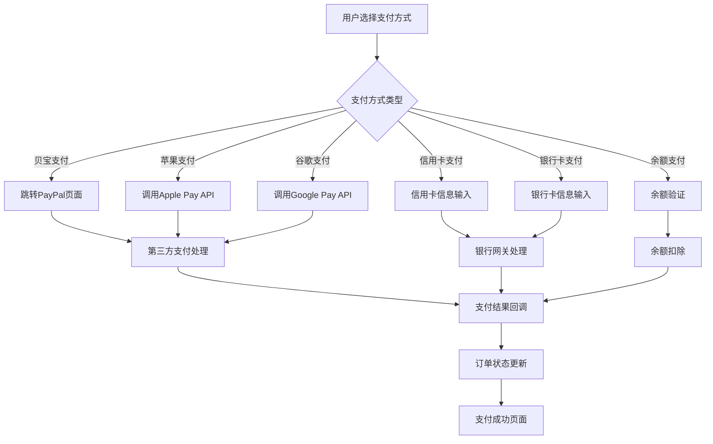

# 玉石交易电商网站 - 支付结算模块产品需求文档

## 1. 产品概述

本文档定义了玉石交易电商网站的支付结算模块功能需求，旨在为用户提供安全、便捷、多样化的支付体验。该模块支持多种主流支付方式，确保交易安全性和用户体验的最优化。

支付结算模块是电商平台的核心功能之一，直接影响用户的购买决策和平台的转化率。通过提供多元化的支付选择，满足不同用户的支付习惯和需求。

## 2. 核心功能

### 2.1 用户角色

| 角色 | 注册方式 | 核心权限 |
|------|----------|----------|
| 普通用户 | 邮箱注册/第三方登录 | 浏览商品、添加购物车、进行支付结算 |
| 会员用户 | 升级或邀请码 | 享受会员折扣、优先客服、专属活动 |
| 管理员 | 系统分配 | 订单管理、支付监控、退款处理 |

### 2.2 功能模块

支付结算模块包含以下核心页面：

1. **购物车页面**：商品确认、数量调整、结算入口
2. **结算页面**：地址选择、支付方式选择、订单确认
3. **支付页面**：支付方式详情、支付确认、安全验证
4. **订单成功页面**：支付结果展示、订单详情、后续操作

### 2.3 页面详情

| 页面名称 | 模块名称 | 功能描述 |
|----------|----------|----------|
| 购物车页面 | 商品列表 | 展示已添加商品、支持批量选择、数量修改、商品删除 |
| 购物车页面 | 价格计算 | 实时计算小计、运费、优惠券折扣、总价 |
| 购物车页面 | 结算按钮 | 验证商品库存、跳转结算页面 |
| 结算页面 | 收货地址 | 地址选择、新增地址、地址编辑、默认地址设置 |
| 结算页面 | 支付方式 | 六种支付方式选择、支付方式详情展示 |
| 结算页面 | 订单摘要 | 商品清单、价格明细、优惠券应用 |
| 结算页面 | 提交订单 | 订单验证、库存检查、支付流程启动 |
| 支付页面 | 支付确认 | 订单信息确认、支付金额确认、支付方式切换 |
| 支付页面 | 安全验证 | 密码验证、短信验证、生物识别验证 |
| 订单成功页面 | 支付结果 | 支付状态展示、订单号生成、支付凭证 |
| 订单成功页面 | 订单详情 | 商品信息、收货地址、支付信息、物流跟踪 |

## 3. 核心流程

### 3.1 购物车结算流程

用户在购物车页面选择商品后，点击结算按钮进入结算页面。系统验证商品库存和价格，用户选择收货地址和支付方式，确认订单信息后提交。根据选择的支付方式，跳转到相应的支付页面完成支付，最后显示订单成功页面。

### 3.2 支付方式处理流程

## 4. 用户界面设计

### 4.1 设计风格

- **主色调**：翡翠绿 (#10B981)、深绿 (#059669)
- **辅助色**：金色 (#F59E0B)、灰色 (#6B7280)
- **按钮样式**：圆角设计、渐变效果、悬停动画
- **字体**：中文使用思源黑体、英文使用Inter
- **布局风格**：卡片式设计、响应式布局、移动端优先
- **图标风格**：线性图标、支付品牌官方图标

### 4.2 页面设计概览

| 页面名称 | 模块名称 | UI元素 |
|----------|----------|--------|
| 购物车页面 | 商品卡片 | 商品图片、名称、价格、数量选择器、删除按钮 |
| 购物车页面 | 结算栏 | 选中商品数量、总价、结算按钮、优惠券入口 |
| 结算页面 | 地址卡片 | 收货人信息、地址详情、默认标签、编辑按钮 |
| 结算页面 | 支付方式 | 支付图标、支付名称、支付描述、选择状态 |
| 结算页面 | 订单摘要 | 商品列表、价格明细、优惠信息、总价突出显示 |
| 支付页面 | 支付表单 | 支付信息输入、安全提示、支付按钮、取消链接 |
| 订单成功页面 | 成功状态 | 成功图标、订单号、支付金额、查看订单按钮 |

### 4.3 响应式设计

- **桌面端**：三栏布局，左侧商品信息，右侧订单摘要
- **平板端**：两栏布局，适配中等屏幕尺寸
- **移动端**：单栏布局，垂直排列，底部固定操作栏
- **触摸优化**：按钮尺寸不小于44px，支持手势操作