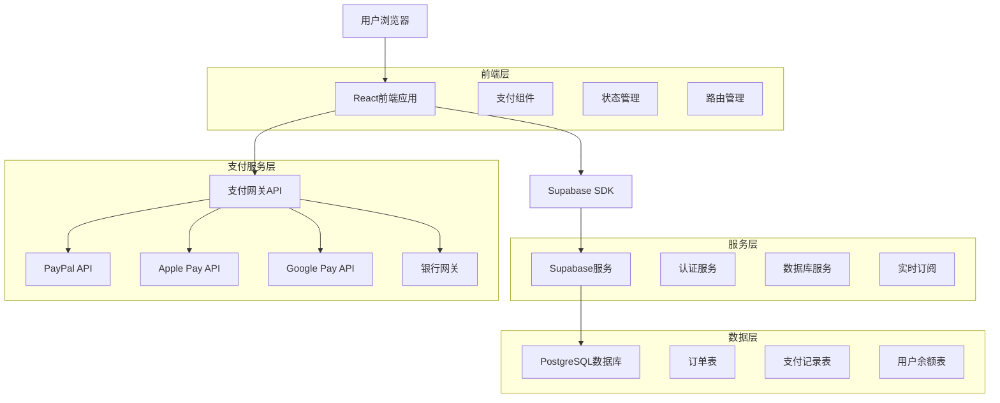
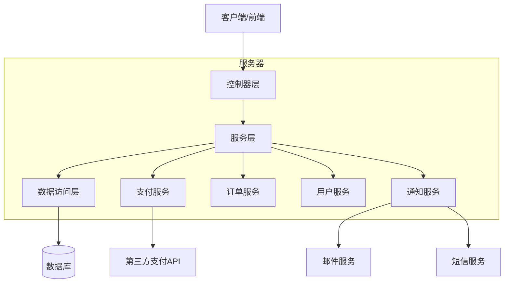
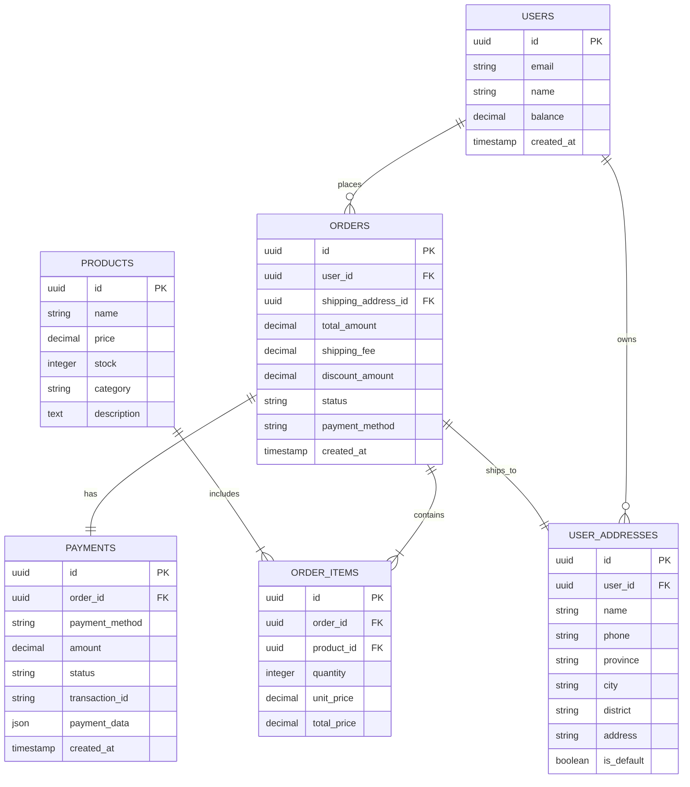

# 玉石交易电商网站 - 支付结算模块技术架构文档

## 1. 架构设计



## 2. 技术描述

- **前端**: React@18 + TypeScript + Tailwind CSS + Vite
- **状态管理**: Zustand
- **后端服务**: Supabase (认证、数据库、实时功能)
- **支付集成**: PayPal SDK、Apple Pay API、Google Pay API、Stripe
- **数据库**: PostgreSQL (通过Supabase)

## 3. 路由定义

| 路由 | 用途 |
|------|------|
| /cart | 购物车页面，显示已添加商品和结算入口 |
| /checkout | 结算页面，地址选择和支付方式选择 |
| /payment/:orderId | 支付页面，具体支付操作和验证 |
| /order-success/:orderId | 订单成功页面，支付结果和订单详情 |
| /orders | 订单列表页面，查看历史订单 |
| /orders/:orderId | 订单详情页面，单个订单的详细信息 |

## 4. API定义

### 4.1 核心API

**订单创建**
```
POST /api/orders
```

请求参数：
| 参数名称 | 参数类型 | 是否必需 | 描述 |
|----------|----------|----------|------|
| items | Array<OrderItem> | true | 订单商品列表 |
| shippingAddress | ShippingAddress | true | 收货地址信息 |
| paymentMethod | string | true | 支付方式标识 |
| couponCode | string | false | 优惠券代码 |

响应数据：
| 参数名称 | 参数类型 | 描述 |
|----------|----------|------|
| orderId | string | 订单唯一标识 |
| totalAmount | number | 订单总金额 |
| status | string | 订单状态 |

示例：
```json
{
  "items": [
    {
      "productId": "jade_001",
      "quantity": 2,
      "price": 1299.00
    }
  ],
  "shippingAddress": {
    "name": "张三",
    "phone": "13800138000",
    "address": "北京市朝阳区xxx街道xxx号"
  },
  "paymentMethod": "paypal"
}
```

**支付处理**
```
POST /api/payments
```

请求参数：
| 参数名称 | 参数类型 | 是否必需 | 描述 |
|----------|----------|----------|------|
| orderId | string | true | 订单ID |
| paymentMethod | string | true | 支付方式 |
| paymentData | object | true | 支付相关数据 |

响应数据：
| 参数名称 | 参数类型 | 描述 |
|----------|----------|------|
| paymentId | string | 支付记录ID |
| status | string | 支付状态 |
| redirectUrl | string | 重定向URL（第三方支付） |

**余额支付**
```
POST /api/payments/balance
```

请求参数：
| 参数名称 | 参数类型 | 是否必需 | 描述 |
|----------|----------|----------|------|
| orderId | string | true | 订单ID |
| amount | number | true | 支付金额 |
| password | string | true | 支付密码 |

响应数据：
| 参数名称 | 参数类型 | 描述 |
|----------|----------|------|
| success | boolean | 支付是否成功 |
| balance | number | 剩余余额 |
| transactionId | string | 交易流水号 |

## 5. 服务器架构图



## 6. 数据模型

### 6.1 数据模型定义



### 6.2 数据定义语言

**用户表 (users)**
```sql
-- 创建用户表
CREATE TABLE users (
    id UUID PRIMARY KEY DEFAULT gen_random_uuid(),
    email VARCHAR(255) UNIQUE NOT NULL,
    name VARCHAR(100) NOT NULL,
    balance DECIMAL(10,2) DEFAULT 0.00,
    created_at TIMESTAMP WITH TIME ZONE DEFAULT NOW(),
    updated_at TIMESTAMP WITH TIME ZONE DEFAULT NOW()
);

-- 创建索引
CREATE INDEX idx_users_email ON users(email);
```

**订单表 (orders)**
```sql
-- 创建订单表
CREATE TABLE orders (
    id UUID PRIMARY KEY DEFAULT gen_random_uuid(),
    user_id UUID NOT NULL REFERENCES users(id),
    shipping_address_id UUID NOT NULL REFERENCES user_addresses(id),
    total_amount DECIMAL(10,2) NOT NULL,
    shipping_fee DECIMAL(10,2) DEFAULT 0.00,
    discount_amount DECIMAL(10,2) DEFAULT 0.00,
    status VARCHAR(20) DEFAULT 'pending' CHECK (status IN ('pending', 'paid', 'shipped', 'delivered', 'cancelled')),
    payment_method VARCHAR(50) NOT NULL,
    created_at TIMESTAMP WITH TIME ZONE DEFAULT NOW(),
    updated_at TIMESTAMP WITH TIME ZONE DEFAULT NOW()
);

-- 创建索引
CREATE INDEX idx_orders_user_id ON orders(user_id);
CREATE INDEX idx_orders_status ON orders(status);
CREATE INDEX idx_orders_created_at ON orders(created_at DESC);
```

**订单商品表 (order_items)**
```sql
-- 创建订单商品表
CREATE TABLE order_items (
    id UUID PRIMARY KEY DEFAULT gen_random_uuid(),
    order_id UUID NOT NULL REFERENCES orders(id) ON DELETE CASCADE,
    product_id UUID NOT NULL REFERENCES products(id),
    quantity INTEGER NOT NULL CHECK (quantity > 0),
    unit_price DECIMAL(10,2) NOT NULL,
    total_price DECIMAL(10,2) NOT NULL,
    created_at TIMESTAMP WITH TIME ZONE DEFAULT NOW()
);

-- 创建索引
CREATE INDEX idx_order_items_order_id ON order_items(order_id);
CREATE INDEX idx_order_items_product_id ON order_items(product_id);
```

**支付记录表 (payments)**
```sql
-- 创建支付记录表
CREATE TABLE payments (
    id UUID PRIMARY KEY DEFAULT gen_random_uuid(),
    order_id UUID NOT NULL REFERENCES orders(id),
    payment_method VARCHAR(50) NOT NULL,
    amount DECIMAL(10,2) NOT NULL,
    status VARCHAR(20) DEFAULT 'pending' CHECK (status IN ('pending', 'completed', 'failed', 'refunded')),
    transaction_id VARCHAR(255),
    payment_data JSONB,
    created_at TIMESTAMP WITH TIME ZONE DEFAULT NOW(),
    updated_at TIMESTAMP WITH TIME ZONE DEFAULT NOW()
);

-- 创建索引
CREATE INDEX idx_payments_order_id ON payments(order_id);
CREATE INDEX idx_payments_status ON payments(status);
CREATE INDEX idx_payments_transaction_id ON payments(transaction_id);
```

**用户地址表 (user_addresses)**
```sql
-- 创建用户地址表
CREATE TABLE user_addresses (
    id UUID PRIMARY KEY DEFAULT gen_random_uuid(),
    user_id UUID NOT NULL REFERENCES users(id) ON DELETE CASCADE,
    name VARCHAR(100) NOT NULL,
    phone VARCHAR(20) NOT NULL,
    province VARCHAR(50) NOT NULL,
    city VARCHAR(50) NOT NULL,
    district VARCHAR(50) NOT NULL,
    address TEXT NOT NULL,
    is_default BOOLEAN DEFAULT FALSE,
    created_at TIMESTAMP WITH TIME ZONE DEFAULT NOW(),
    updated_at TIMESTAMP WITH TIME ZONE DEFAULT NOW()
);

-- 创建索引
CREATE INDEX idx_user_addresses_user_id ON user_addresses(user_id);
CREATE INDEX idx_user_addresses_is_default ON user_addresses(is_default);

-- 初始化数据
INSERT INTO user_addresses (user_id, name, phone, province, city, district, address, is_default)
SELECT 
    id,
    '默认收货人',
    '13800138000',
    '北京市',
    '朝阳区',
    '建国门外',
    '国贸大厦A座1001室',
    true
FROM users 
LIMIT 1;
```

**权限设置**
```sql
-- 为匿名用户授予基本读取权限
GRANT SELECT ON products TO anon;
GRANT SELECT ON categories TO anon;

-- 为认证用户授予完整权限
GRANT ALL PRIVILEGES ON users TO authenticated;
GRANT ALL PRIVILEGES ON orders TO authenticated;
GRANT ALL PRIVILEGES ON order_items TO authenticated;
GRANT ALL PRIVILEGES ON payments TO authenticated;
GRANT ALL PRIVILEGES ON user_addresses TO authenticated;
GRANT ALL PRIVILEGES ON products TO authenticated;
```