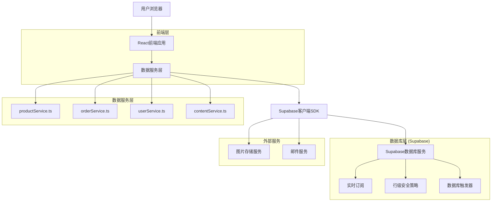
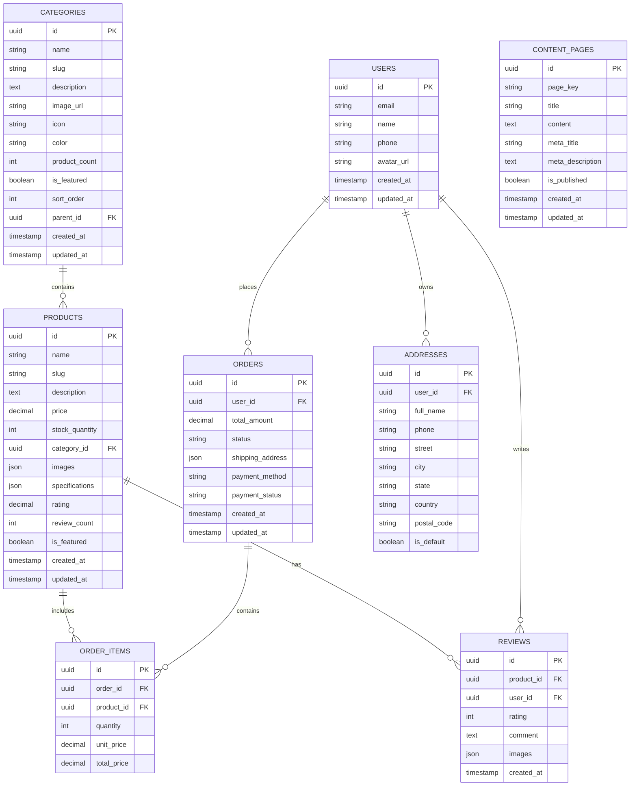

# 数据迁移技术架构文档

## 1. 架构设计



## 2. 技术描述

- **前端**: React@18 + TypeScript@5 + Vite@5 + TailwindCSS@3 + Zustand@4
- **数据库**: Supabase (PostgreSQL) + 实时订阅
- **状态管理**: Zustand + React Query (数据缓存)
- **UI组件**: Headless UI + Lucide React图标

## 3. 路由定义

| 路由 | 用途 |
|------|------|
| /admin/database | 数据库管理页面，查看表结构和数据统计 |
| /admin/migration | 数据迁移页面，执行数据导入和验证 |
| /admin/services | 服务配置页面，管理API服务和缓存设置 |
| /admin/monitor | 实时监控页面，查看数据同步状态和日志 |
| /admin/testing | 测试验证页面，执行功能测试和性能测试 |

## 4. API定义

### 4.1 数据服务API

**商品数据服务 (productService.ts)**

```typescript
// 获取商品列表
async function getProducts(params: ProductQueryParams): Promise<Product[]>

// 获取商品详情
async function getProductById(id: string): Promise<ProductDetail>

// 创建商品
async function createProduct(product: CreateProductData): Promise<Product>

// 更新商品
async function updateProduct(id: string, updates: UpdateProductData): Promise<Product>
```

**订单数据服务 (orderService.ts)**

```typescript
// 获取订单列表
async function getOrders(userId?: string): Promise<Order[]>

// 创建订单
async function createOrder(orderData: CreateOrderData): Promise<Order>

// 更新订单状态
async function updateOrderStatus(orderId: string, status: OrderStatus): Promise<Order>
```

**用户数据服务 (userService.ts)**

```typescript
// 获取用户信息
async function getUserProfile(userId: string): Promise<User>

// 更新用户信息
async function updateUserProfile(userId: string, updates: UpdateUserData): Promise<User>

// 获取用户地址
async function getUserAddresses(userId: string): Promise<UserAddress[]>
```

**内容数据服务 (contentService.ts)**

```typescript
// 获取页面内容
async function getPageContent(pageKey: string): Promise<ContentPage>

// 更新页面内容
async function updatePageContent(pageKey: string, content: string): Promise<ContentPage>
```

### 4.2 实时订阅API

```typescript
// 商品库存变更订阅
function subscribeToProductStock(productId: string, callback: (stock: number) => void)

// 订单状态变更订阅
function subscribeToOrderStatus(orderId: string, callback: (status: OrderStatus) => void)

// 用户活动订阅
function subscribeToUserActivity(userId: string, callback: (activity: UserActivity) => void)
```

## 5. 数据模型

### 5.1 数据模型定义



### 5.2 数据定义语言

**分类表 (categories)**
```sql
-- 创建分类表
CREATE TABLE categories (
  id UUID PRIMARY KEY DEFAULT gen_random_uuid(),
  name VARCHAR(100) NOT NULL,
  slug VARCHAR(100) UNIQUE NOT NULL,
  description TEXT,
  image_url VARCHAR(500),
  icon VARCHAR(50),
  color VARCHAR(20),
  product_count INTEGER DEFAULT 0,
  is_featured BOOLEAN DEFAULT false,
  sort_order INTEGER DEFAULT 0,
  parent_id UUID REFERENCES categories(id),
  created_at TIMESTAMP WITH TIME ZONE DEFAULT NOW(),
  updated_at TIMESTAMP WITH TIME ZONE DEFAULT NOW()
);

-- 创建索引
CREATE INDEX idx_categories_parent_id ON categories(parent_id);
CREATE INDEX idx_categories_slug ON categories(slug);
CREATE INDEX idx_categories_featured ON categories(is_featured);
```

**商品表 (products)**
```sql
-- 创建商品表
CREATE TABLE products (
  id UUID PRIMARY KEY DEFAULT gen_random_uuid(),
  name VARCHAR(200) NOT NULL,
  slug VARCHAR(200) UNIQUE NOT NULL,
  description TEXT,
  price DECIMAL(10,2) NOT NULL,
  stock_quantity INTEGER DEFAULT 0,
  category_id UUID REFERENCES categories(id),
  images JSONB DEFAULT '[]',
  specifications JSONB DEFAULT '{}',
  rating DECIMAL(3,2) DEFAULT 0,
  review_count INTEGER DEFAULT 0,
  is_featured BOOLEAN DEFAULT false,
  created_at TIMESTAMP WITH TIME ZONE DEFAULT NOW(),
  updated_at TIMESTAMP WITH TIME ZONE DEFAULT NOW()
);

-- 创建索引
CREATE INDEX idx_products_category_id ON products(category_id);
CREATE INDEX idx_products_slug ON products(slug);
CREATE INDEX idx_products_featured ON products(is_featured);
CREATE INDEX idx_products_price ON products(price);
CREATE INDEX idx_products_rating ON products(rating);
```

**用户表 (users)**
```sql
-- 创建用户表
CREATE TABLE users (
  id UUID PRIMARY KEY DEFAULT gen_random_uuid(),
  email VARCHAR(255) UNIQUE NOT NULL,
  name VARCHAR(100) NOT NULL,
  phone VARCHAR(20),
  avatar_url VARCHAR(500),
  created_at TIMESTAMP WITH TIME ZONE DEFAULT NOW(),
  updated_at TIMESTAMP WITH TIME ZONE DEFAULT NOW()
);

-- 创建索引
CREATE INDEX idx_users_email ON users(email);
```

**订单表 (orders)**
```sql
-- 创建订单表
CREATE TABLE orders (
  id UUID PRIMARY KEY DEFAULT gen_random_uuid(),
  user_id UUID REFERENCES users(id),
  total_amount DECIMAL(10,2) NOT NULL,
  status VARCHAR(50) DEFAULT 'pending',
  shipping_address JSONB NOT NULL,
  payment_method VARCHAR(50),
  payment_status VARCHAR(50) DEFAULT 'pending',
  created_at TIMESTAMP WITH TIME ZONE DEFAULT NOW(),
  updated_at TIMESTAMP WITH TIME ZONE DEFAULT NOW()
);

-- 创建索引
CREATE INDEX idx_orders_user_id ON orders(user_id);
CREATE INDEX idx_orders_status ON orders(status);
CREATE INDEX idx_orders_created_at ON orders(created_at DESC);
```

**订单项表 (order_items)**
```sql
-- 创建订单项表
CREATE TABLE order_items (
  id UUID PRIMARY KEY DEFAULT gen_random_uuid(),
  order_id UUID REFERENCES orders(id) ON DELETE CASCADE,
  product_id UUID REFERENCES products(id),
  quantity INTEGER NOT NULL,
  unit_price DECIMAL(10,2) NOT NULL,
  total_price DECIMAL(10,2) NOT NULL
);

-- 创建索引
CREATE INDEX idx_order_items_order_id ON order_items(order_id);
CREATE INDEX idx_order_items_product_id ON order_items(product_id);
```

**评价表 (reviews)**
```sql
-- 创建评价表
CREATE TABLE reviews (
  id UUID PRIMARY KEY DEFAULT gen_random_uuid(),
  product_id UUID REFERENCES products(id) ON DELETE CASCADE,
  user_id UUID REFERENCES users(id),
  rating INTEGER CHECK (rating >= 1 AND rating <= 5),
  comment TEXT,
  images JSONB DEFAULT '[]',
  created_at TIMESTAMP WITH TIME ZONE DEFAULT NOW()
);

-- 创建索引
CREATE INDEX idx_reviews_product_id ON reviews(product_id);
CREATE INDEX idx_reviews_user_id ON reviews(user_id);
CREATE INDEX idx_reviews_rating ON reviews(rating);
```

**地址表 (addresses)**
```sql
-- 创建地址表
CREATE TABLE addresses (
  id UUID PRIMARY KEY DEFAULT gen_random_uuid(),
  user_id UUID REFERENCES users(id) ON DELETE CASCADE,
  full_name VARCHAR(100) NOT NULL,
  phone VARCHAR(20) NOT NULL,
  street TEXT NOT NULL,
  city VARCHAR(100) NOT NULL,
  state VARCHAR(100),
  country VARCHAR(100) NOT NULL,
  postal_code VARCHAR(20),
  is_default BOOLEAN DEFAULT false,
  created_at TIMESTAMP WITH TIME ZONE DEFAULT NOW(),
  updated_at TIMESTAMP WITH TIME ZONE DEFAULT NOW()
);

-- 创建索引
CREATE INDEX idx_addresses_user_id ON addresses(user_id);
```

**内容页面表 (content_pages)**
```sql
-- 创建内容页面表
CREATE TABLE content_pages (
  id UUID PRIMARY KEY DEFAULT gen_random_uuid(),
  page_key VARCHAR(50) UNIQUE NOT NULL,
  title VARCHAR(200) NOT NULL,
  content TEXT NOT NULL,
  meta_title VARCHAR(200),
  meta_description TEXT,
  is_published BOOLEAN DEFAULT true,
  created_at TIMESTAMP WITH TIME ZONE DEFAULT NOW(),
  updated_at TIMESTAMP WITH TIME ZONE DEFAULT NOW()
);

-- 创建索引
CREATE INDEX idx_content_pages_key ON content_pages(page_key);
```

**行级安全策略 (RLS)**
```sql
-- 启用RLS
ALTER TABLE products ENABLE ROW LEVEL SECURITY;
ALTER TABLE categories ENABLE ROW LEVEL SECURITY;
ALTER TABLE orders ENABLE ROW LEVEL SECURITY;
ALTER TABLE reviews ENABLE ROW LEVEL SECURITY;
ALTER TABLE addresses ENABLE ROW LEVEL SECURITY;
ALTER TABLE content_pages ENABLE ROW LEVEL SECURITY;

-- 基本访问权限
GRANT SELECT ON products TO anon;
GRANT SELECT ON categories TO anon;
GRANT SELECT ON reviews TO anon;
GRANT SELECT ON content_pages TO anon;

-- 认证用户权限
GRANT ALL PRIVILEGES ON ALL TABLES IN SCHEMA public TO authenticated;

-- 用户数据访问策略
CREATE POLICY "用户只能访问自己的订单" ON orders
  FOR ALL USING (auth.uid() = user_id);

CREATE POLICY "用户只能访问自己的地址" ON addresses
  FOR ALL USING (auth.uid() = user_id);
```

**数据触发器**
```sql
-- 更新商品评分触发器
CREATE OR REPLACE FUNCTION update_product_rating()
RETURNS TRIGGER AS $$
BEGIN
  UPDATE products 
  SET 
    rating = (SELECT AVG(rating) FROM reviews WHERE product_id = NEW.product_id),
    review_count = (SELECT COUNT(*) FROM reviews WHERE product_id = NEW.product_id)
  WHERE id = NEW.product_id;
  RETURN NEW;
END;
$$ LANGUAGE plpgsql;

CREATE TRIGGER trigger_update_product_rating
  AFTER INSERT OR UPDATE OR DELETE ON reviews
  FOR EACH ROW EXECUTE FUNCTION update_product_rating();

-- 更新分类商品数量触发器
CREATE OR REPLACE FUNCTION update_category_product_count()
RETURNS TRIGGER AS $$
BEGIN
  IF TG_OP = 'INSERT' THEN
    UPDATE categories SET product_count = product_count + 1 WHERE id = NEW.category_id;
  ELSIF TG_OP = 'DELETE' THEN
    UPDATE categories SET product_count = product_count - 1 WHERE id = OLD.category_id;
  ELSIF TG_OP = 'UPDATE' AND OLD.category_id != NEW.category_id THEN
    UPDATE categories SET product_count = product_count - 1 WHERE id = OLD.category_id;
    UPDATE categories SET product_count = product_count + 1 WHERE id = NEW.category_id;
  END IF;
  RETURN COALESCE(NEW, OLD);
END;
$$ LANGUAGE plpgsql;

CREATE TRIGGER trigger_update_category_product_count
  AFTER INSERT OR UPDATE OR DELETE ON products
  FOR EACH ROW EXECUTE FUNCTION update_category_product_count();
```