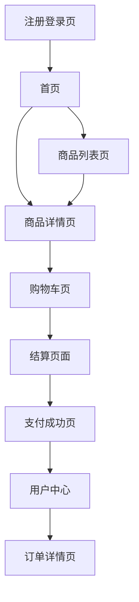

# 玉石交易电商网站产品需求文档

## 1. 产品概述

玉石雅韵是一个专注于高品质玉石交易的现代化电商平台，致力于为全球用户提供优质的和田玉、翡翠、玛瑙等珍贵玉石产品。平台采用移动端优先的设计理念，结合现代简洁的视觉风格，为用户打造流畅的购物体验。

- 解决传统玉石交易信息不透明、品质难辨别的问题，为玉石爱好者和收藏家提供可信赖的交易平台
- 目标市场价值：打造全球领先的玉石电商平台，预计年交易额达到5000万美元

## 2. 核心功能

### 2.1 用户角色

| 角色 | 注册方式 | 核心权限 |
|------|----------|----------|
| 普通用户 | 邮箱注册、用户名注册、Google/Facebook第三方登录 | 浏览商品、下单购买、收藏商品、评价商品 |
| VIP用户 | 消费满额自动升级 | 享受专属折扣、优先客服、专场拍卖参与权 |
| 商家用户 | 企业认证注册 | 发布商品、管理订单、查看销售数据 |

### 2.2 功能模块

我们的玉石交易电商网站包含以下核心页面：

1. **首页**：品牌展示区、精选商品轮播、商品分类导航、热销推荐
2. **商品列表页**：商品筛选、排序功能、网格/列表视图切换
3. **商品详情页**：高清图片展示、360度旋转视图、详细描述、用户评价
4. **购物车页**：商品管理、数量调整、优惠券使用、价格计算
5. **结算页面**：收货地址、支付方式选择、订单确认
6. **用户中心**：个人信息、订单管理、收藏夹、积分系统
7. **注册登录页**：多种登录方式、密码找回功能

### 2.3 页面详情

| 页面名称 | 模块名称 | 功能描述 |
|----------|----------|----------|
| 首页 | 品牌展示区 | 展示品牌理念，传承千年玉石文化的宣传视频或图片轮播 |
| 首页 | 精选商品轮播 | 自动轮播展示热门和新品玉石，支持手势滑动 |
| 首页 | 商品分类导航 | 按玉石类型（和田玉、翡翠、玛瑙等）快速导航 |
| 商品列表页 | 筛选功能 | 按价格、材质、产地、颜色等多维度筛选 |
| 商品列表页 | 排序功能 | 支持按价格、销量、评分、上新时间排序 |
| 商品详情页 | 高清图片展示 | 支持放大查看、多角度展示玉石纹理和光泽 |
| 商品详情页 | 360度旋转视图 | 全方位展示玉石外观，提升用户购买信心 |
| 商品详情页 | 专业鉴定证书 | 展示权威机构出具的玉石鉴定证书 |
| 购物车页 | 商品管理 | 添加、删除、修改商品数量，批量操作 |
| 结算页面 | 多种支付方式 | 支持Visa、Mastercard、Maestro、American Express、Discover、Diners Club、PayPal、Afterpay、Klarna、Apple Pay、Google Pay、Zip Pay、Sezzle、Affirm、JCB等国际主流支付方式 |
| 结算页面 | 地址管理 | 新增、编辑、删除收货地址，支持国际配送 |
| 用户中心 | 订单管理 | 查看订单状态、物流跟踪、申请退换货 |
| 注册登录页 | 第三方登录 | 支持Google、Facebook快速登录注册 |

## 3. 核心流程

### 普通用户购物流程
用户首先访问首页浏览精选商品，通过分类导航或搜索功能找到心仪商品，进入商品详情页查看详细信息和鉴定证书，确认购买后加入购物车，在购物车中确认商品信息后进入结算页面，选择收货地址和支付方式完成支付，最后在用户中心跟踪订单状态。

### 用户注册登录流程
新用户可选择邮箱注册或第三方账号（Google/Facebook）快速注册，填写基本信息后完成注册，老用户直接登录即可开始购物。

## 4. 用户界面设计

### 4.1 设计风格

- **主色调**：玉石绿（#4A9B8E）作为主色，象征高雅与自然
- **辅助色**：温润白（#F8F9FA）、雅致灰（#6C757D）、金色点缀（#FFD700）
- **按钮风格**：圆角矩形按钮，具有轻微阴影效果，点击时有微动画反馈
- **字体**：主标题使用优雅的衬线字体，正文使用清晰的无衬线字体，中文支持思源黑体
- **布局风格**：卡片式设计，大量留白，突出商品展示，采用网格布局
- **图标风格**：线性图标风格，简洁现代，与整体设计保持一致

### 4.2 页面设计概览

| 页面名称 | 模块名称 | UI元素 |
|----------|----------|---------|
| 首页 | 品牌展示区 | 全屏背景图，玉石绿色渐变遮罩，优雅的品牌标语，居中布局 |
| 首页 | 商品轮播 | 卡片式商品展示，圆角设计，商品名称和价格清晰标注 |
| 商品列表页 | 筛选栏 | 顶部固定筛选条，标签式筛选选项，清除筛选按钮 |
| 商品详情页 | 图片展示区 | 大图展示，缩略图导航，支持手势缩放和滑动 |
| 购物车页 | 商品列表 | 左侧商品图片，右侧信息和操作按钮，底部结算栏 |
| 结算页面 | 支付方式 | 图标化支付选项，选中状态明显，安全提示信息 |

### 4.3 响应式设计

网站采用移动端优先的响应式设计策略，确保在各种设备上都能提供优质的用户体验：

- **移动端（320px-768px）**：单列布局，大按钮设计，优化触摸操作
- **平板端（768px-1024px）**：双列布局，适中的按钮和文字大小
- **桌面端（1024px+）**：多列布局，充分利用屏幕空间，鼠标悬停效果

所有交互元素都针对触摸操作进行了优化，确保在移动设备上操作流畅自然。