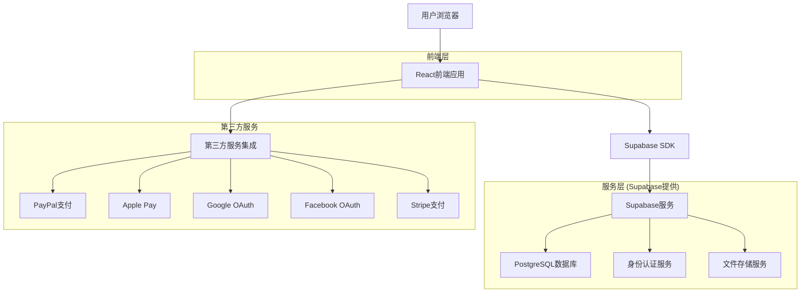
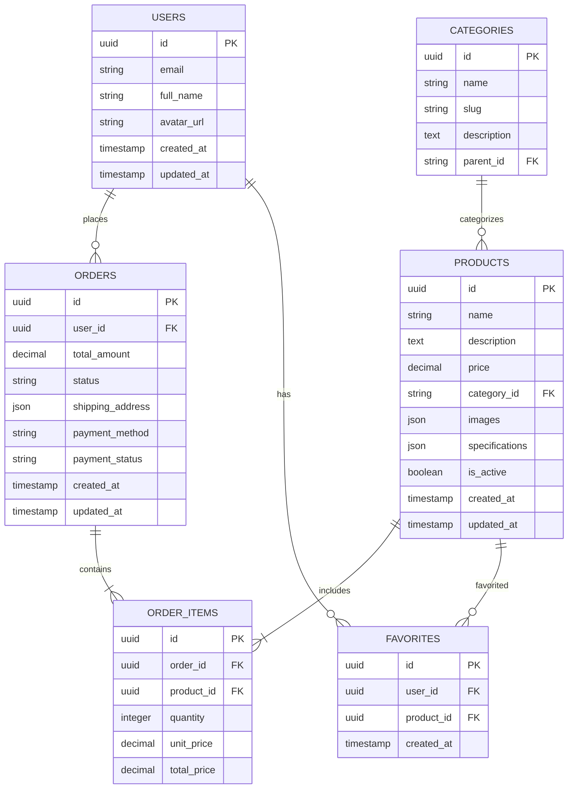

# 玉石交易电商网站技术架构文档

## 1. 架构设计



## 2. 技术描述

- **前端**: React@18 + TypeScript@5 + Tailwind CSS@3 + Vite@5
- **状态管理**: Zustand@4 (轻量级状态管理)
- **UI组件库**: Headless UI + Radix UI (无样式组件库)
- **图片处理**: React Image Gallery + React Zoom Pan Pinch
- **支付集成**: PayPal SDK + Apple Pay JS + Stripe Elements
- **认证服务**: Supabase Auth (支持第三方登录)
- **数据库**: Supabase (PostgreSQL)
- **文件存储**: Supabase Storage
- **部署**: Vercel (前端) + Supabase (后端服务)

## 3. 路由定义

| 路由 | 用途 |
|------|------|
| / | 首页，展示品牌介绍、精选商品和分类导航 |
| /products | 商品列表页，支持筛选和排序功能 |
| /products/:id | 商品详情页，展示商品详细信息和360度视图 |
| /cart | 购物车页面，管理购买商品和数量 |
| /checkout | 结算页面，选择地址和支付方式 |
| /login | 登录页面，支持邮箱和第三方登录 |
| /register | 注册页面，用户账号创建 |
| /profile | 用户中心，个人信息和订单管理 |
| /orders | 订单列表页，查看历史订单 |
| /orders/:id | 订单详情页，查看具体订单信息 |
| /favorites | 收藏夹页面，管理收藏的商品 |
| /search | 搜索结果页，展示搜索的商品 |

## 4. API定义

### 4.1 核心API

**用户认证相关**
```
POST /auth/v1/signup
```

请求参数:
| 参数名称 | 参数类型 | 是否必需 | 描述 |
|----------|----------|----------|------|
| email | string | true | 用户邮箱地址 |
| password | string | true | 用户密码 |
| full_name | string | true | 用户全名 |

响应参数:
| 参数名称 | 参数类型 | 描述 |
|----------|----------|------|
| user | object | 用户信息对象 |
| session | object | 会话信息 |

**商品管理相关**
```
GET /rest/v1/products
```

请求参数:
| 参数名称 | 参数类型 | 是否必需 | 描述 |
|----------|----------|----------|------|
| category | string | false | 商品分类筛选 |
| price_min | number | false | 最低价格 |
| price_max | number | false | 最高价格 |
| sort | string | false | 排序方式 (price_asc, price_desc, created_at) |

**订单管理相关**
```
POST /rest/v1/orders
```

请求参数:
| 参数名称 | 参数类型 | 是否必需 | 描述 |
|----------|----------|----------|------|
| user_id | uuid | true | 用户ID |
| items | array | true | 订单商品列表 |
| shipping_address | object | true | 收货地址信息 |
| payment_method | string | true | 支付方式 |

示例请求:
```json
{
  "user_id": "123e4567-e89b-12d3-a456-426614174000",
  "items": [
    {
      "product_id": "prod_001",
      "quantity": 1,
      "price": 299.99
    }
  ],
  "shipping_address": {
    "street": "123 Main St",
    "city": "New York",
    "country": "US",
    "postal_code": "10001"
  },
  "payment_method": "paypal"
}
```

## 5. 数据模型

### 5.1 数据模型定义



### 5.2 数据定义语言

**用户表 (users)**
```sql
-- 创建用户表
CREATE TABLE users (
    id UUID PRIMARY KEY DEFAULT gen_random_uuid(),
    email VARCHAR(255) UNIQUE NOT NULL,
    full_name VARCHAR(100) NOT NULL,
    avatar_url TEXT,
    created_at TIMESTAMP WITH TIME ZONE DEFAULT NOW(),
    updated_at TIMESTAMP WITH TIME ZONE DEFAULT NOW()
);

-- 创建索引
CREATE INDEX idx_users_email ON users(email);
```

**商品表 (products)**
```sql
-- 创建商品表
CREATE TABLE products (
    id UUID PRIMARY KEY DEFAULT gen_random_uuid(),
    name VARCHAR(255) NOT NULL,
    description TEXT,
    price DECIMAL(10,2) NOT NULL,
    category_id UUID REFERENCES categories(id),
    images JSONB DEFAULT '[]',
    specifications JSONB DEFAULT '{}',
    is_active BOOLEAN DEFAULT true,
    created_at TIMESTAMP WITH TIME ZONE DEFAULT NOW(),
    updated_at TIMESTAMP WITH TIME ZONE DEFAULT NOW()
);

-- 创建索引
CREATE INDEX idx_products_category ON products(category_id);
CREATE INDEX idx_products_price ON products(price);
CREATE INDEX idx_products_active ON products(is_active);
```

**分类表 (categories)**
```sql
-- 创建分类表
CREATE TABLE categories (
    id UUID PRIMARY KEY DEFAULT gen_random_uuid(),
    name VARCHAR(100) NOT NULL,
    slug VARCHAR(100) UNIQUE NOT NULL,
    description TEXT,
    parent_id UUID REFERENCES categories(id),
    created_at TIMESTAMP WITH TIME ZONE DEFAULT NOW()
);

-- 创建索引
CREATE INDEX idx_categories_slug ON categories(slug);
CREATE INDEX idx_categories_parent ON categories(parent_id);
```

**订单表 (orders)**
```sql
-- 创建订单表
CREATE TABLE orders (
    id UUID PRIMARY KEY DEFAULT gen_random_uuid(),
    user_id UUID REFERENCES users(id) NOT NULL,
    total_amount DECIMAL(10,2) NOT NULL,
    status VARCHAR(50) DEFAULT 'pending',
    shipping_address JSONB NOT NULL,
    payment_method VARCHAR(50) NOT NULL,
    payment_status VARCHAR(50) DEFAULT 'pending',
    created_at TIMESTAMP WITH TIME ZONE DEFAULT NOW(),
    updated_at TIMESTAMP WITH TIME ZONE DEFAULT NOW()
);

-- 创建索引
CREATE INDEX idx_orders_user_id ON orders(user_id);
CREATE INDEX idx_orders_status ON orders(status);
CREATE INDEX idx_orders_created_at ON orders(created_at DESC);
```

**订单商品表 (order_items)**
```sql
-- 创建订单商品表
CREATE TABLE order_items (
    id UUID PRIMARY KEY DEFAULT gen_random_uuid(),
    order_id UUID REFERENCES orders(id) NOT NULL,
    product_id UUID REFERENCES products(id) NOT NULL,
    quantity INTEGER NOT NULL DEFAULT 1,
    unit_price DECIMAL(10,2) NOT NULL,
    total_price DECIMAL(10,2) NOT NULL
);

-- 创建索引
CREATE INDEX idx_order_items_order_id ON order_items(order_id);
CREATE INDEX idx_order_items_product_id ON order_items(product_id);
```

**收藏表 (favorites)**
```sql
-- 创建收藏表
CREATE TABLE favorites (
    id UUID PRIMARY KEY DEFAULT gen_random_uuid(),
    user_id UUID REFERENCES users(id) NOT NULL,
    product_id UUID REFERENCES products(id) NOT NULL,
    created_at TIMESTAMP WITH TIME ZONE DEFAULT NOW(),
    UNIQUE(user_id, product_id)
);

-- 创建索引
CREATE INDEX idx_favorites_user_id ON favorites(user_id);
CREATE INDEX idx_favorites_product_id ON favorites(product_id);
```

**权限设置**
```sql
-- 为匿名用户授予基本读取权限
GRANT SELECT ON products TO anon;
GRANT SELECT ON categories TO anon;

-- 为认证用户授予完整权限
GRANT ALL PRIVILEGES ON users TO authenticated;
GRANT ALL PRIVILEGES ON orders TO authenticated;
GRANT ALL PRIVILEGES ON order_items TO authenticated;
GRANT ALL PRIVILEGES ON favorites TO authenticated;
GRANT SELECT ON products TO authenticated;
GRANT SELECT ON categories TO authenticated;
```

**初始数据**
```sql
-- 插入商品分类
INSERT INTO categories (name, slug, description) VALUES
('和田玉', 'hetian-jade', '新疆和田地区出产的优质玉石'),
('翡翠', 'jadeite', '缅甸等地出产的硬玉'),
('玛瑙', 'agate', '各种颜色的玛瑙制品'),
('水晶', 'crystal', '天然水晶饰品'),
('琥珀', 'amber', '古老的树脂化石');

-- 插入示例商品
INSERT INTO products (name, description, price, category_id, images, specifications) VALUES
('和田玉观音吊坠', '精选新疆和田玉制作，工艺精湛，寓意平安', 1299.00, 
 (SELECT id FROM categories WHERE slug = 'hetian-jade'),
 '["https://example.com/jade1.jpg", "https://example.com/jade2.jpg"]',
 '{"material": "和田玉", "size": "3.5cm x 2.5cm", "weight": "15g", "certificate": "国检证书"}');
```