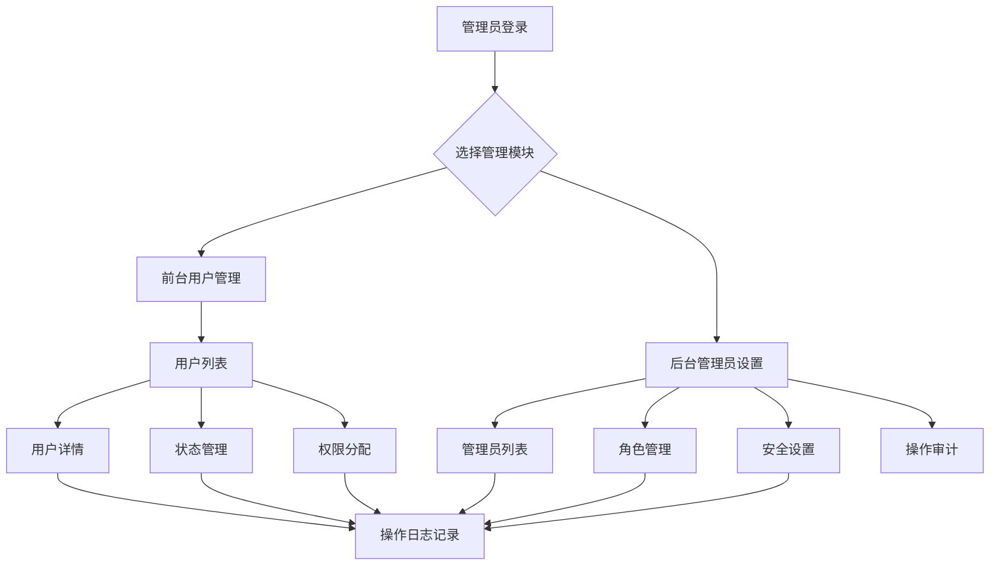

# 用户管理模块重构 - 产品需求文档

## 1. 产品概述

本项目旨在重构Jade购物网站的用户管理模块，实现前台用户账号管理与后台管理员账户管理的完全分离，提升系统安全性和管理效率。

- 核心目标：建立清晰的前后台账户体系分离，确保数据安全性和管理便利性
- 解决问题：当前系统前后台账户混合管理导致的安全隐患和管理混乱
- 目标用户：网站管理员、系统运维人员、前台用户

## 2. 核心功能

### 2.1 用户角色

| 角色 | 注册方法 | 核心权限 |
|------|---------|----------|
| 前台用户 | 邮箱注册/第三方登录 | 购物、订单管理、个人信息维护 |
| 后台管理员 | 系统管理员创建 | 用户管理、系统配置、数据分析 |
| 超级管理员 | 系统预设 | 全部权限、管理员账户管理 |

### 2.2 功能模块

我们的用户管理重构包含以下主要页面：

1. **前台用户管理页面** (`/admin/users`)：用户列表展示、用户详情查看、账户状态管理、权限分配
2. **后台管理员设置页面** (`/admin/settings`)：管理员账户管理、角色权限配置、系统安全设置
3. **用户详情页面**：完整用户信息展示、操作日志、权限详情
4. **权限管理页面**：角色定义、权限分配、权限继承关系

### 2.3 页面详情

| 页面名称 | 模块名称 | 功能描述 |
|----------|----------|----------|
| 前台用户管理 | 用户列表 | 展示所有前台用户，支持搜索、筛选、分页浏览 |
| 前台用户管理 | 用户详情 | 查看用户完整信息、订单历史、操作记录 |
| 前台用户管理 | 状态管理 | 激活/禁用用户账户、设置用户标签、风险等级 |
| 前台用户管理 | 权限分配 | 为用户分配特殊权限、VIP等级管理 |
| 后台管理员设置 | 管理员列表 | 展示所有后台管理员账户、角色信息 |
| 后台管理员设置 | 角色管理 | 创建/编辑管理员角色、定义权限范围 |
| 后台管理员设置 | 安全设置 | 登录安全策略、密码策略、会话管理 |
| 后台管理员设置 | 操作审计 | 管理员操作日志、敏感操作记录 |

## 3. 核心流程

**前台用户管理流程：**
管理员登录后台 → 访问用户管理页面 → 查看用户列表 → 选择用户进行操作（查看详情/修改状态/分配权限） → 确认操作并记录日志

**后台管理员管理流程：**
超级管理员登录 → 访问系统设置页面 → 管理员账户管理 → 创建/编辑管理员 → 分配角色权限 → 设置安全策略 → 保存配置

## 4. 用户界面设计

### 4.1 设计风格

- 主色调：#3B82F6 (蓝色)，辅助色：#10B981 (绿色)、#EF4444 (红色)
- 按钮样式：圆角按钮，悬停效果，阴影设计
- 字体：系统默认字体，标题16px，正文14px，小字12px
- 布局风格：卡片式布局，左侧导航，顶部面包屑导航
- 图标风格：线性图标，统一的视觉语言

### 4.2 页面设计概览

| 页面名称 | 模块名称 | UI元素 |
|----------|----------|---------|
| 前台用户管理 | 用户列表 | 表格布局，搜索框，筛选器，分页器，操作按钮组 |
| 前台用户管理 | 用户详情 | 标签页布局，信息卡片，时间轴，状态徽章 |
| 前台用户管理 | 状态管理 | 开关组件，下拉选择器，确认对话框 |
| 后台管理员设置 | 管理员列表 | 表格布局，角色徽章，权限标签，操作菜单 |
| 后台管理员设置 | 角色管理 | 树形权限选择器，角色卡片，权限矩阵 |
| 后台管理员设置 | 安全设置 | 表单布局，安全等级指示器，策略配置面板 |

### 4.3 响应式设计

桌面优先设计，支持平板和移动端适配，关键操作保持触摸友好的交互设计。