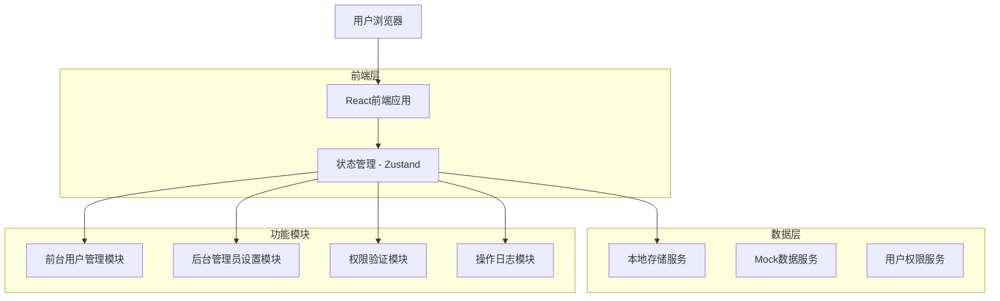
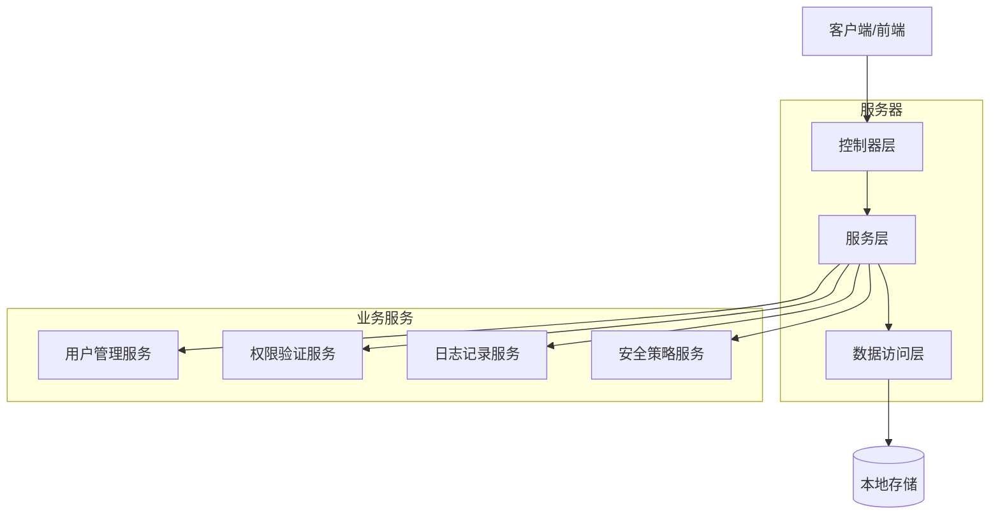
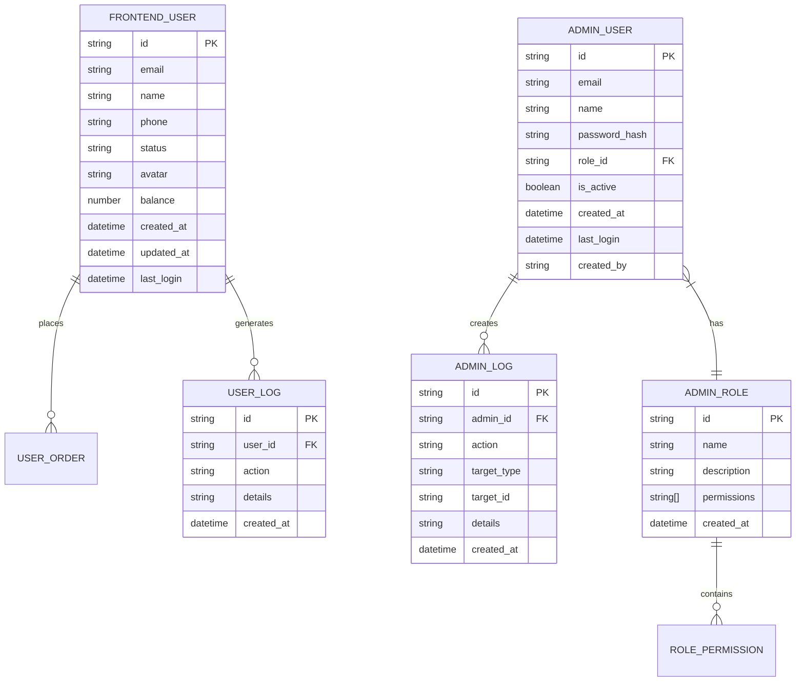

# 用户管理模块重构 - 技术架构文档

## 1. 架构设计



## 2. 技术描述

- 前端：React@18 + TypeScript + Tailwind CSS + Vite
- 状态管理：Zustand
- 路由：React Router@6
- UI组件：自定义组件库 + Headless UI
- 数据存储：LocalStorage + Mock数据

## 3. 路由定义

| 路由 | 用途 |
|------|------|
| /admin/users | 前台用户管理页面，展示和管理所有前台用户账户 |
| /admin/users/add | 添加新的前台用户页面 |
| /admin/users/:id/edit | 编辑前台用户信息页面 |
| /admin/users/:id | 前台用户详情页面，显示完整用户信息 |
| /admin/settings | 后台管理员设置主页面 |
| /admin/settings/administrators | 管理员账户管理页面 |
| /admin/settings/roles | 角色权限管理页面 |
| /admin/settings/security | 系统安全设置页面 |
| /admin/settings/audit | 操作审计日志页面 |

## 4. API定义

### 4.1 前台用户管理API

**获取用户列表**
```
GET /api/users
```

请求参数:
| 参数名称 | 参数类型 | 是否必需 | 描述 |
|----------|----------|----------|------|
| page | number | false | 页码，默认1 |
| limit | number | false | 每页数量，默认20 |
| status | string | false | 用户状态筛选 |
| search | string | false | 搜索关键词 |

响应:
| 参数名称 | 参数类型 | 描述 |
|----------|----------|------|
| users | User[] | 用户列表 |
| total | number | 总数量 |
| page | number | 当前页码 |

**更新用户状态**
```
PUT /api/users/:id/status
```

请求:
| 参数名称 | 参数类型 | 是否必需 | 描述 |
|----------|----------|----------|------|
| status | string | true | 用户状态 (active/inactive/banned) |
| reason | string | false | 操作原因 |

响应:
```json
{
  "success": true,
  "message": "用户状态更新成功",
  "user": {
    "id": "user123",
    "status": "active"
  }
}
```

### 4.2 后台管理员API

**获取管理员列表**
```
GET /api/administrators
```

**创建管理员账户**
```
POST /api/administrators
```

请求:
| 参数名称 | 参数类型 | 是否必需 | 描述 |
|----------|----------|----------|------|
| email | string | true | 管理员邮箱 |
| name | string | true | 管理员姓名 |
| role | string | true | 角色ID |
| permissions | string[] | false | 特殊权限列表 |

### 4.3 权限管理API

**获取角色列表**
```
GET /api/roles
```

**更新角色权限**
```
PUT /api/roles/:id/permissions
```

## 5. 服务架构图



## 6. 数据模型

### 6.1 数据模型定义



### 6.2 数据定义语言

**前台用户表 (frontend_users)**
```sql
-- 创建前台用户表
CREATE TABLE frontend_users (
    id VARCHAR(36) PRIMARY KEY DEFAULT (UUID()),
    email VARCHAR(255) UNIQUE NOT NULL,
    name VARCHAR(100) NOT NULL,
    phone VARCHAR(20),
    status VARCHAR(20) DEFAULT 'active' CHECK (status IN ('active', 'inactive', 'banned')),
    avatar TEXT,
    balance DECIMAL(10,2) DEFAULT 0.00,
    created_at TIMESTAMP DEFAULT CURRENT_TIMESTAMP,
    updated_at TIMESTAMP DEFAULT CURRENT_TIMESTAMP ON UPDATE CURRENT_TIMESTAMP,
    last_login TIMESTAMP
);

-- 创建索引
CREATE INDEX idx_frontend_users_email ON frontend_users(email);
CREATE INDEX idx_frontend_users_status ON frontend_users(status);
CREATE INDEX idx_frontend_users_created_at ON frontend_users(created_at DESC);

-- 初始化数据
INSERT INTO frontend_users (id, email, name, phone, status, balance) VALUES
('user_001', 'admin@jade.com', '系统管理员', '13800138000', 'active', 1000.00),
('user_002', 'john@example.com', 'John Doe', '13800138001', 'active', 500.00),
('user_003', 'jane@example.com', 'Jane Smith', '13800138002', 'active', 750.00);
```

**后台管理员表 (admin_users)**
```sql
-- 创建后台管理员表
CREATE TABLE admin_users (
    id VARCHAR(36) PRIMARY KEY DEFAULT (UUID()),
    email VARCHAR(255) UNIQUE NOT NULL,
    name VARCHAR(100) NOT NULL,
    password_hash VARCHAR(255) NOT NULL,
    role_id VARCHAR(36) NOT NULL,
    is_active BOOLEAN DEFAULT TRUE,
    created_at TIMESTAMP DEFAULT CURRENT_TIMESTAMP,
    last_login TIMESTAMP,
    created_by VARCHAR(36)
);

-- 创建管理员角色表
CREATE TABLE admin_roles (
    id VARCHAR(36) PRIMARY KEY DEFAULT (UUID()),
    name VARCHAR(50) UNIQUE NOT NULL,
    description TEXT,
    permissions JSON,
    created_at TIMESTAMP DEFAULT CURRENT_TIMESTAMP
);

-- 创建操作日志表
CREATE TABLE admin_logs (
    id VARCHAR(36) PRIMARY KEY DEFAULT (UUID()),
    admin_id VARCHAR(36) NOT NULL,
    action VARCHAR(100) NOT NULL,
    target_type VARCHAR(50),
    target_id VARCHAR(36),
    details JSON,
    created_at TIMESTAMP DEFAULT CURRENT_TIMESTAMP
);

-- 初始化角色数据
INSERT INTO admin_roles (id, name, description, permissions) VALUES
('role_001', '超级管理员', '拥有所有权限', '["*"]'),
('role_002', '用户管理员', '负责用户管理相关功能', '["users.*", "logs.read"]'),
('role_003', '内容管理员', '负责内容和产品管理', '["products.*", "content.*"]');

-- 初始化管理员数据
INSERT INTO admin_users (id, email, name, password_hash, role_id, created_by) VALUES
('admin_001', 'superadmin@jade.com', '超级管理员', '$2b$10$hashedpassword', 'role_001', 'system'),
('admin_002', 'useradmin@jade.com', '用户管理员', '$2b$10$hashedpassword', 'role_002', 'admin_001');
```