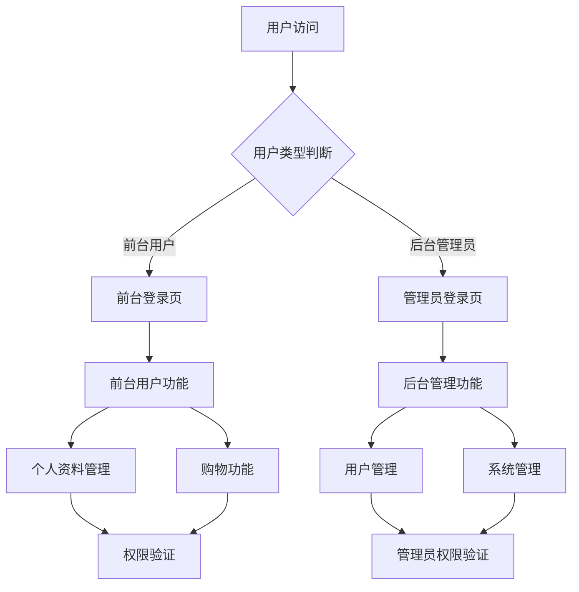

# 用户管理模块重构产品需求文档

## 1. 产品概述

本项目旨在重构翡翠商城的用户管理模块，明确区分前台网站用户和后台管理用户两类账户体系，确保系统安全性和功能完整性。

- 解决现有用户管理模块中前台用户与后台管理员权限混淆、路由保护不完善、安全机制不足等问题
- 为前台购物用户和后台管理员提供完全隔离的账户体系和功能模块
- 建立完善的权限控制和安全审计机制，确保系统数据安全和操作可追溯

## 2. 核心功能

### 2.1 用户角色

| 角色 | 注册方式 | 核心权限 |
|------|----------|----------|
| 前台用户 | 邮箱注册、手机注册 | 浏览商品、购物下单、个人资料管理、订单查看 |
| 后台管理员 | 超级管理员创建 | 用户管理、商品管理、订单管理、系统设置 |
| 超级管理员 | 系统预设 | 所有管理权限、管理员账户创建、系统配置 |

### 2.2 功能模块

我们的用户管理重构需求包含以下主要页面：

1. **前台用户模块**：用户注册、用户登录、个人资料管理、密码找回、账户安全设置
2. **后台管理模块**：管理员登录、用户数据查看、权限管理、操作日志、系统设置
3. **安全审计模块**：登录日志、操作记录、权限验证、数据加密

### 2.3 页面详情

| 页面名称 | 模块名称 | 功能描述 |
|----------|----------|----------|
| 用户注册页 | 注册表单 | 邮箱/手机号注册、密码设置、验证码验证、用户协议确认 |
| 用户登录页 | 登录表单 | 邮箱/手机号登录、密码验证、记住登录状态、忘记密码链接 |
| 个人资料页 | 资料管理 | 基本信息编辑、头像上传、收货地址管理、联系方式更新 |
| 密码找回页 | 密码重置 | 邮箱/手机验证、新密码设置、安全问题验证 |
| 账户安全页 | 安全设置 | 密码修改、绑定手机/邮箱、登录设备管理、安全日志查看 |
| 管理员登录页 | 管理员认证 | 管理员账号登录、双因子认证、登录IP限制、会话管理 |
| 用户管理页 | 用户数据 | 用户列表查看、用户详情查看、用户状态管理、批量操作 |
| 权限管理页 | 权限控制 | 角色权限配置、功能权限分配、数据权限设置、权限继承 |
| 操作日志页 | 审计记录 | 管理员操作记录、用户行为日志、系统事件记录、日志导出 |
| 系统设置页 | 系统配置 | 安全策略配置、登录规则设置、密码策略、会话超时 |

## 3. 核心流程

### 前台用户流程
用户通过注册页面创建账户，完成邮箱验证后可登录系统。登录后可访问个人资料管理、订单查看、购物车等功能。用户可通过密码找回功能重置密码，在账户安全页面管理登录设备和查看安全日志。

### 后台管理员流程
管理员通过专用登录页面进入后台系统，支持双因子认证。登录后可访问用户管理、权限配置、操作日志等管理功能。超级管理员可创建新的管理员账户并分配相应权限。

### 权限验证流程
系统在每次页面访问和API调用时进行权限验证，确保用户只能访问授权的功能。前台用户无法访问后台管理功能，后台管理员无法使用前台用户权限。

## 4. 用户界面设计

### 4.1 设计风格

- **主色调**：翡翠绿 (#10B981) 作为主色，深灰色 (#374151) 作为辅助色
- **按钮样式**：圆角按钮，渐变背景，悬停效果
- **字体**：系统默认字体，标题 16-24px，正文 14px，说明文字 12px
- **布局风格**：卡片式布局，顶部导航，响应式设计
- **图标风格**：Lucide图标库，简洁线性风格

### 4.2 页面设计概览

| 页面名称 | 模块名称 | UI元素 |
|----------|----------|--------|
| 用户注册页 | 注册表单 | 居中卡片布局，白色背景，翡翠绿按钮，表单验证提示，进度指示器 |
| 用户登录页 | 登录表单 | 简洁登录框，记住密码选项，社交登录按钮，忘记密码链接 |
| 个人资料页 | 资料管理 | 左侧导航菜单，右侧内容区域，头像上传组件，表单输入框 |
| 管理员登录页 | 管理员认证 | 深色主题，安全标识，双因子认证输入，IP限制提示 |
| 用户管理页 | 用户数据 | 数据表格，搜索过滤器，批量操作按钮，分页组件 |
| 权限管理页 | 权限控制 | 树形权限结构，权限开关，角色标签，权限继承图 |
| 操作日志页 | 审计记录 | 时间线布局，日志级别标识，搜索筛选，导出功能 |

### 4.3 响应式设计

系统采用桌面优先的响应式设计，支持移动端适配。前台用户页面针对移动端购物体验优化，后台管理页面主要面向桌面端使用，提供触摸友好的交互元素。