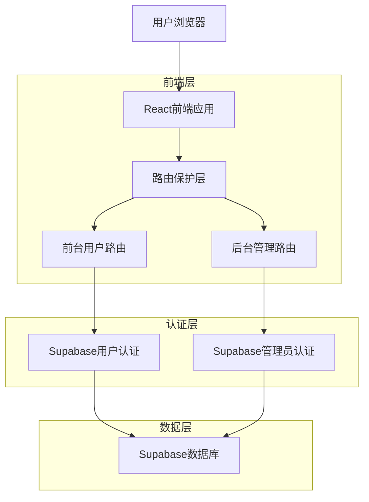
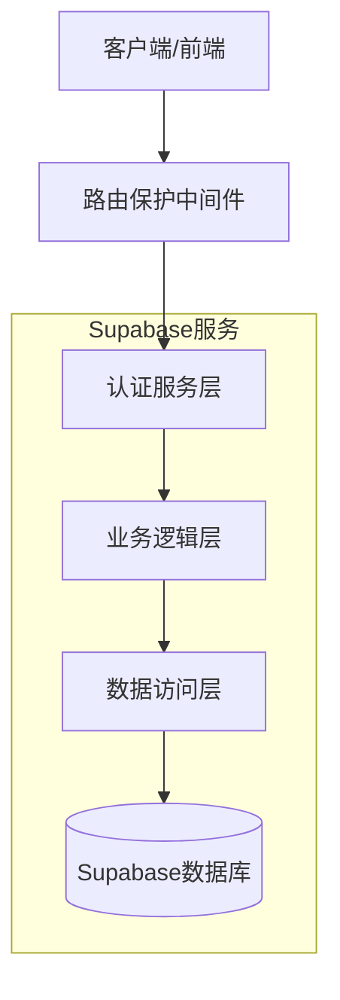
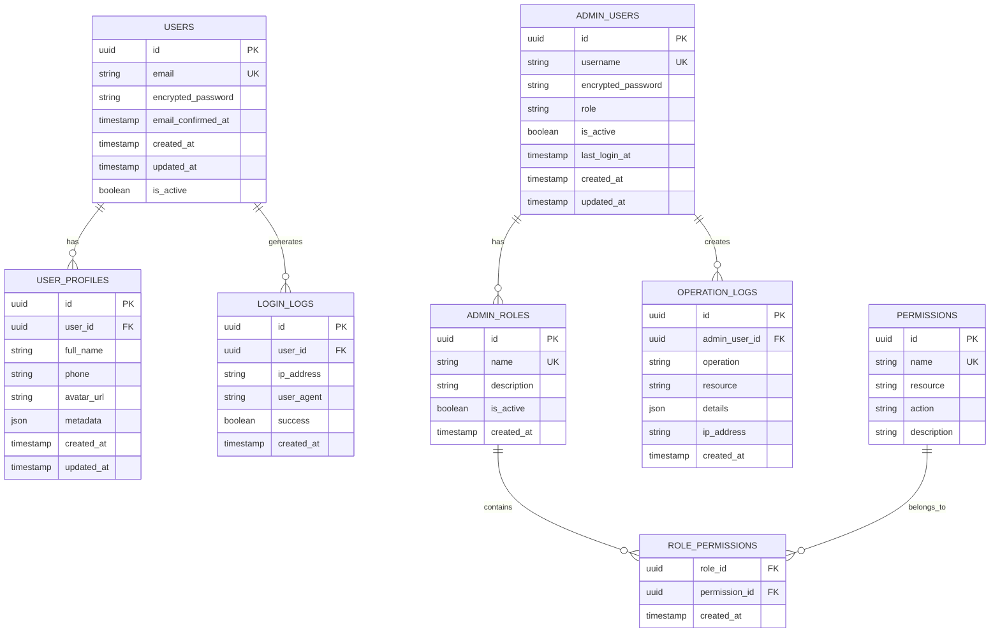

# 用户管理模块重构技术架构文档

## 1. 架构设计



## 2. 技术描述

- 前端：React@18 + TypeScript + Tailwind CSS + Vite + React Router
- 后端：Supabase (认证、数据库、实时订阅)
- 状态管理：Zustand
- UI组件：Lucide React + 自定义组件库

## 3. 路由定义

| 路由 | 用途 |
|------|------|
| /login | 前台用户登录页面 |
| /register | 前台用户注册页面 |
| /profile | 前台用户个人资料页面 |
| /profile/security | 前台用户账户安全设置 |
| /forgot-password | 前台用户密码找回页面 |
| /admin/login | 后台管理员登录页面 |
| /admin/dashboard | 后台管理仪表板 |
| /admin/users | 后台用户管理页面 |
| /admin/users/:id | 后台用户详情页面 |
| /admin/permissions | 后台权限管理页面 |
| /admin/logs | 后台操作日志页面 |
| /admin/settings | 后台系统设置页面 |

## 4. API定义

### 4.1 前台用户认证API

用户注册
```
POST /auth/v1/signup
```

请求参数：
| 参数名 | 参数类型 | 是否必需 | 描述 |
|--------|----------|----------|------|
| email | string | true | 用户邮箱 |
| password | string | true | 用户密码 |
| metadata | object | false | 用户元数据 |

响应：
| 参数名 | 参数类型 | 描述 |
|--------|----------|------|
| user | object | 用户信息 |
| session | object | 会话信息 |

用户登录
```
POST /auth/v1/token?grant_type=password
```

请求参数：
| 参数名 | 参数类型 | 是否必需 | 描述 |
|--------|----------|----------|------|
| email | string | true | 用户邮箱 |
| password | string | true | 用户密码 |

### 4.2 后台管理员认证API

管理员登录
```
POST /rest/v1/rpc/admin_login
```

请求参数：
| 参数名 | 参数类型 | 是否必需 | 描述 |
|--------|----------|----------|------|
| username | string | true | 管理员用户名 |
| password | string | true | 管理员密码 |
| totp_code | string | false | 双因子认证码 |

响应：
| 参数名 | 参数类型 | 描述 |
|--------|----------|------|
| admin_user | object | 管理员信息 |
| permissions | array | 权限列表 |
| session_token | string | 会话令牌 |

### 4.3 用户管理API

获取用户列表
```
GET /rest/v1/users
```

请求参数：
| 参数名 | 参数类型 | 是否必需 | 描述 |
|--------|----------|----------|------|
| page | number | false | 页码 |
| limit | number | false | 每页数量 |
| search | string | false | 搜索关键词 |
| status | string | false | 用户状态筛选 |

## 5. 服务器架构图



## 6. 数据模型

### 6.1 数据模型定义



### 6.2 数据定义语言

前台用户表 (users)
```sql
-- Supabase自带用户表，扩展用户资料表
CREATE TABLE user_profiles (
  id UUID PRIMARY KEY DEFAULT gen_random_uuid(),
  user_id UUID REFERENCES auth.users(id) ON DELETE CASCADE,
  full_name VARCHAR(100),
  phone VARCHAR(20),
  avatar_url TEXT,
  metadata JSONB DEFAULT '{}',
  created_at TIMESTAMP WITH TIME ZONE DEFAULT NOW(),
  updated_at TIMESTAMP WITH TIME ZONE DEFAULT NOW()
);

-- 用户登录日志表
CREATE TABLE login_logs (
  id UUID PRIMARY KEY DEFAULT gen_random_uuid(),
  user_id UUID REFERENCES auth.users(id) ON DELETE CASCADE,
  ip_address INET,
  user_agent TEXT,
  success BOOLEAN DEFAULT true,
  created_at TIMESTAMP WITH TIME ZONE DEFAULT NOW()
);

-- 创建索引
CREATE INDEX idx_user_profiles_user_id ON user_profiles(user_id);
CREATE INDEX idx_login_logs_user_id ON login_logs(user_id);
CREATE INDEX idx_login_logs_created_at ON login_logs(created_at DESC);
```

后台管理员表 (admin_users)
```sql
-- 管理员用户表
CREATE TABLE admin_users (
  id UUID PRIMARY KEY DEFAULT gen_random_uuid(),
  username VARCHAR(50) UNIQUE NOT NULL,
  encrypted_password VARCHAR(255) NOT NULL,
  role VARCHAR(20) DEFAULT 'admin' CHECK (role IN ('super_admin', 'admin')),
  is_active BOOLEAN DEFAULT true,
  last_login_at TIMESTAMP WITH TIME ZONE,
  created_at TIMESTAMP WITH TIME ZONE DEFAULT NOW(),
  updated_at TIMESTAMP WITH TIME ZONE DEFAULT NOW()
);

-- 权限表
CREATE TABLE permissions (
  id UUID PRIMARY KEY DEFAULT gen_random_uuid(),
  name VARCHAR(50) UNIQUE NOT NULL,
  resource VARCHAR(50) NOT NULL,
  action VARCHAR(20) NOT NULL,
  description TEXT
);

-- 角色权限关联表
CREATE TABLE admin_role_permissions (
  admin_user_id UUID REFERENCES admin_users(id) ON DELETE CASCADE,
  permission_id UUID REFERENCES permissions(id) ON DELETE CASCADE,
  created_at TIMESTAMP WITH TIME ZONE DEFAULT NOW(),
  PRIMARY KEY (admin_user_id, permission_id)
);

-- 操作日志表
CREATE TABLE operation_logs (
  id UUID PRIMARY KEY DEFAULT gen_random_uuid(),
  admin_user_id UUID REFERENCES admin_users(id) ON DELETE SET NULL,
  operation VARCHAR(50) NOT NULL,
  resource VARCHAR(50) NOT NULL,
  details JSONB DEFAULT '{}',
  ip_address INET,
  created_at TIMESTAMP WITH TIME ZONE DEFAULT NOW()
);

-- 创建索引
CREATE INDEX idx_admin_users_username ON admin_users(username);
CREATE INDEX idx_operation_logs_admin_user_id ON operation_logs(admin_user_id);
CREATE INDEX idx_operation_logs_created_at ON operation_logs(created_at DESC);

-- 初始化权限数据
INSERT INTO permissions (name, resource, action, description) VALUES
('users.read', 'users', 'read', '查看用户信息'),
('users.write', 'users', 'write', '编辑用户信息'),
('users.delete', 'users', 'delete', '删除用户'),
('products.read', 'products', 'read', '查看商品信息'),
('products.write', 'products', 'write', '编辑商品信息'),
('orders.read', 'orders', 'read', '查看订单信息'),
('system.admin', 'system', 'admin', '系统管理权限');

-- 创建默认超级管理员
INSERT INTO admin_users (username, encrypted_password, role) VALUES
('admin', crypt('admin123', gen_salt('bf')), 'super_admin');
```

行级安全策略 (RLS)
```sql
-- 启用行级安全
ALTER TABLE user_profiles ENABLE ROW LEVEL SECURITY;
ALTER TABLE login_logs ENABLE ROW LEVEL SECURITY;

-- 用户只能访问自己的资料
CREATE POLICY "Users can view own profile" ON user_profiles
  FOR SELECT USING (auth.uid() = user_id);

CREATE POLICY "Users can update own profile" ON user_profiles
  FOR UPDATE USING (auth.uid() = user_id);

-- 管理员可以访问所有用户数据
CREATE POLICY "Admins can view all profiles" ON user_profiles
  FOR ALL USING (
    EXISTS (
      SELECT 1 FROM admin_users 
      WHERE id = auth.uid() AND is_active = true
    )
  );

-- 基础权限设置
GRANT SELECT ON user_profiles TO anon;
GRANT ALL PRIVILEGES ON user_profiles TO authenticated;
GRANT ALL PRIVILEGES ON admin_users TO authenticated;
GRANT ALL PRIVILEGES ON permissions TO authenticated;
GRANT ALL PRIVILEGES ON operation_logs TO authenticated;
```