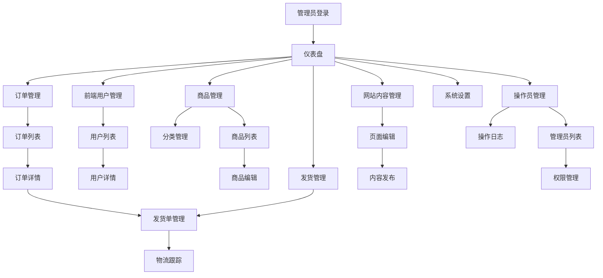

# 电商后台管理系统产品需求文档

## 1. 产品概述

基于现有玉石交易电商网站的完整后台管理系统，为管理员提供用户管理、商品管理、订单管理、发货管理、网站内容管理等核心功能。

- 该系统将与现有前端电商网站共享Supabase数据库，确保数据一致性和实时同步
- 实现前端用户与后台管理员的完全数据隔离，保障系统安全性
- 为电商运营提供全方位的管理工具，提升运营效率和用户体验

## 2. 核心功能

### 2.1 用户角色

| 角色 | 注册方式 | 核心权限 |
|------|----------|----------|
| 超级管理员 | 系统预设账号 | 拥有所有功能权限，可管理其他管理员 |
| 普通管理员 | 超级管理员创建 | 可管理用户、商品、订单等业务功能 |
| 操作员 | 管理员邀请创建 | 仅可查看和处理指定模块的日常操作 |

### 2.2 功能模块

我们的电商后台管理系统包含以下主要页面：

1. **仪表盘页面**：数据概览、实时统计、快捷操作入口
2. **前端用户管理页面**：用户列表、用户详情、状态管理、活动日志
3. **后台操作员管理页面**：管理员账户管理、权限分配、操作日志
4. **商品管理页面**：商品CRUD、分类管理、库存管理、价格管理
5. **订单管理页面**：订单查看、状态更新、支付管理、退款处理
6. **发货管理页面**：物流信息、快递跟踪、发货状态、批量发货
7. **网站内容管理页面**：静态页面编辑、内容发布、SEO管理
8. **系统设置页面**：基础配置、安全设置、数据导出

### 2.3 页面详情

| 页面名称 | 模块名称 | 功能描述 |
|----------|----------|----------|
| 仪表盘页面 | 数据概览 | 显示用户数量、订单统计、销售额、库存预警等关键指标 |
| 仪表盘页面 | 实时监控 | 实时显示在线用户、今日订单、热销商品等动态数据 |
| 仪表盘页面 | 快捷操作 | 提供常用功能的快速入口，如新增商品、处理订单等 |
| 前端用户管理页面 | 用户列表 | 分页显示所有前端用户，支持搜索、筛选、排序功能 |
| 前端用户管理页面 | 用户详情 | 查看用户完整信息、订单历史、活动记录 |
| 前端用户管理页面 | 状态管理 | 激活、停用、封禁用户账户，记录操作原因 |
| 后台操作员管理页面 | 管理员列表 | 显示所有后台管理员，支持角色筛选和状态管理 |
| 后台操作员管理页面 | 权限管理 | 分配和修改管理员权限，设置功能模块访问权限 |
| 后台操作员管理页面 | 操作日志 | 记录所有管理员操作，包括时间、操作内容、IP地址等 |
| 商品管理页面 | 商品列表 | 分页展示所有商品，支持多条件搜索和批量操作 |
| 商品管理页面 | 商品编辑 | 商品信息的增删改查，包括图片上传、规格设置 |
| 商品管理页面 | 分类管理 | 商品分类的层级管理，支持拖拽排序 |
| 商品管理页面 | 库存管理 | 实时库存监控、库存预警、批量库存调整 |
| 订单管理页面 | 订单列表 | 显示所有订单，支持状态筛选、时间范围查询 |
| 订单管理页面 | 订单详情 | 查看订单完整信息，包括商品、用户、支付、物流信息 |
| 订单管理页面 | 状态更新 | 更新订单状态，处理退款、取消等操作 |
| 发货管理页面 | 发货单管理 | 创建和管理发货单，支持批量发货操作 |
| 发货管理页面 | 物流跟踪 | 集成多家快递公司API，实时跟踪物流状态 |
| 发货管理页面 | 发货统计 | 发货数量统计、物流时效分析、异常订单处理 |
| 网站内容管理页面 | 页面编辑 | 编辑About、Contact、Help等静态页面内容 |
| 网站内容管理页面 | 内容发布 | 支持富文本编辑、图片上传、内容预览和发布 |
| 网站内容管理页面 | SEO管理 | 设置页面标题、描述、关键词等SEO信息 |
| 系统设置页面 | 基础配置 | 网站基本信息、联系方式、营业时间等设置 |
| 系统设置页面 | 安全设置 | 密码策略、登录限制、操作权限等安全配置 |
| 系统设置页面 | 数据管理 | 数据备份、导出、清理等数据管理功能 |

## 3. 核心流程

**超级管理员流程：**
系统初始化 → 管理员登录 → 创建普通管理员 → 分配权限 → 监控系统运行

**普通管理员流程：**
管理员登录 → 查看仪表盘 → 处理日常业务（用户/商品/订单管理） → 查看操作日志

**用户管理流程：**
查看用户列表 → 搜索筛选用户 → 查看用户详情 → 执行管理操作（激活/停用/封禁）

**商品管理流程：**
查看商品列表 → 新增/编辑商品 → 设置分类和库存 → 发布商品

**订单处理流程：**
查看订单列表 → 筛选待处理订单 → 查看订单详情 → 更新订单状态 → 安排发货

## 4. 用户界面设计

### 4.1 设计风格

- **主色调**：深蓝色 (#1e40af) 和白色 (#ffffff)，体现专业和可信赖
- **辅助色**：灰色 (#6b7280) 用于次要信息，绿色 (#10b981) 用于成功状态，红色 (#ef4444) 用于警告
- **按钮样式**：圆角按钮，主要按钮使用渐变效果，次要按钮使用边框样式
- **字体**：系统默认字体，标题使用 16-24px，正文使用 14px，小字使用 12px
- **布局风格**：左侧导航 + 顶部面包屑的经典后台布局，卡片式内容展示
- **图标风格**：使用 Heroicons 图标库，简洁现代的线性图标

### 4.2 页面设计概览

| 页面名称 | 模块名称 | UI元素 |
|----------|----------|--------|
| 仪表盘页面 | 数据概览 | 统计卡片使用白色背景、阴影效果，数字使用大号字体突出显示 |
| 仪表盘页面 | 图表展示 | 使用 Chart.js 实现柱状图、折线图，配色与主题保持一致 |
| 前端用户管理页面 | 用户列表 | 表格布局，斑马纹背景，悬停高亮，操作按钮使用图标+文字 |
| 前端用户管理页面 | 搜索筛选 | 顶部搜索栏，下拉筛选器，标签式状态筛选 |
| 商品管理页面 | 商品列表 | 网格或列表视图切换，商品图片缩略图，价格和库存突出显示 |
| 商品管理页面 | 商品编辑 | 分步骤表单，图片拖拽上传，实时预览功能 |
| 订单管理页面 | 订单列表 | 时间线布局显示订单状态，颜色编码区分不同状态 |
| 订单管理页面 | 订单详情 | 分区块显示订单信息，商品信息使用卡片布局 |
| 发货管理页面 | 物流跟踪 | 时间轴显示物流进度，地图组件显示配送路线 |
| 网站内容管理页面 | 富文本编辑 | 集成 TinyMCE 编辑器，工具栏简洁实用 |
| 操作员管理页面 | 权限设置 | 树形结构显示权限层级，复选框批量选择 |
| 系统设置页面 | 配置表单 | 分组表单布局，重要设置使用警告色提示 |

### 4.3 响应式设计

- **桌面优先设计**：主要针对 1920x1080 及以上分辨率优化
- **平板适配**：在 768px-1024px 宽度下，侧边栏可折叠，表格支持横向滚动
- **移动端支持**：768px 以下使用底部导航，表格转换为卡片布局
- **触控优化**：按钮和链接区域不小于 44px，支持手势操作