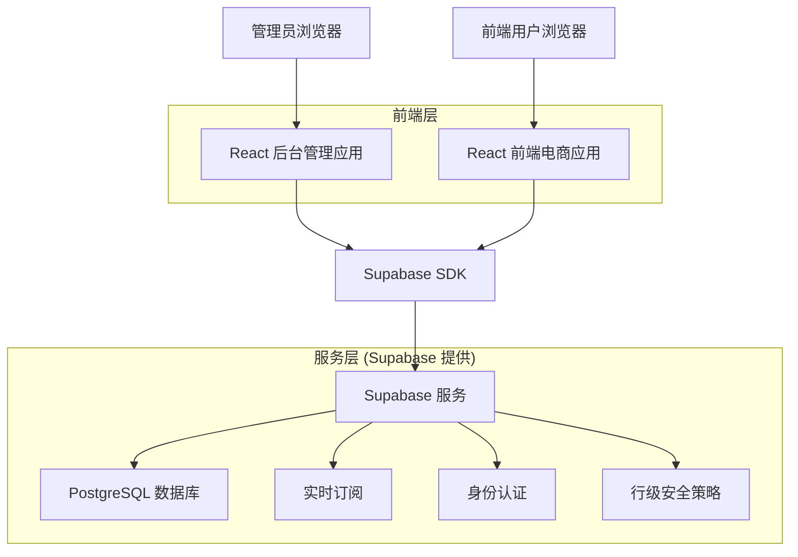
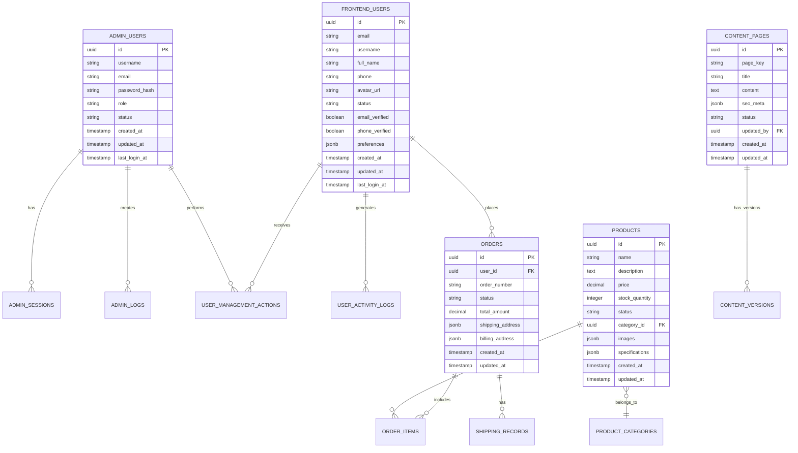

# 电商后台管理系统技术架构文档

## 1. 架构设计



## 2. 技术描述

- **前端**：React@18 + TypeScript + TailwindCSS + Vite
- **状态管理**：Zustand
- **数据获取**：React Query + Supabase SDK
- **UI组件**：Radix UI + Headless UI
- **图表库**：Recharts
- **富文本编辑**：React Quill
- **后端服务**：Supabase (PostgreSQL + 实时订阅 + 身份认证)

## 3. 路由定义

| 路由 | 用途 |
|------|------|
| /admin/login | 管理员登录页面 |
| /admin/dashboard | 仪表盘，显示系统概览和关键指标 |
| /admin/users | 前端用户管理，用户列表和详情 |
| /admin/users/:id | 用户详情页面，查看和编辑用户信息 |
| /admin/operators | 后台操作员管理，管理员账户管理 |
| /admin/operators/:id | 操作员详情页面，权限设置和信息编辑 |
| /admin/products | 商品管理，商品列表和分类管理 |
| /admin/products/:id | 商品详情页面，商品信息编辑 |
| /admin/products/categories | 商品分类管理页面 |
| /admin/orders | 订单管理，订单列表和状态管理 |
| /admin/orders/:id | 订单详情页面，订单信息和状态更新 |
| /admin/shipping | 发货管理，发货单和物流跟踪 |
| /admin/shipping/:id | 发货详情页面，物流信息和状态更新 |
| /admin/content | 网站内容管理，静态页面编辑 |
| /admin/content/:page | 具体页面编辑，如 about、contact 等 |
| /admin/logs | 操作日志，系统操作记录查看 |
| /admin/settings | 系统设置，基础配置和安全设置 |

## 4. 数据模型

### 4.1 数据模型定义



### 4.2 数据定义语言

**管理员用户表 (admin_users)**
```sql
-- 创建管理员用户表
CREATE TABLE admin_users (
    id UUID PRIMARY KEY DEFAULT gen_random_uuid(),
    username VARCHAR(50) UNIQUE NOT NULL,
    email VARCHAR(255) UNIQUE NOT NULL,
    password_hash VARCHAR(255) NOT NULL,
    role VARCHAR(20) NOT NULL DEFAULT 'operator' CHECK (role IN ('admin', 'operator')),
    status VARCHAR(20) NOT NULL DEFAULT 'active' CHECK (status IN ('active', 'inactive')),
    created_at TIMESTAMP WITH TIME ZONE DEFAULT NOW(),
    updated_at TIMESTAMP WITH TIME ZONE DEFAULT NOW(),
    last_login_at TIMESTAMP WITH TIME ZONE
);

-- 创建索引
CREATE INDEX idx_admin_users_username ON admin_users(username);
CREATE INDEX idx_admin_users_email ON admin_users(email);
CREATE INDEX idx_admin_users_role ON admin_users(role);
CREATE INDEX idx_admin_users_status ON admin_users(status);

-- 插入初始管理员账户
INSERT INTO admin_users (username, email, password_hash, role, status)
VALUES ('admin', 'admin@example.com', '$2b$10$rQZ8kHWKtGY5uFJ7mXvzHOqGzQzQzQzQzQzQzQzQzQzQzQzQzQzQz', 'admin', 'active')
ON CONFLICT (username) DO NOTHING;
```

**管理员会话表 (admin_sessions)**
```sql
-- 创建管理员会话表
CREATE TABLE admin_sessions (
    id UUID PRIMARY KEY DEFAULT gen_random_uuid(),
    admin_user_id UUID NOT NULL REFERENCES admin_users(id) ON DELETE CASCADE,
    token VARCHAR(255) UNIQUE NOT NULL,
    expires_at TIMESTAMP WITH TIME ZONE NOT NULL,
    created_at TIMESTAMP WITH TIME ZONE DEFAULT NOW(),
    ip_address INET,
    user_agent TEXT
);

-- 创建索引
CREATE INDEX idx_admin_sessions_admin_user_id ON admin_sessions(admin_user_id);
CREATE INDEX idx_admin_sessions_token ON admin_sessions(token);
CREATE INDEX idx_admin_sessions_expires_at ON admin_sessions(expires_at);
```

**管理员操作日志表 (admin_logs)**
```sql
-- 创建管理员操作日志表
CREATE TABLE admin_logs (
    id UUID PRIMARY KEY DEFAULT gen_random_uuid(),
    admin_user_id UUID NOT NULL REFERENCES admin_users(id) ON DELETE CASCADE,
    action VARCHAR(100) NOT NULL,
    resource_type VARCHAR(50) NOT NULL,
    resource_id UUID,
    details JSONB DEFAULT '{}',
    ip_address INET,
    user_agent TEXT,
    created_at TIMESTAMP WITH TIME ZONE DEFAULT NOW()
);

-- 创建索引
CREATE INDEX idx_admin_logs_admin_user_id ON admin_logs(admin_user_id);
CREATE INDEX idx_admin_logs_action ON admin_logs(action);
CREATE INDEX idx_admin_logs_resource_type ON admin_logs(resource_type);
CREATE INDEX idx_admin_logs_created_at ON admin_logs(created_at DESC);
```

**商品表 (products)**
```sql
-- 创建商品表
CREATE TABLE products (
    id UUID PRIMARY KEY DEFAULT gen_random_uuid(),
    name VARCHAR(255) NOT NULL,
    description TEXT,
    price DECIMAL(10,2) NOT NULL,
    stock_quantity INTEGER NOT NULL DEFAULT 0,
    status VARCHAR(20) NOT NULL DEFAULT 'draft' CHECK (status IN ('draft', 'active', 'inactive', 'out_of_stock')),
    category_id UUID REFERENCES product_categories(id),
    images JSONB DEFAULT '[]',
    specifications JSONB DEFAULT '{}',
    seo_title VARCHAR(255),
    seo_description TEXT,
    seo_keywords TEXT,
    created_at TIMESTAMP WITH TIME ZONE DEFAULT NOW(),
    updated_at TIMESTAMP WITH TIME ZONE DEFAULT NOW()
);

-- 创建索引
CREATE INDEX idx_products_name ON products(name);
CREATE INDEX idx_products_status ON products(status);
CREATE INDEX idx_products_category_id ON products(category_id);
CREATE INDEX idx_products_price ON products(price);
CREATE INDEX idx_products_created_at ON products(created_at DESC);
```

**订单表 (orders)**
```sql
-- 创建订单表
CREATE TABLE orders (
    id UUID PRIMARY KEY DEFAULT gen_random_uuid(),
    user_id UUID NOT NULL REFERENCES frontend_users(id) ON DELETE CASCADE,
    order_number VARCHAR(50) UNIQUE NOT NULL,
    status VARCHAR(20) NOT NULL DEFAULT 'pending' CHECK (status IN ('pending', 'paid', 'processing', 'shipped', 'delivered', 'cancelled', 'refunded')),
    total_amount DECIMAL(10,2) NOT NULL,
    shipping_address JSONB NOT NULL,
    billing_address JSONB,
    payment_method VARCHAR(50),
    payment_status VARCHAR(20) DEFAULT 'pending',
    notes TEXT,
    created_at TIMESTAMP WITH TIME ZONE DEFAULT NOW(),
    updated_at TIMESTAMP WITH TIME ZONE DEFAULT NOW()
);

-- 创建索引
CREATE INDEX idx_orders_user_id ON orders(user_id);
CREATE INDEX idx_orders_order_number ON orders(order_number);
CREATE INDEX idx_orders_status ON orders(status);
CREATE INDEX idx_orders_created_at ON orders(created_at DESC);
```

**发货记录表 (shipping_records)**
```sql
-- 创建发货记录表
CREATE TABLE shipping_records (
    id UUID PRIMARY KEY DEFAULT gen_random_uuid(),
    order_id UUID NOT NULL REFERENCES orders(id) ON DELETE CASCADE,
    tracking_number VARCHAR(100),
    carrier VARCHAR(50),
    status VARCHAR(20) NOT NULL DEFAULT 'preparing' CHECK (status IN ('preparing', 'shipped', 'in_transit', 'delivered', 'exception')),
    shipped_at TIMESTAMP WITH TIME ZONE,
    delivered_at TIMESTAMP WITH TIME ZONE,
    notes TEXT,
    created_at TIMESTAMP WITH TIME ZONE DEFAULT NOW(),
    updated_at TIMESTAMP WITH TIME ZONE DEFAULT NOW()
);

-- 创建索引
CREATE INDEX idx_shipping_records_order_id ON shipping_records(order_id);
CREATE INDEX idx_shipping_records_tracking_number ON shipping_records(tracking_number);
CREATE INDEX idx_shipping_records_status ON shipping_records(status);
```

**网站内容页面表 (content_pages)**
```sql
-- 创建网站内容页面表
CREATE TABLE content_pages (
    id UUID PRIMARY KEY DEFAULT gen_random_uuid(),
    page_key VARCHAR(50) UNIQUE NOT NULL,
    title VARCHAR(255) NOT NULL,
    content TEXT,
    seo_meta JSONB DEFAULT '{}',
    status VARCHAR(20) NOT NULL DEFAULT 'draft' CHECK (status IN ('draft', 'published', 'archived')),
    updated_by UUID REFERENCES admin_users(id),
    created_at TIMESTAMP WITH TIME ZONE DEFAULT NOW(),
    updated_at TIMESTAMP WITH TIME ZONE DEFAULT NOW()
);

-- 创建索引
CREATE INDEX idx_content_pages_page_key ON content_pages(page_key);
CREATE INDEX idx_content_pages_status ON content_pages(status);
CREATE INDEX idx_content_pages_updated_by ON content_pages(updated_by);

-- 插入初始页面内容
INSERT INTO content_pages (page_key, title, content, status)
VALUES 
    ('about', '关于我们', '<h1>关于我们</h1><p>这里是关于我们的内容...</p>', 'published'),
    ('contact', '联系我们', '<h1>联系我们</h1><p>这里是联系我们的内容...</p>', 'published'),
    ('help', '帮助中心', '<h1>帮助中心</h1><p>这里是帮助中心的内容...</p>', 'published'),
    ('shipping', '配送说明', '<h1>配送说明</h1><p>这里是配送说明的内容...</p>', 'published'),
    ('returns', '退换货政策', '<h1>退换货政策</h1><p>这里是退换货政策的内容...</p>', 'published'),
    ('privacy', '隐私政策', '<h1>隐私政策</h1><p>这里是隐私政策的内容...</p>', 'published'),
    ('terms', '服务条款', '<h1>服务条款</h1><p>这里是服务条款的内容...</p>', 'published')
ON CONFLICT (page_key) DO NOTHING;
```

## 5. 权限控制策略

### 5.1 行级安全策略 (RLS)

```sql
-- 启用行级安全
ALTER TABLE admin_users ENABLE ROW LEVEL SECURITY;
ALTER TABLE admin_sessions ENABLE ROW LEVEL SECURITY;
ALTER TABLE admin_logs ENABLE ROW LEVEL SECURITY;
ALTER TABLE frontend_users ENABLE ROW LEVEL SECURITY;

-- 管理员用户访问策略
CREATE POLICY "管理员可以查看所有管理员" ON admin_users
    FOR SELECT USING (auth.role() = 'authenticated');

CREATE POLICY "超级管理员可以管理所有管理员" ON admin_users
    FOR ALL USING (
        EXISTS (
            SELECT 1 FROM admin_users 
            WHERE id = auth.uid() AND role = 'admin'
        )
    );

-- 前端用户访问策略
CREATE POLICY "管理员可以查看所有前端用户" ON frontend_users
    FOR SELECT USING (
        EXISTS (
            SELECT 1 FROM admin_users 
            WHERE id = auth.uid() AND status = 'active'
        )
    );

CREATE POLICY "管理员可以管理前端用户" ON frontend_users
    FOR ALL USING (
        EXISTS (
            SELECT 1 FROM admin_users 
            WHERE id = auth.uid() AND status = 'active'
        )
    );
```

### 5.2 权限级别定义

- **超级管理员 (admin)**：拥有所有功能权限，可以管理其他管理员
- **普通管理员 (operator)**：可以管理业务数据，但不能管理其他管理员
- **只读权限**：仅可查看数据，不能进行修改操作

## 6. 实时数据同步

使用 Supabase 的实时订阅功能实现数据的实时同步：

```typescript
// 订阅前端用户变更
const subscription = supabase
  .channel('frontend_users_changes')
  .on('postgres_changes', 
    { event: '*', schema: 'public', table: 'frontend_users' },
    (payload) => {
      // 处理用户数据变更
      handleUserChange(payload)
    }
  )
  .subscribe()

// 订阅订单状态变更
const orderSubscription = supabase
  .channel('orders_changes')
  .on('postgres_changes',
    { event: 'UPDATE', schema: 'public', table: 'orders' },
    (payload) => {
      // 处理订单状态变更
      handleOrderStatusChange(payload)
    }
  )
  .subscribe()
```