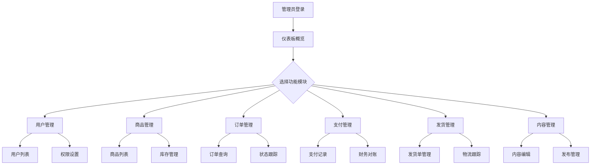

# 系统后台管理模块产品需求文档

## 1. 产品概述

系统后台管理模块是一个全面的电商平台管理系统，为管理员提供完整的业务管理功能，包括用户管理、商品管理、订单管理、支付管理、发货管理和内容管理等核心模块。
该系统旨在提高管理效率，简化运营流程，为电商平台的日常运营提供强有力的技术支撑。
通过数据可视化和智能化管理，帮助管理员更好地掌控业务全局，提升用户体验和运营效率。

## 2. 核心功能

### 2.1 用户角色

| 角色 | 注册方式 | 核心权限 |
|------|----------|----------|
| 超级管理员 | 系统预设账号 | 拥有所有模块的完整权限，包括用户管理、系统配置等 |
| 运营管理员 | 超级管理员创建 | 商品管理、订单管理、内容管理权限 |
| 财务管理员 | 超级管理员创建 | 支付管理、财务对账、订单退款权限 |
| 客服管理员 | 超级管理员创建 | 用户服务、订单处理、发货管理权限 |

### 2.2 功能模块

系统后台管理模块包含以下核心页面：
1. **仪表板页面**：数据统计概览、快捷操作入口、系统通知中心
2. **用户管理页面**：用户列表、权限设置、角色管理、活动日志
3. **商品管理页面**：商品列表、分类管理、库存管理、评价审核
4. **订单管理页面**：订单列表、状态跟踪、详情查看、退款处理
5. **支付管理页面**：支付配置、记录查询、异常处理、财务对账
6. **发货管理页面**：物流管理、发货单、跟踪查询、退换货处理
7. **内容管理页面**：页面编辑、富文本编辑、多语言管理、发布控制
8. **系统设置页面**：权限配置、日志管理、系统参数设置

### 2.3 页面详情

| 页面名称 | 模块名称 | 功能描述 |
|----------|----------|----------|
| 仪表板页面 | 数据统计面板 | 显示用户数量、订单统计、销售额、商品库存等关键指标的可视化图表 |
| 仪表板页面 | 快捷操作区 | 提供常用功能的快速入口，如新增商品、处理订单、查看通知等 |
| 仪表板页面 | 系统通知中心 | 显示系统消息、待处理事项、异常警告等重要信息 |
| 用户管理页面 | 用户列表管理 | 查看、搜索、筛选用户信息，支持批量操作和用户状态管理 |
| 用户管理页面 | 权限角色设置 | 创建和编辑用户角色，分配功能权限，设置访问控制规则 |
| 用户管理页面 | 活动日志记录 | 记录用户操作历史，包括登录、购买、评价等行为轨迹 |
| 商品管理页面 | 商品信息管理 | 添加、编辑、删除商品信息，包括图片、描述、价格、规格等 |
| 商品管理页面 | 分类管理系统 | 创建和管理商品分类层级，设置分类属性和展示规则 |
| 商品管理页面 | 库存预警系统 | 监控商品库存状态，设置预警阈值，自动提醒补货 |
| 商品管理页面 | 评价审核功能 | 审核用户评价内容，管理评价显示状态，处理恶意评价 |
| 订单管理页面 | 订单查询筛选 | 多条件搜索订单，按状态、时间、金额等维度筛选和排序 |
| 订单管理页面 | 状态跟踪管理 | 更新订单状态，跟踪处理进度，设置状态变更通知 |
| 订单管理页面 | 详情查看功能 | 查看订单完整信息，包括商品详情、用户信息、支付记录等 |
| 订单管理页面 | 取消退款处理 | 处理订单取消申请，执行退款操作，记录处理结果 |
| 支付管理页面 | 支付方式配置 | 配置支付渠道参数，设置支付方式可用性和优先级 |
| 支付管理页面 | 支付记录查询 | 查询支付交易记录，支持多维度筛选和数据导出 |
| 支付管理页面 | 异常处理功能 | 处理支付失败、重复支付等异常情况，提供解决方案 |
| 支付管理页面 | 财务对账系统 | 自动对账功能，生成财务报表，核对收支明细 |
| 发货管理页面 | 物流信息管理 | 管理物流公司信息，配置运费规则，设置配送区域 |
| 发货管理页面 | 发货单生成 | 自动生成发货单据，打印快递单，批量处理发货 |
| 发货管理页面 | 物流跟踪查询 | 实时查询物流状态，同步跟踪信息，通知用户 |
| 发货管理页面 | 退换货处理 | 处理退换货申请，管理退货流程，更新库存状态 |
| 内容管理页面 | 页面内容编辑 | 编辑网站页面内容，管理轮播图、公告、帮助文档等 |
| 内容管理页面 | 富文本编辑器 | 提供所见即所得的内容编辑功能，支持图片、视频、链接等 |
| 内容管理页面 | 多语言管理 | 管理多语言内容版本，支持内容翻译和本地化设置 |
| 内容管理页面 | 发布控制系统 | 控制内容发布状态，设置发布时间，管理内容版本 |

## 3. 核心流程

### 管理员操作流程
管理员登录系统后，首先进入仪表板查看整体数据概览和待处理事项。根据工作需要，可以进入相应的功能模块进行具体操作，如处理订单、管理商品、审核内容等。系统会记录所有操作日志，确保操作可追溯。

### 用户管理流程
超级管理员创建新的管理员账号，分配相应角色和权限。管理员可以查看和管理普通用户信息，处理用户申诉，查看用户活动日志。权限变更需要经过审批流程。

### 商品管理流程
运营管理员添加新商品信息，设置商品分类和库存。系统自动监控库存状态，当库存低于预警线时发送通知。商品评价需要经过审核后才能显示，确保内容质量。

### 订单处理流程
客服管理员接收新订单通知，确认订单信息后安排发货。订单状态会实时更新，用户可以跟踪订单进度。如遇退款申请，财务管理员会进行审核和处理。

## 4. 用户界面设计

### 4.1 设计风格
- 主色调：深蓝色 (#1e40af) 和浅蓝色 (#3b82f6)，体现专业性和可信度
- 辅助色：绿色 (#10b981) 表示成功，红色 (#ef4444) 表示警告，橙色 (#f59e0b) 表示提醒
- 按钮样式：圆角矩形设计，支持悬停效果和禁用状态
- 字体：系统默认字体，标题使用 16-24px，正文使用 14px，说明文字使用 12px
- 布局风格：左侧导航 + 顶部面包屑 + 主内容区域的经典后台布局
- 图标风格：使用简洁的线性图标，保持视觉一致性

### 4.2 页面设计概览

| 页面名称 | 模块名称 | UI元素 |
|----------|----------|--------|
| 仪表板页面 | 数据统计面板 | 卡片式布局，使用图表库展示数据，配色以蓝色为主，支持数据刷新动画 |
| 仪表板页面 | 快捷操作区 | 网格布局的操作按钮，每个按钮包含图标和文字说明，悬停时有阴影效果 |
| 用户管理页面 | 用户列表 | 表格布局，支持排序和筛选，行悬停高亮，操作按钮使用小尺寸设计 |
| 用户管理页面 | 权限设置 | 树形结构展示权限层级，复选框选择权限项，支持批量操作 |
| 商品管理页面 | 商品列表 | 卡片 + 列表混合布局，商品图片缩略图，价格和库存状态用不同颜色标识 |
| 商品管理页面 | 库存预警 | 仪表盘样式的库存指示器，红色表示缺货，橙色表示预警，绿色表示充足 |
| 订单管理页面 | 订单列表 | 时间线布局显示订单状态，不同状态使用不同颜色标签，支持快速筛选 |
| 订单管理页面 | 订单详情 | 分步骤展示订单信息，使用卡片分组显示商品、用户、支付、物流信息 |
| 支付管理页面 | 支付记录 | 表格布局，金额字段右对齐，成功/失败状态用绿色/红色标识 |
| 支付管理页面 | 财务对账 | 双栏布局，左侧筛选条件，右侧对账结果，支持数据导出功能 |
| 发货管理页面 | 物流跟踪 | 地图组件显示物流路径，时间轴显示跟踪记录，实时状态更新 |
| 内容管理页面 | 富文本编辑器 | 工具栏 + 编辑区域 + 预览区域的三栏布局，支持拖拽上传图片 |

### 4.3 响应式设计
系统采用桌面优先的响应式设计，在平板设备上侧边栏可折叠，在手机设备上转为底部导航栏。所有表格和图表都支持横向滚动，确保在小屏幕上的可用性。触摸设备优化了按钮大小和间距，提供更好的操作体验。