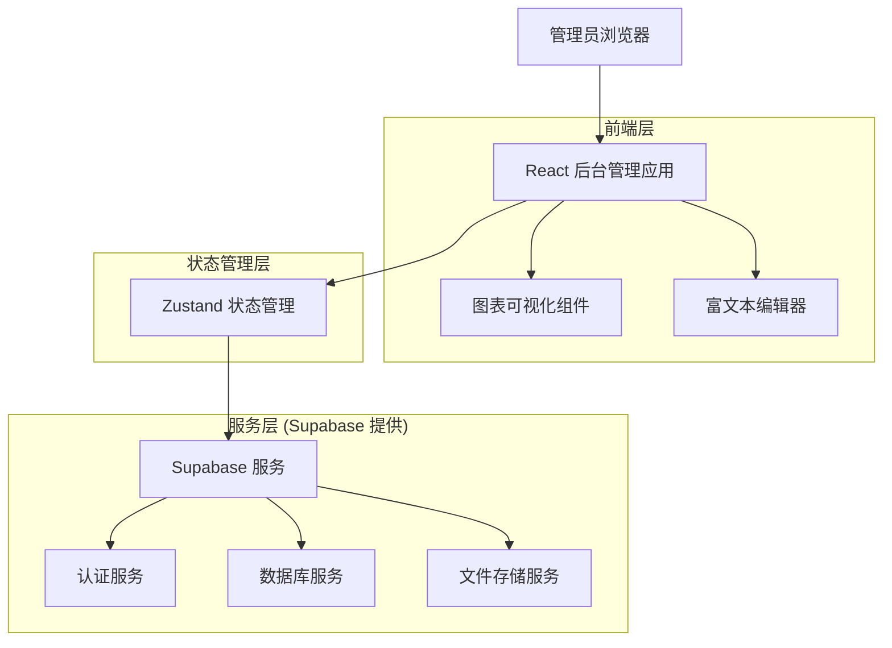
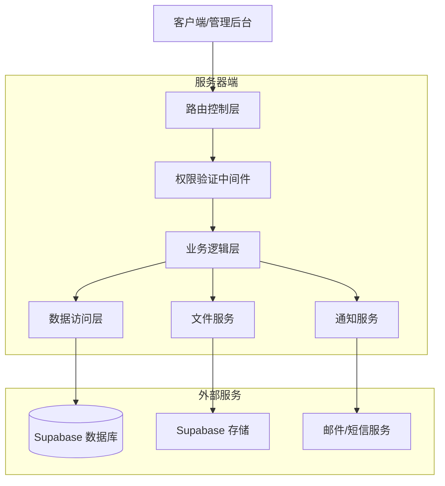
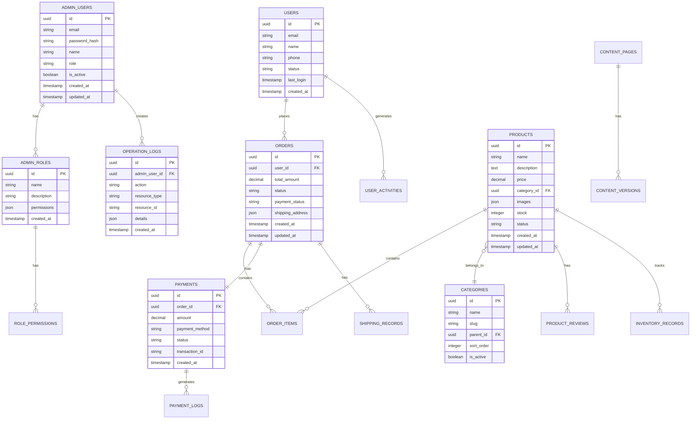

# 系统后台管理模块技术架构文档

## 1. 架构设计



## 2. 技术描述

- 前端：React@18 + TypeScript + Tailwind CSS + Vite
- 状态管理：Zustand
- 数据可视化：Chart.js 或 Recharts
- 富文本编辑：React-Quill
- UI组件库：Headless UI + 自定义组件
- 后端服务：Supabase (认证、数据库、文件存储)
- 路由管理：React Router v6

## 3. 路由定义

| 路由 | 用途 |
|------|------|
| /admin | 后台管理主页，重定向到仪表板 |
| /admin/dashboard | 仪表板页面，显示数据统计和快捷操作 |
| /admin/users | 用户管理页面，管理网站用户和管理员 |
| /admin/users/:id | 用户详情页面，查看和编辑用户信息 |
| /admin/products | 商品管理页面，管理商品信息和分类 |
| /admin/products/categories | 商品分类管理页面 |
| /admin/products/:id | 商品详情编辑页面 |
| /admin/orders | 订单管理页面，查询和处理订单 |
| /admin/orders/:id | 订单详情页面，查看订单完整信息 |
| /admin/payments | 支付管理页面，管理支付配置和记录 |
| /admin/payments/settings | 支付方式配置页面 |
| /admin/shipping | 发货管理页面，管理物流和发货 |
| /admin/shipping/logistics | 物流公司管理页面 |
| /admin/content | 内容管理页面，管理网站内容 |
| /admin/content/pages | 页面内容编辑页面 |
| /admin/settings | 系统设置页面，权限和参数配置 |
| /admin/logs | 操作日志页面，查看系统日志 |

## 4. API定义

### 4.1 核心API

#### 用户管理相关
```
GET /api/admin/users
```

请求参数:
| 参数名称 | 参数类型 | 是否必需 | 描述 |
|----------|----------|----------|------|
| page | number | false | 页码，默认为1 |
| limit | number | false | 每页数量，默认为20 |
| search | string | false | 搜索关键词 |
| role | string | false | 用户角色筛选 |
| status | string | false | 用户状态筛选 |

响应数据:
| 字段名称 | 字段类型 | 描述 |
|----------|----------|------|
| users | User[] | 用户列表 |
| total | number | 总数量 |
| page | number | 当前页码 |
| totalPages | number | 总页数 |

示例:
```json
{
  "users": [
    {
      "id": "user_123",
      "email": "user@example.com",
      "name": "张三",
      "role": "customer",
      "status": "active",
      "created_at": "2024-01-01T00:00:00Z"
    }
  ],
  "total": 100,
  "page": 1,
  "totalPages": 5
}
```

#### 商品管理相关
```
POST /api/admin/products
```

请求参数:
| 参数名称 | 参数类型 | 是否必需 | 描述 |
|----------|----------|----------|------|
| name | string | true | 商品名称 |
| description | string | true | 商品描述 |
| price | number | true | 商品价格 |
| category_id | string | true | 分类ID |
| images | string[] | false | 商品图片URL数组 |
| stock | number | true | 库存数量 |
| status | string | true | 商品状态 |

响应数据:
| 字段名称 | 字段类型 | 描述 |
|----------|----------|------|
| success | boolean | 操作是否成功 |
| product | Product | 创建的商品信息 |
| message | string | 操作结果消息 |

#### 订单管理相关
```
PUT /api/admin/orders/:id/status
```

请求参数:
| 参数名称 | 参数类型 | 是否必需 | 描述 |
|----------|----------|----------|------|
| status | string | true | 新的订单状态 |
| note | string | false | 状态变更备注 |

响应数据:
| 字段名称 | 字段类型 | 描述 |
|----------|----------|------|
| success | boolean | 更新是否成功 |
| order | Order | 更新后的订单信息 |

#### 支付管理相关
```
GET /api/admin/payments/records
```

请求参数:
| 参数名称 | 参数类型 | 是否必需 | 描述 |
|----------|----------|----------|------|
| start_date | string | false | 开始日期 |
| end_date | string | false | 结束日期 |
| payment_method | string | false | 支付方式 |
| status | string | false | 支付状态 |

响应数据:
| 字段名称 | 字段类型 | 描述 |
|----------|----------|------|
| records | PaymentRecord[] | 支付记录列表 |
| summary | PaymentSummary | 支付汇总信息 |

## 5. 服务器架构图



## 6. 数据模型

### 6.1 数据模型定义



### 6.2 数据定义语言

#### 管理员用户表 (admin_users)
```sql
-- 创建管理员用户表
CREATE TABLE admin_users (
    id UUID PRIMARY KEY DEFAULT gen_random_uuid(),
    email VARCHAR(255) UNIQUE NOT NULL,
    password_hash VARCHAR(255) NOT NULL,
    name VARCHAR(100) NOT NULL,
    role VARCHAR(50) DEFAULT 'admin' CHECK (role IN ('super_admin', 'admin', 'operator', 'finance', 'customer_service')),
    is_active BOOLEAN DEFAULT true,
    last_login TIMESTAMP WITH TIME ZONE,
    created_at TIMESTAMP WITH TIME ZONE DEFAULT NOW(),
    updated_at TIMESTAMP WITH TIME ZONE DEFAULT NOW()
);

-- 创建索引
CREATE INDEX idx_admin_users_email ON admin_users(email);
CREATE INDEX idx_admin_users_role ON admin_users(role);
CREATE INDEX idx_admin_users_is_active ON admin_users(is_active);

-- 权限设置
GRANT SELECT, INSERT, UPDATE ON admin_users TO authenticated;
GRANT SELECT ON admin_users TO anon;
```

#### 管理员角色表 (admin_roles)
```sql
-- 创建管理员角色表
CREATE TABLE admin_roles (
    id UUID PRIMARY KEY DEFAULT gen_random_uuid(),
    name VARCHAR(100) UNIQUE NOT NULL,
    description TEXT,
    permissions JSONB NOT NULL DEFAULT '{}',
    is_active BOOLEAN DEFAULT true,
    created_at TIMESTAMP WITH TIME ZONE DEFAULT NOW(),
    updated_at TIMESTAMP WITH TIME ZONE DEFAULT NOW()
);

-- 创建索引
CREATE INDEX idx_admin_roles_name ON admin_roles(name);
CREATE INDEX idx_admin_roles_permissions ON admin_roles USING GIN(permissions);

-- 权限设置
GRANT ALL PRIVILEGES ON admin_roles TO authenticated;
```

#### 商品分类表 (categories)
```sql
-- 创建商品分类表
CREATE TABLE categories (
    id UUID PRIMARY KEY DEFAULT gen_random_uuid(),
    name VARCHAR(100) NOT NULL,
    slug VARCHAR(100) UNIQUE NOT NULL,
    parent_id UUID REFERENCES categories(id),
    description TEXT,
    sort_order INTEGER DEFAULT 0,
    is_active BOOLEAN DEFAULT true,
    created_at TIMESTAMP WITH TIME ZONE DEFAULT NOW(),
    updated_at TIMESTAMP WITH TIME ZONE DEFAULT NOW()
);

-- 创建索引
CREATE INDEX idx_categories_parent_id ON categories(parent_id);
CREATE INDEX idx_categories_slug ON categories(slug);
CREATE INDEX idx_categories_is_active ON categories(is_active);

-- 权限设置
GRANT ALL PRIVILEGES ON categories TO authenticated;
GRANT SELECT ON categories TO anon;
```

#### 库存记录表 (inventory_records)
```sql
-- 创建库存记录表
CREATE TABLE inventory_records (
    id UUID PRIMARY KEY DEFAULT gen_random_uuid(),
    product_id UUID REFERENCES products(id) ON DELETE CASCADE,
    change_type VARCHAR(20) NOT NULL CHECK (change_type IN ('in', 'out', 'adjust')),
    quantity INTEGER NOT NULL,
    reason VARCHAR(255),
    operator_id UUID REFERENCES admin_users(id),
    created_at TIMESTAMP WITH TIME ZONE DEFAULT NOW()
);

-- 创建索引
CREATE INDEX idx_inventory_records_product_id ON inventory_records(product_id);
CREATE INDEX idx_inventory_records_created_at ON inventory_records(created_at DESC);

-- 权限设置
GRANT ALL PRIVILEGES ON inventory_records TO authenticated;
```

#### 操作日志表 (operation_logs)
```sql
-- 创建操作日志表
CREATE TABLE operation_logs (
    id UUID PRIMARY KEY DEFAULT gen_random_uuid(),
    admin_user_id UUID REFERENCES admin_users(id),
    action VARCHAR(100) NOT NULL,
    resource_type VARCHAR(50) NOT NULL,
    resource_id VARCHAR(255),
    details JSONB DEFAULT '{}',
    ip_address INET,
    user_agent TEXT,
    created_at TIMESTAMP WITH TIME ZONE DEFAULT NOW()
);

-- 创建索引
CREATE INDEX idx_operation_logs_admin_user_id ON operation_logs(admin_user_id);
CREATE INDEX idx_operation_logs_action ON operation_logs(action);
CREATE INDEX idx_operation_logs_resource_type ON operation_logs(resource_type);
CREATE INDEX idx_operation_logs_created_at ON operation_logs(created_at DESC);

-- 权限设置
GRANT ALL PRIVILEGES ON operation_logs TO authenticated;
```

#### 内容页面表 (content_pages)
```sql
-- 创建内容页面表
CREATE TABLE content_pages (
    id UUID PRIMARY KEY DEFAULT gen_random_uuid(),
    title VARCHAR(255) NOT NULL,
    slug VARCHAR(255) UNIQUE NOT NULL,
    content TEXT,
    meta_description TEXT,
    meta_keywords TEXT,
    language VARCHAR(10) DEFAULT 'zh-CN',
    status VARCHAR(20) DEFAULT 'draft' CHECK (status IN ('draft', 'published', 'archived')),
    published_at TIMESTAMP WITH TIME ZONE,
    created_by UUID REFERENCES admin_users(id),
    created_at TIMESTAMP WITH TIME ZONE DEFAULT NOW(),
    updated_at TIMESTAMP WITH TIME ZONE DEFAULT NOW()
);

-- 创建索引
CREATE INDEX idx_content_pages_slug ON content_pages(slug);
CREATE INDEX idx_content_pages_status ON content_pages(status);
CREATE INDEX idx_content_pages_language ON content_pages(language);

-- 权限设置
GRANT ALL PRIVILEGES ON content_pages TO authenticated;
GRANT SELECT ON content_pages TO anon;
```

#### 初始化数据
```sql
-- 插入默认管理员角色
INSERT INTO admin_roles (name, description, permissions) VALUES
('super_admin', '超级管理员', '{"users": ["create", "read", "update", "delete"], "products": ["create", "read", "update", "delete"], "orders": ["create", "read", "update", "delete"], "payments": ["create", "read", "update", "delete"], "shipping": ["create", "read", "update", "delete"], "content": ["create", "read", "update", "delete"], "settings": ["create", "read", "update", "delete"]}'),
('admin', '管理员', '{"users": ["read", "update"], "products": ["create", "read", "update", "delete"], "orders": ["read", "update"], "payments": ["read"], "shipping": ["read", "update"], "content": ["create", "read", "update", "delete"]}'),
('operator', '运营管理员', '{"products": ["create", "read", "update"], "orders": ["read", "update"], "content": ["create", "read", "update"]}'),
('finance', '财务管理员', '{"orders": ["read"], "payments": ["read", "update"]}'),
('customer_service', '客服管理员', '{"users": ["read"], "orders": ["read", "update"], "shipping": ["read", "update"]}');

-- 插入默认商品分类
INSERT INTO categories (name, slug, description) VALUES
('玉石原料', 'raw-jade', '各类天然玉石原料'),
('成品饰品', 'finished-jewelry', '加工完成的玉石饰品'),
('收藏品', 'collectibles', '具有收藏价值的玉石制品'),
('工艺品', 'crafts', '手工雕刻的玉石工艺品');

-- 插入默认内容页面
INSERT INTO content_pages (title, slug, content, status, published_at) VALUES
('关于我们', 'about', '<h1>关于我们</h1><p>这里是关于我们的内容...</p>', 'published', NOW()),
('联系我们', 'contact', '<h1>联系我们</h1><p>这里是联系我们的内容...</p>', 'published', NOW()),
('隐私政策', 'privacy', '<h1>隐私政策</h1><p>这里是隐私政策的内容...</p>', 'published', NOW()),
('服务条款', 'terms', '<h1>服务条款</h1><p>这里是服务条款的内容...</p>', 'published', NOW());
```