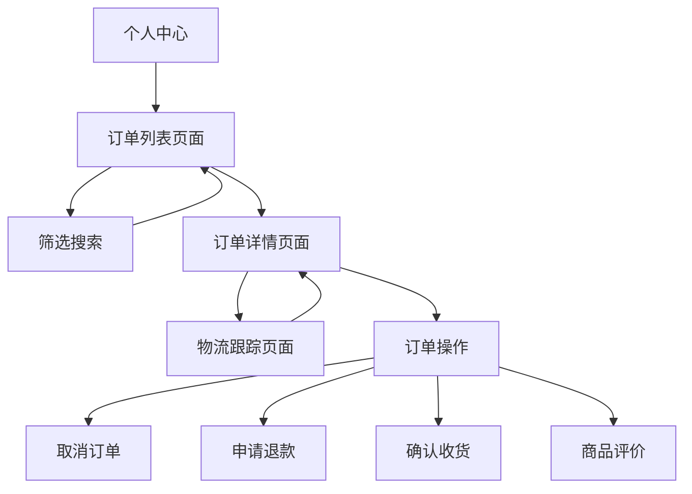

# 订单历史模块产品需求文档

## 1. Product Overview

订单历史模块是玉石交易电商网站的核心功能模块，为用户提供完整的订单管理和跟踪服务。该模块确保用户能够查看、管理和跟踪所有历史订单，提供准确、及时、完整的订单信息展示。

- 解决用户查看历史订单、跟踪订单状态、管理订单信息的核心需求
- 服务于已注册用户，提供个性化的订单管理体验
- 通过数据准确性验证和实时状态同步，提升用户信任度和满意度

## 2. Core Features

### 2.1 User Roles

| Role | Registration Method | Core Permissions |
|------|---------------------|------------------|
| 注册用户 | 邮箱注册或手机注册 | 查看个人订单历史、跟踪订单状态、申请退换货 |
| VIP用户 | 消费达标自动升级 | 享受优先客服、专属订单管理、快速退换货 |

### 2.2 Feature Module

订单历史模块包含以下核心页面：

1. **订单列表页面**：订单概览、筛选搜索、状态标识、快速操作
2. **订单详情页面**：完整订单信息、商品详情、物流跟踪、操作按钮
3. **订单跟踪页面**：实时物流信息、状态时间线、配送进度

### 2.3 Page Details

| Page Name | Module Name | Feature description |
|-----------|-------------|---------------------|
| 订单列表页面 | 订单概览区域 | 显示订单卡片，包含订单号、下单时间、商品缩略图、订单状态、总金额。支持分页加载 |
| 订单列表页面 | 筛选搜索区域 | 按订单状态、时间范围、商品名称筛选。支持订单号快速搜索 |
| 订单列表页面 | 快速操作区域 | 查看详情、申请退款、联系客服、再次购买等快捷操作按钮 |
| 订单详情页面 | 订单基本信息 | 显示订单号、下单时间、订单状态、支付方式、收货地址等完整信息 |
| 订单详情页面 | 商品信息区域 | 展示商品图片、名称、规格、数量、单价、小计等详细信息 |
| 订单详情页面 | 费用明细区域 | 显示商品金额、运费、优惠金额、实付金额等费用构成 |
| 订单详情页面 | 物流信息区域 | 展示物流公司、运单号、配送状态、预计到达时间 |
| 订单详情页面 | 操作按钮区域 | 根据订单状态显示相应操作：取消订单、申请退款、确认收货、评价商品 |
| 订单跟踪页面 | 物流时间线 | 显示订单从下单到收货的完整时间线，包含每个节点的时间和状态描述 |
| 订单跟踪页面 | 配送进度条 | 可视化展示当前配送进度，包含已完成和待完成的配送节点 |
| 订单跟踪页面 | 物流详情 | 显示详细的物流轨迹信息，包含时间、地点、操作描述 |

## 3. Core Process

### 用户订单管理流程

用户登录后进入个人中心，点击"我的订单"进入订单列表页面。用户可以通过筛选条件查找特定订单，点击订单卡片查看详细信息。在订单详情页面，用户可以查看完整的订单信息、商品详情和物流状态，并根据订单状态执行相应操作。对于已发货订单，用户可以点击"查看物流"进入订单跟踪页面，实时了解配送进度。

## 4. User Interface Design

### 4.1 Design Style

- **主色调**：翡翠绿 (#10B981) 作为主色，白色 (#FFFFFF) 作为背景色
- **辅助色**：灰色系 (#6B7280, #9CA3AF, #F3F4F6) 用于文本和边框
- **状态色**：绿色 (#059669) 表示成功，橙色 (#D97706) 表示处理中，红色 (#DC2626) 表示异常
- **按钮样式**：圆角矩形，主要按钮使用翡翠绿背景，次要按钮使用边框样式
- **字体**：系统默认字体，标题使用 16-20px，正文使用 14px，辅助信息使用 12px
- **布局风格**：卡片式设计，清晰的信息层级，充足的留白空间
- **图标风格**：线性图标，统一的视觉风格，支持状态变化动画

### 4.2 Page Design Overview

| Page Name | Module Name | UI Elements |
|-----------|-------------|-------------|
| 订单列表页面 | 订单概览区域 | 卡片式布局，每个订单卡片包含商品缩略图、订单信息和状态标签。使用网格布局，支持响应式调整 |
| 订单列表页面 | 筛选搜索区域 | 顶部固定的筛选栏，包含下拉选择器、日期选择器和搜索输入框。使用浅灰色背景区分 |
| 订单详情页面 | 订单信息区域 | 分段式信息展示，使用标签和数值的对比布局。重要信息使用加粗字体突出显示 |
| 订单详情页面 | 商品信息区域 | 表格式布局展示商品列表，包含商品图片、名称、规格、数量、价格等信息 |
| 订单跟踪页面 | 物流时间线 | 垂直时间线设计，使用圆点和连线表示进度节点。已完成节点使用绿色，当前节点使用橙色 |

### 4.3 Responsiveness

采用移动端优先的响应式设计策略。在移动端，订单卡片采用单列布局，筛选条件收缩为可展开的抽屉式设计。订单详情页面在移动端采用垂直堆叠布局，确保信息清晰可读。支持触摸手势操作，如滑动刷新、下拉加载等。