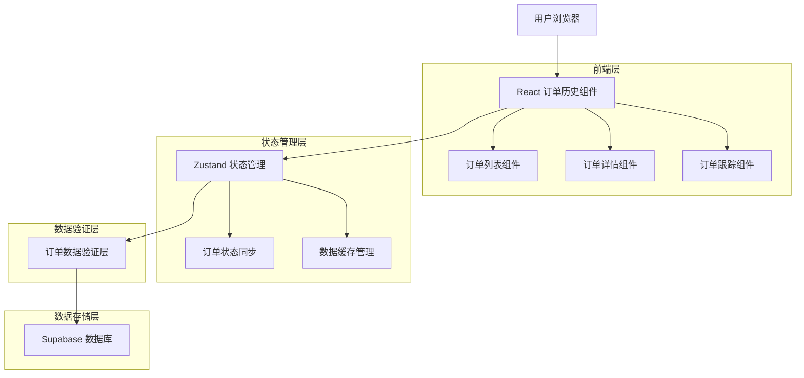
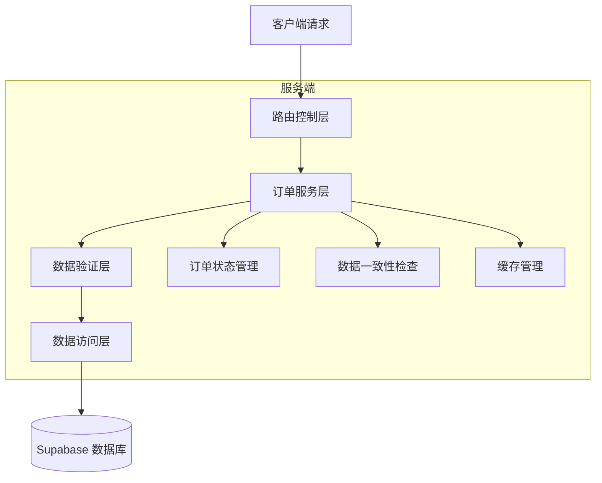
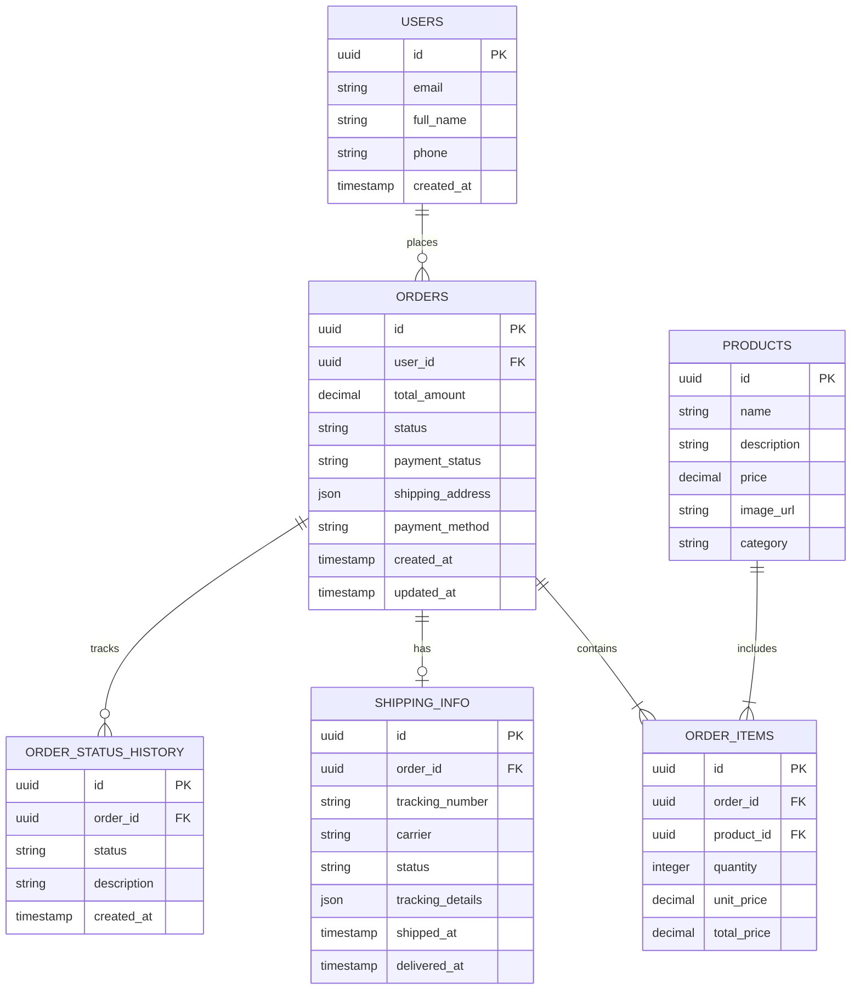

# 订单历史模块技术架构文档

## 1. Architecture design



## 2. Technology Description

- Frontend: React@18 + TypeScript + Tailwind CSS@3 + Vite
- State Management: Zustand (订单状态管理)
- Database: Supabase (PostgreSQL)
- Data Validation: Zod (数据验证)
- UI Components: Lucide React (图标库)

## 3. Route definitions

| Route | Purpose |
|-------|---------|
| /orders | 订单列表页面，显示用户所有历史订单 |
| /orders/:id | 订单详情页面，显示单个订单的完整信息 |
| /orders/:id/tracking | 订单跟踪页面，显示物流信息和配送进度 |
| /profile | 个人中心页面，包含订单管理入口 |

## 4. API definitions

### 4.1 Core API

订单查询相关
```
GET /api/orders
```

Request:
| Param Name | Param Type | isRequired | Description |
|------------|------------|------------|-------------|
| page | number | false | 页码，默认为1 |
| limit | number | false | 每页数量，默认为10 |
| status | string | false | 订单状态筛选 |
| start_date | string | false | 开始日期 |
| end_date | string | false | 结束日期 |
| search | string | false | 搜索关键词 |

Response:
| Param Name | Param Type | Description |
|------------|------------|-------------|
| data | Order[] | 订单列表 |
| total | number | 总订单数 |
| page | number | 当前页码 |
| totalPages | number | 总页数 |

订单详情查询
```
GET /api/orders/:id
```

Response:
| Param Name | Param Type | Description |
|------------|------------|-------------|
| data | Order | 订单详细信息 |
| shipping_info | ShippingInfo | 物流信息 |

订单状态更新
```
PUT /api/orders/:id/status
```

Request:
| Param Name | Param Type | isRequired | Description |
|------------|------------|------------|-------------|
| status | string | true | 新的订单状态 |
| reason | string | false | 状态变更原因 |

## 5. Server architecture diagram



## 6. Data model

### 6.1 Data model definition



### 6.2 Data Definition Language

订单表 (orders)
```sql
-- 创建订单表
CREATE TABLE orders (
    id UUID PRIMARY KEY DEFAULT gen_random_uuid(),
    user_id UUID NOT NULL REFERENCES users(id),
    total_amount DECIMAL(10,2) NOT NULL,
    status VARCHAR(20) DEFAULT 'pending' CHECK (status IN ('pending', 'processing', 'shipped', 'delivered', 'cancelled')),
    payment_status VARCHAR(20) DEFAULT 'pending' CHECK (payment_status IN ('pending', 'paid', 'failed', 'refunded')),
    shipping_address JSONB NOT NULL,
    payment_method VARCHAR(50) NOT NULL,
    created_at TIMESTAMP WITH TIME ZONE DEFAULT NOW(),
    updated_at TIMESTAMP WITH TIME ZONE DEFAULT NOW()
);

-- 创建订单项表
CREATE TABLE order_items (
    id UUID PRIMARY KEY DEFAULT gen_random_uuid(),
    order_id UUID NOT NULL REFERENCES orders(id) ON DELETE CASCADE,
    product_id UUID NOT NULL REFERENCES products(id),
    quantity INTEGER NOT NULL CHECK (quantity > 0),
    unit_price DECIMAL(10,2) NOT NULL,
    total_price DECIMAL(10,2) NOT NULL,
    created_at TIMESTAMP WITH TIME ZONE DEFAULT NOW()
);

-- 创建物流信息表
CREATE TABLE shipping_info (
    id UUID PRIMARY KEY DEFAULT gen_random_uuid(),
    order_id UUID NOT NULL REFERENCES orders(id) ON DELETE CASCADE,
    tracking_number VARCHAR(100),
    carrier VARCHAR(50),
    status VARCHAR(20) DEFAULT 'pending',
    tracking_details JSONB DEFAULT '[]',
    shipped_at TIMESTAMP WITH TIME ZONE,
    delivered_at TIMESTAMP WITH TIME ZONE,
    created_at TIMESTAMP WITH TIME ZONE DEFAULT NOW(),
    updated_at TIMESTAMP WITH TIME ZONE DEFAULT NOW()
);

-- 创建订单状态历史表
CREATE TABLE order_status_history (
    id UUID PRIMARY KEY DEFAULT gen_random_uuid(),
    order_id UUID NOT NULL REFERENCES orders(id) ON DELETE CASCADE,
    status VARCHAR(20) NOT NULL,
    description TEXT,
    created_at TIMESTAMP WITH TIME ZONE DEFAULT NOW()
);

-- 创建索引
CREATE INDEX idx_orders_user_id ON orders(user_id);
CREATE INDEX idx_orders_status ON orders(status);
CREATE INDEX idx_orders_created_at ON orders(created_at DESC);
CREATE INDEX idx_order_items_order_id ON order_items(order_id);
CREATE INDEX idx_shipping_info_order_id ON shipping_info(order_id);
CREATE INDEX idx_order_status_history_order_id ON order_status_history(order_id);

-- 设置权限
GRANT SELECT ON orders TO anon;
GRANT ALL PRIVILEGES ON orders TO authenticated;
GRANT SELECT ON order_items TO anon;
GRANT ALL PRIVILEGES ON order_items TO authenticated;
GRANT SELECT ON shipping_info TO anon;
GRANT ALL PRIVILEGES ON shipping_info TO authenticated;
GRANT SELECT ON order_status_history TO anon;
GRANT ALL PRIVILEGES ON order_status_history TO authenticated;

-- 插入测试数据
INSERT INTO orders (user_id, total_amount, status, payment_status, shipping_address, payment_method) VALUES
('550e8400-e29b-41d4-a716-446655440000', 1299.00, 'delivered', 'paid', '{"name":"张三","phone":"13800138000","address":"北京市朝阳区xxx街道xxx号"}', 'alipay'),
('550e8400-e29b-41d4-a716-446655440001', 2599.00, 'shipped', 'paid', '{"name":"李四","phone":"13900139000","address":"上海市浦东新区xxx路xxx号"}', 'wechat'),
('550e8400-e29b-41d4-a716-446655440002', 899.00, 'processing', 'paid', '{"name":"王五","phone":"13700137000","address":"广州市天河区xxx大道xxx号"}', 'credit_card');

-- 插入订单状态历史
INSERT INTO order_status_history (order_id, status, description) VALUES
((SELECT id FROM orders WHERE total_amount = 1299.00), 'pending', '订单已创建'),
((SELECT id FROM orders WHERE total_amount = 1299.00), 'processing', '订单处理中'),
((SELECT id FROM orders WHERE total_amount = 1299.00), 'shipped', '订单已发货'),
((SELECT id FROM orders WHERE total_amount = 1299.00), 'delivered', '订单已送达');
```