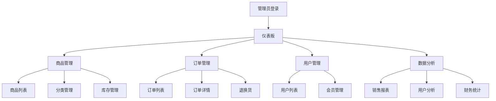

# 玉石雅韵电商平台后台管理系统产品需求文档

## 1. 产品概述

玉石雅韵电商平台后台管理系统是一套专为玉石珠宝电商业务设计的综合性管理平台。系统旨在为管理员提供高效的商品管理、订单处理、用户管理、数据分析等核心功能，通过数据可视化、批量操作、权限控制等现代化管理手段，提升运营效率和决策质量。

该系统将整合当前前端应用中的所有模拟数据，建立完整的数据库架构，为电商平台的规模化运营提供强有力的技术支撑。

## 2. 核心功能

### 2.1 用户角色

| 角色 | 注册方式 | 核心权限 |
|------|----------|----------|
| 超级管理员 | 系统预设账户 | 系统全部功能权限，包括用户管理、系统配置 |
| 运营管理员 | 超级管理员创建 | 商品管理、订单管理、营销活动管理 |
| 客服专员 | 运营管理员创建 | 订单处理、用户服务、退换货处理 |
| 数据分析师 | 运营管理员创建 | 数据查看、报表导出、统计分析 |

### 2.2 功能模块

后台管理系统包含以下核心页面：

1. **仪表板页面**：数据概览、实时统计、快速操作入口
2. **商品管理页面**：商品列表、分类管理、库存管理、批量操作
3. **订单管理页面**：订单列表、状态管理、物流跟踪、退换货处理
4. **用户管理页面**：用户列表、用户详情、会员等级管理
5. **营销管理页面**：优惠券管理、活动配置、推广统计
6. **数据分析页面**：销售报表、用户分析、商品分析、财务统计
7. **系统管理页面**：权限管理、日志查看、系统配置
8. **内容管理页面**：评价管理、媒体资源管理、公告管理

### 2.3 页面详情

| 页面名称 | 模块名称 | 功能描述 |
|----------|----------|----------|
| 仪表板页面 | 数据概览 | 显示关键业务指标、今日数据、趋势图表、待处理事项 |
| 仪表板页面 | 快速操作 | 提供常用功能快捷入口、最近操作记录 |
| 商品管理页面 | 商品列表 | 商品搜索筛选、批量编辑、状态管理、库存预警 |
| 商品管理页面 | 分类管理 | 分类树形结构管理、分类属性配置、排序设置 |
| 商品管理页面 | 商品编辑 | 商品信息编辑、图片上传、规格管理、SEO设置 |
| 订单管理页面 | 订单列表 | 订单搜索、状态筛选、批量处理、导出功能 |
| 订单管理页面 | 订单详情 | 订单信息查看、状态更新、物流信息、备注管理 |
| 订单管理页面 | 退换货管理 | 退换货申请处理、审核流程、退款管理 |
| 用户管理页面 | 用户列表 | 用户搜索、信息查看、状态管理、批量操作 |
| 用户管理页面 | 用户详情 | 用户资料、订单历史、消费统计、行为分析 |
| 用户管理页面 | 会员管理 | 会员等级设置、权益配置、升级规则管理 |
| 营销管理页面 | 优惠券管理 | 优惠券创建、发放规则、使用统计、批量操作 |
| 营销管理页面 | 活动管理 | 营销活动配置、参与统计、效果分析 |
| 数据分析页面 | 销售报表 | 销售趋势、商品排行、地区分析、时间对比 |
| 数据分析页面 | 用户分析 | 用户画像、行为分析、留存率、转化率 |
| 数据分析页面 | 财务统计 | 收入统计、成本分析、利润报表、资金流水 |
| 系统管理页面 | 权限管理 | 角色管理、权限分配、操作日志、安全设置 |
| 系统管理页面 | 系统配置 | 基础设置、支付配置、物流设置、邮件配置 |
| 内容管理页面 | 评价管理 | 评价审核、回复管理、违规处理、统计分析 |

## 3. 核心流程

### 3.1 管理员操作流程

**商品管理流程**：
管理员登录 → 商品管理 → 添加/编辑商品 → 设置分类和属性 → 上传图片 → 设置价格和库存 → 发布商品

**订单处理流程**：
订单管理 → 查看新订单 → 确认订单信息 → 更新订单状态 → 安排发货 → 跟踪物流 → 确认收货

**用户服务流程**：
用户管理 → 查看用户信息 → 处理用户问题 → 更新用户状态 → 记录服务日志

### 3.2 数据分析流程

**报表生成流程**：
数据分析 → 选择报表类型 → 设置时间范围 → 选择筛选条件 → 生成报表 → 导出数据

## 4. 用户界面设计

### 4.1 设计风格

- **主色调**：深蓝色 (#1e40af) 作为主色，传达专业和信任感
- **辅助色**：翠绿色 (#059669) 呼应玉石主题，白色 (#ffffff) 保持清洁感
- **按钮样式**：现代扁平化设计，圆角按钮，悬停效果明显
- **字体**：主要使用 Inter 字体，中文使用苹方或微软雅黑，字号 14px-16px
- **布局风格**：左侧导航 + 顶部面包屑的经典后台布局，卡片式内容展示
- **图标风格**：使用 Lucide React 图标库，保持一致的线性风格

### 4.2 页面设计概览

| 页面名称 | 模块名称 | UI元素 |
|----------|----------|---------|
| 仪表板页面 | 数据卡片 | 白色卡片背景，彩色图标，大号数字显示，趋势箭头指示 |
| 仪表板页面 | 图表区域 | 响应式图表容器，工具提示，图例说明，时间选择器 |
| 商品管理页面 | 数据表格 | 斑马纹表格，排序功能，分页控件，批量选择复选框 |
| 商品管理页面 | 搜索筛选 | 搜索框，下拉筛选器，日期选择器，重置按钮 |
| 订单管理页面 | 状态标签 | 彩色状态徽章，进度条显示，时间轴展示 |
| 订单管理页面 | 操作按钮 | 主要操作按钮，次要操作下拉菜单，危险操作确认弹窗 |
| 用户管理页面 | 用户头像 | 圆形头像，默认头像占位符，在线状态指示器 |
| 数据分析页面 | 图表组件 | 柱状图、折线图、饼图、热力图，交互式图例 |

### 4.3 响应式设计

系统采用桌面优先的响应式设计策略，确保在不同屏幕尺寸下的良好体验：

- **桌面端（≥1200px）**：完整的左侧导航栏，多列数据展示
- **平板端（768px-1199px）**：可折叠侧边栏，调整表格列数
- **移动端（<768px）**：顶部导航栏，卡片式布局，触摸友好的操作按钮

## 5. 数据架构

### 5.1 核心数据实体

基于现有模拟数据分析，系统需要管理以下核心数据实体：

- **商品数据**：6个商品实体，包含完整的商品信息、规格、图片等
- **分类数据**：4个主要分类（和田玉、翡翠、玛瑙、水晶）
- **订单数据**：3个订单实体，涵盖不同订单状态
- **用户数据**：用户基础信息、地址、设置等
- **评价数据**：5条商品评价，包含评分、评论、图片
- **系统配置**：用户设置、通知配置、安全设置等

### 5.2 数据迁移需求

系统需要将以下模拟数据迁移至数据库：

1. **商品表**：迁移6个商品及其完整信息
2. **分类表**：建立4个主分类的层级结构
3. **订单表**：迁移3个订单及相关订单项
4. **用户表**：建立用户基础数据结构
5. **评价表**：迁移5条评价数据
6. **地址表**：建立用户地址管理
7. **系统配置表**：迁移用户设置和系统配置

### 5.3 数据关系

- 商品与分类：多对一关系
- 订单与用户：多对一关系
- 订单与商品：多对多关系（通过订单项表）
- 评价与商品：多对一关系
- 评价与用户：多对一关系
- 地址与用户：多对一关系

## 6. 技术要求

### 6.1 性能要求

- 页面加载时间不超过2秒
- 数据查询响应时间不超过1秒
- 支持并发用户数不少于100人
- 数据导出功能支持10万条记录

### 6.2 安全要求

- 用户身份认证和授权
- 操作日志记录和审计
- 数据传输加密
- SQL注入和XSS攻击防护

### 6.3 兼容性要求

- 支持主流浏览器（Chrome、Firefox、Safari、Edge）
- 响应式设计适配不同设备
- 支持键盘导航和无障碍访问

## 7. 系统集成

### 7.1 前端集成

- 与现有前端应用共享用户认证状态
- 统一的API接口规范
- 一致的错误处理机制

### 7.2 第三方服务集成

- 支付系统集成（支付宝、微信支付）
- 物流系统集成（快递查询API）
- 短信服务集成（验证码、通知）
- 邮件服务集成（订单通知、营销邮件）

## 8. 部署和维护

### 8.1 部署要求

- 支持Docker容器化部署
- 数据库备份和恢复机制
- 日志收集和监控系统
- 自动化部署流程

### 8.2 维护要求

- 定期数据备份
- 系统性能监控
- 安全漏洞扫描
- 用户操作审计