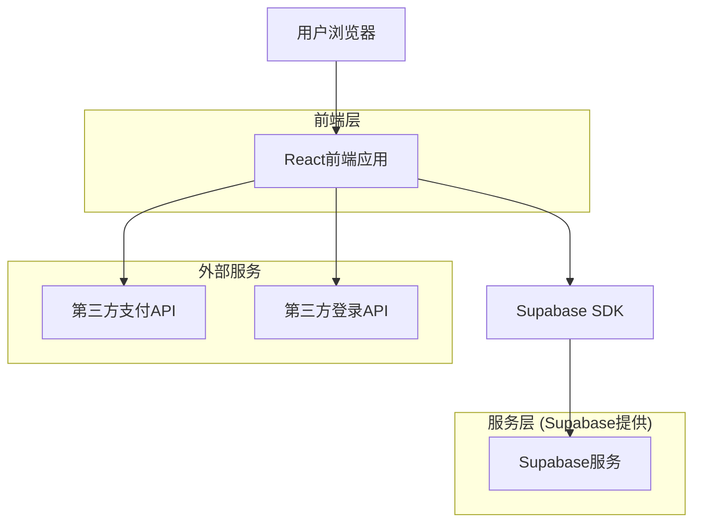
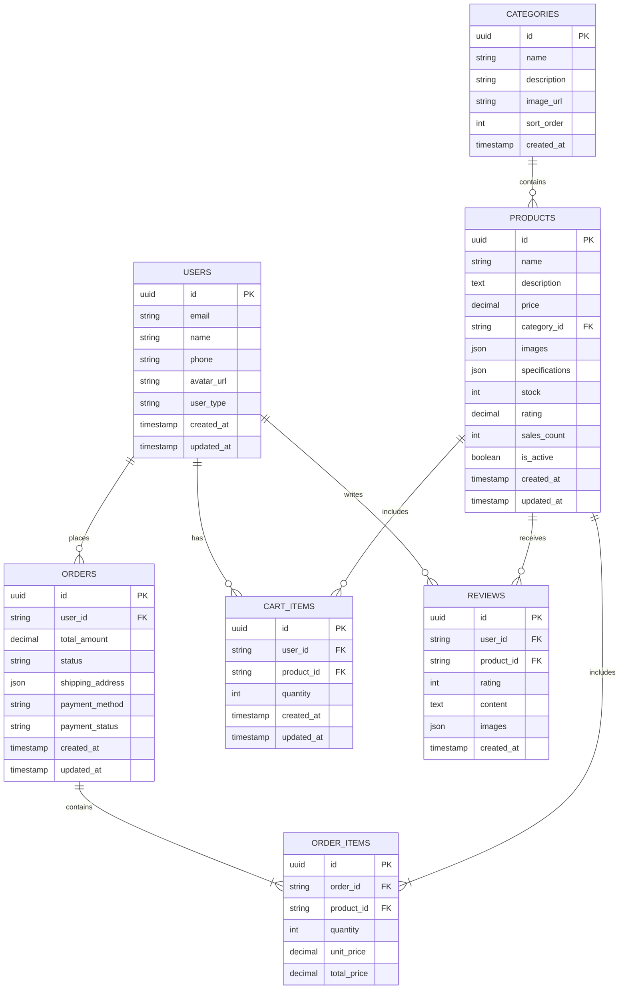

# 玉石雅韵电商平台技术架构文档

## 1. 架构设计



## 2. 技术描述

- 前端：React@18 + TypeScript + Tailwind CSS@3 + Vite
- 后端：Supabase (PostgreSQL数据库 + 认证 + 存储)
- 状态管理：Zustand
- UI组件库：Headless UI + 自定义组件
- 图标库：Heroicons
- 支付集成：Stripe (贝宝、苹果支付、银行卡) + 支付宝/微信支付SDK
- 第三方登录：微信开放平台 + 支付宝开放平台

## 3. 路由定义

| 路由 | 用途 |
|------|------|
| / | 首页，展示轮播图、商品推荐、热销商品 |
| /login | 登录页面，支持邮箱、微信、支付宝登录 |
| /register | 注册页面，用户账号注册 |
| /products | 商品列表页，商品分类浏览和搜索 |
| /products/:id | 商品详情页，展示商品详细信息和用户评价 |
| /cart | 购物车页面，管理购买商品 |
| /checkout | 订单结算页面，填写收货信息和选择支付方式 |
| /payment | 支付页面，处理支付流程 |
| /profile | 个人中心，用户信息和订单管理 |
| /orders | 历史订单页面，查看订单状态 |
| /orders/:id | 订单详情页面，查看具体订单信息 |
| /contact | 联系我们页面，客服和邮件联系 |
| /coming-soon | 敬请期待页面，未上线功能展示 |

## 4. API定义

### 4.1 核心API

用户认证相关 (Supabase Auth)
```
POST /auth/v1/signup
POST /auth/v1/token
POST /auth/v1/logout
```

商品管理相关
```
GET /rest/v1/products
```

请求参数：
| 参数名称 | 参数类型 | 是否必需 | 描述 |
|----------|----------|----------|------|
| category | string | false | 商品分类筛选 |
| price_min | number | false | 最低价格 |
| price_max | number | false | 最高价格 |
| sort | string | false | 排序方式 (price_asc, price_desc, sales, rating) |
| limit | number | false | 每页数量，默认20 |
| offset | number | false | 偏移量，用于分页 |

响应数据：
| 字段名称 | 字段类型 | 描述 |
|----------|----------|------|
| data | array | 商品列表数据 |
| count | number | 总商品数量 |
| has_more | boolean | 是否有更多数据 |

示例响应：
```json
{
  "data": [
    {
      "id": "uuid",
      "name": "和田白玉手镯",
      "price": 8800,
      "category": "白玉",
      "images": ["url1", "url2"],
      "description": "新疆和田白玉，温润如脂",
      "stock": 1,
      "rating": 4.8,
      "sales_count": 156
    }
  ],
  "count": 1,
  "has_more": false
}
```

订单管理相关
```
POST /rest/v1/orders
GET /rest/v1/orders
PUT /rest/v1/orders/:id
```

支付处理相关
```
POST /api/payments/create-intent
POST /api/payments/confirm
```

## 5. 数据模型

### 5.1 数据模型定义



### 5.2 数据定义语言

用户表 (users)
```sql
-- 创建用户表
CREATE TABLE users (
    id UUID PRIMARY KEY DEFAULT gen_random_uuid(),
    email VARCHAR(255) UNIQUE NOT NULL,
    name VARCHAR(100) NOT NULL,
    phone VARCHAR(20),
    avatar_url TEXT,
    user_type VARCHAR(20) DEFAULT 'normal' CHECK (user_type IN ('normal', 'vip')),
    created_at TIMESTAMP WITH TIME ZONE DEFAULT NOW(),
    updated_at TIMESTAMP WITH TIME ZONE DEFAULT NOW()
);

-- 创建索引
CREATE INDEX idx_users_email ON users(email);
CREATE INDEX idx_users_created_at ON users(created_at DESC);

-- 设置权限
GRANT SELECT ON users TO anon;
GRANT ALL PRIVILEGES ON users TO authenticated;
```

商品分类表 (categories)
```sql
-- 创建分类表
CREATE TABLE categories (
    id UUID PRIMARY KEY DEFAULT gen_random_uuid(),
    name VARCHAR(100) NOT NULL,
    description TEXT,
    image_url TEXT,
    sort_order INTEGER DEFAULT 0,
    created_at TIMESTAMP WITH TIME ZONE DEFAULT NOW()
);

-- 插入初始数据
INSERT INTO categories (name, description, sort_order) VALUES
('白玉', '新疆和田白玉，温润如脂', 1),
('青玉', '青色玉石，质地坚韧', 2),
('黄玉', '黄色玉石，色泽温润', 3),
('碧玉', '绿色玉石，清新自然', 4),
('墨玉', '黑色玉石，深邃神秘', 5);

-- 设置权限
GRANT SELECT ON categories TO anon;
GRANT ALL PRIVILEGES ON categories TO authenticated;
```

商品表 (products)
```sql
-- 创建商品表
CREATE TABLE products (
    id UUID PRIMARY KEY DEFAULT gen_random_uuid(),
    name VARCHAR(200) NOT NULL,
    description TEXT,
    price DECIMAL(10,2) NOT NULL,
    category_id UUID REFERENCES categories(id),
    images JSONB DEFAULT '[]',
    specifications JSONB DEFAULT '{}',
    stock INTEGER DEFAULT 0,
    rating DECIMAL(3,2) DEFAULT 0,
    sales_count INTEGER DEFAULT 0,
    is_active BOOLEAN DEFAULT true,
    created_at TIMESTAMP WITH TIME ZONE DEFAULT NOW(),
    updated_at TIMESTAMP WITH TIME ZONE DEFAULT NOW()
);

-- 创建索引
CREATE INDEX idx_products_category_id ON products(category_id);
CREATE INDEX idx_products_price ON products(price);
CREATE INDEX idx_products_rating ON products(rating DESC);
CREATE INDEX idx_products_sales_count ON products(sales_count DESC);
CREATE INDEX idx_products_created_at ON products(created_at DESC);

-- 插入示例数据
INSERT INTO products (name, description, price, category_id, specifications, stock, rating, sales_count) 
SELECT 
    '和田白玉手镯',
    '新疆和田白玉制作，温润如脂，工艺精湛',
    8800.00,
    id,
    '{"material": "和田白玉", "weight": "36.1g", "size": "内径5.8cm", "origin": "新疆和田"}',
    1,
    4.8,
    156
FROM categories WHERE name = '白玉';

-- 设置权限
GRANT SELECT ON products TO anon;
GRANT ALL PRIVILEGES ON products TO authenticated;
```

订单表 (orders)
```sql
-- 创建订单表
CREATE TABLE orders (
    id UUID PRIMARY KEY DEFAULT gen_random_uuid(),
    user_id UUID NOT NULL,
    total_amount DECIMAL(10,2) NOT NULL,
    status VARCHAR(20) DEFAULT 'pending' CHECK (status IN ('pending', 'paid', 'shipped', 'delivered', 'cancelled')),
    shipping_address JSONB NOT NULL,
    payment_method VARCHAR(50),
    payment_status VARCHAR(20) DEFAULT 'pending' CHECK (payment_status IN ('pending', 'paid', 'failed', 'refunded')),
    created_at TIMESTAMP WITH TIME ZONE DEFAULT NOW(),
    updated_at TIMESTAMP WITH TIME ZONE DEFAULT NOW()
);

-- 创建索引
CREATE INDEX idx_orders_user_id ON orders(user_id);
CREATE INDEX idx_orders_status ON orders(status);
CREATE INDEX idx_orders_created_at ON orders(created_at DESC);

-- 设置权限
GRANT SELECT ON orders TO authenticated;
GRANT INSERT, UPDATE ON orders TO authenticated;
```

订单商品表 (order_items)
```sql
-- 创建订单商品表
CREATE TABLE order_items (
    id UUID PRIMARY KEY DEFAULT gen_random_uuid(),
    order_id UUID REFERENCES orders(id) ON DELETE CASCADE,
    product_id UUID REFERENCES products(id),
    quantity INTEGER NOT NULL DEFAULT 1,
    unit_price DECIMAL(10,2) NOT NULL,
    total_price DECIMAL(10,2) NOT NULL
);

-- 创建索引
CREATE INDEX idx_order_items_order_id ON order_items(order_id);
CREATE INDEX idx_order_items_product_id ON order_items(product_id);

-- 设置权限
GRANT SELECT ON order_items TO authenticated;
GRANT INSERT, UPDATE ON order_items TO authenticated;
```

购物车表 (cart_items)
```sql
-- 创建购物车表
CREATE TABLE cart_items (
    id UUID PRIMARY KEY DEFAULT gen_random_uuid(),
    user_id UUID NOT NULL,
    product_id UUID REFERENCES products(id) ON DELETE CASCADE,
    quantity INTEGER NOT NULL DEFAULT 1,
    created_at TIMESTAMP WITH TIME ZONE DEFAULT NOW(),
    updated_at TIMESTAMP WITH TIME ZONE DEFAULT NOW()
);

-- 创建索引
CREATE INDEX idx_cart_items_user_id ON cart_items(user_id);
CREATE INDEX idx_cart_items_product_id ON cart_items(product_id);

-- 设置权限
GRANT ALL PRIVILEGES ON cart_items TO authenticated;
```

用户评价表 (reviews)
```sql
-- 创建评价表
CREATE TABLE reviews (
    id UUID PRIMARY KEY DEFAULT gen_random_uuid(),
    user_id UUID NOT NULL,
    product_id UUID REFERENCES products(id) ON DELETE CASCADE,
    rating INTEGER NOT NULL CHECK (rating >= 1 AND rating <= 5),
    content TEXT,
    images JSONB DEFAULT '[]',
    created_at TIMESTAMP WITH TIME ZONE DEFAULT NOW()
);

-- 创建索引
CREATE INDEX idx_reviews_product_id ON reviews(product_id);
CREATE INDEX idx_reviews_user_id ON reviews(user_id);
CREATE INDEX idx_reviews_rating ON reviews(rating DESC);
CREATE INDEX idx_reviews_created_at ON reviews(created_at DESC);

-- 设置权限
GRANT SELECT ON reviews TO anon;
GRANT ALL PRIVILEGES ON reviews TO authenticated;
```